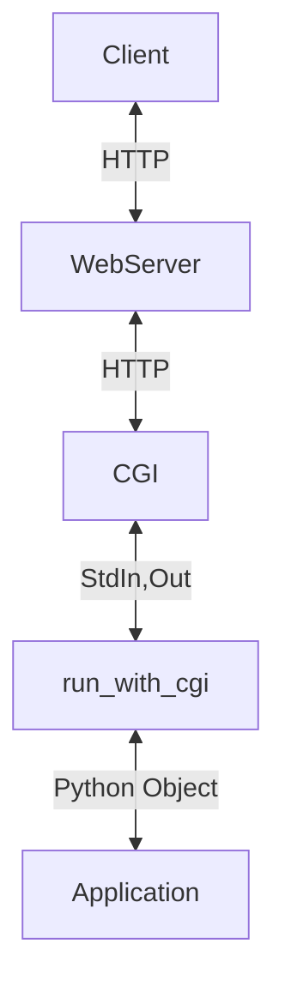
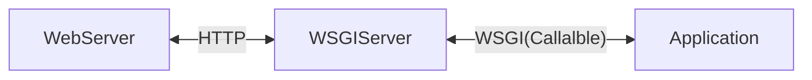

### 출처
* [pep333](https://peps.python.org/pep-0333/)
___
### 개요
* WSGI란
* WSGI의 동작방식
* WAS란?
* 장고는 어떻게 동작하나요?
___
### WSGI란

WSGI란 Web Server Gateway Interface의 약자로 웹서버와 응용 프로그램의 중간에 위치해 서로간의 통신을 가능하게 한다. 읭? 그러면 일전에 다룬 [[CGI]]와 다를게 없지 않나? 라는 생각이 든다면 당신의 생각이 맞다. 적절히 이해했다.

WSGI는 파이썬에 특화된 인터페이스로 CGI를 기반에 두고 있긴 하지만 엄밀히 따지자면 CGI는 아니다. <b><u> 정확히 표현하자면 파이썬 특화 FastCGI라고 정의하는 것이 적절하다.</b></u> CGI는 표준 입출력과 환경변수를 활용해 HTTP 요청 정보를 획득하고 응답 정보를 반환한다는 규칙만 정의할 뿐 어떤 언어를 활용해서 구현 하라는 규칙은 존재하지 않는다. (이는 FastCGI도 마찬가지이다)

이에 따라서 **HTTP 정보를 순수 파이썬으로 파싱해 파이썬 객체로 응용 프로그램에 전달하고 응용 프로그램에서도 곧장 파이썬 객체를 반환해 웹서버로 전달하고 싶다는 욕구가 발생했다.** 니즈가 많은 만큼 해결법도 다양했는데, 이로 인해 웹서버 API의 춘추 전국 시대가 열리게 된다.

#### 역사적 배경
사실 WSGI이전에도 웹 서버와 파이썬을 연결하는 API는 많이 존재했다. mod_python과 같이 웹 서버 소프트웨어 자체에 파이썬 인터프리터를 탑재해 웹 서버 내부에서 처리하는 방식도 존재했고 아예 웹서버 자체를 파이썬으로 작성해 곧장 파이썬 객체를 다루고 처리하는 방법도 존재했다.

문제는 웹서버와 연결하는 방법이 다양하다 보니 실질적으로 이러한 **API 뒷단에서 동작하는 프레임워크 입장에서는 지원해야하는 요소의 수가 많아지고 번잡해지는 상황이 발생했다.** 이를 위해 기준을 작성할 필요가 발생했고 이때 그 기준으로 등장한 것이 WSGI이기도 하다.

> The availability and widespread use of such an API in web servers for Python – whether those servers are written in Python (e.g. Medusa), embed Python (e.g. mod_python), or invoke Python via a gateway protocol (e.g. CGI, FastCGI, etc.) – would separate choice of framework from choice of web server, freeing users to choose a pairing that suits them, while freeing framework and server developers to focus on their preferred area of specialization.
> 
> **This PEP, therefore, proposes a simple and universal interface between web servers and web applications or frameworks: the Python Web Server Gateway Interface (WSGI).** [pep333](https://peps.python.org/pep-0333/)

당시 문서를 확인하면 자바와 비교를 많이 하는데 이때 자바는 서블릿 기반의 공통된 시스템을 활용하고 있었기에 어떤 프레임 워크를 사용해도 웹서버를 변경해야 한다거나 하는 문제가 존재하지 않았다. **이러한 구조를 파이썬에도 도입해 파이썬 <-> 웹 서버 간의 통일된 인터페이스를 생성하는 것이 WSGI의 탄생 비화이다.**

>[!info]
>**This PEP, therefore, proposes a simple and universal interface between web servers and web applications or frameworks: the Python Web Server Gateway Interface (WSGI).**

___
### WSGI의 구조

**==WSGI의 가장 큰 특징은 웹 서버로 부터 받은 HTTP 요청을 특정한 파이썬 콜러블 오브젝트와 연결할 수 있다는 것이다.==** WSGI 서버는 HTTP 요청이 오면 특정 콜러블 오브젝트를 호출하는 방식으로 동작한다. (콜러블 오브젝트는 함수 메서드 뿐아니라 `__call__`이 구현된 모든 객체를 말한다) 이때 실행하는 콜러블 오브젝트는 어떠한 의존성도 가지면 안된다.

WSGI는 크게 웹 서버와 소통하는 부분 어플리케이션과 소통하는 부분으로 구분할 수있다. 웹 서버와 통신하는 부분을 서버, 게이트웨이 파트라 하고 어플리케이션과 소통하는 부분을 어플리케이션, 프레임워크 파트라 하자.

이제 WSGI를 통해서 실행하는 어플리케이션의 예시를 살펴보자. 아래 코드는 2개의 콜러블 오브젝트를 보여준다. 

```python
def simple_app(environ, start_response):
    """Simplest possible application object"""
    status = '200 OK'
    response_headers = [('Content-type', 'text/plain')]
    start_response(status, response_headers)
    return ['Hello world!\n']


class AppClass:
    """Produce the same output, but using a class

    (Note: 'AppClass' is the "application" here, so calling it
    returns an instance of 'AppClass', which is then the iterable
    return value of the "application callable" as required by
    the spec.

    If we wanted to use *instances* of 'AppClass' as application
    objects instead, we would have to implement a '__call__'
    method, which would be invoked to execute the application,
    and we would need to create an instance for use by the
    server or gateway.
    """

    def __init__(self, environ, start_response):
        self.environ = environ
        self.start = start_response

    def __iter__(self):
        status = '200 OK'
        response_headers = [('Content-type', 'text/plain')]
        self.start(status, response_headers)
        yield "Hello world!\n"
```

이러한 콜러블 객체를 WSGI 서버에 넘겨주면 WSGI는 적절한 요청을 수신할 때마다 해당 콜러블 객체를 호출한다. 이어서 서버, 게이트웨이 파트의 예시를 확인해보자.

```python
import os, sys

def run_with_cgi(application):

    environ = dict(os.environ.items())
    environ['wsgi.input']        = sys.stdin
    environ['wsgi.errors']       = sys.stderr
    environ['wsgi.version']      = (1, 0)
    environ['wsgi.multithread']  = False
    environ['wsgi.multiprocess'] = True
    environ['wsgi.run_once']     = True

    if environ.get('HTTPS', 'off') in ('on', '1'):
        environ['wsgi.url_scheme'] = 'https'
    else:
        environ['wsgi.url_scheme'] = 'http'

    headers_set = []
    headers_sent = []

    def write(data):
        if not headers_set:
             raise AssertionError("write() before start_response()")

        elif not headers_sent:
             # Before the first output, send the stored headers
             status, response_headers = headers_sent[:] = headers_set
             sys.stdout.write('Status: %s\r\n' % status)
             for header in response_headers:
                 sys.stdout.write('%s: %s\r\n' % header)
             sys.stdout.write('\r\n')

        sys.stdout.write(data)
        sys.stdout.flush()

    def start_response(status, response_headers, exc_info=None):
        if exc_info:
            try:
                if headers_sent:
                    # Re-raise original exception if headers sent
                    raise exc_info[0], exc_info[1], exc_info[2]
            finally:
                exc_info = None     # avoid dangling circular ref
        elif headers_set:
            raise AssertionError("Headers already set!")

        headers_set[:] = [status, response_headers]
        return write

    result = application(environ, start_response) #콜러블 객체를 실행
    try:
        for data in result:
            if data:    # don't send headers until body appears
                write(data)
        if not headers_sent:
            write('')   # send headers now if body was empty
    finally:
        if hasattr(result, 'close'):
            result.close()
```

다음의 코드는 대략적으로 작성한 WSGI 서버 코드로 앞단에 CGI가 존재함을 가정하고 작성했다. 코드를 확인해보면 콜러블 오브젝트인 application을 전달받아 동작하는 것을 확인할 수 있고 결과 값을 CGI의 형식을 통해 웹서버에 전달 하는 것 또한 파악이 가능하다. 따라서 이를 그림으로 나타내면 다음과 같다.



이는 초창기 장고에서 사용 됐던 패턴으로 옛날의 WSGI가 완전히 자리잡기 전까지 장고는 flup이라는 라이브러리를 활용해 위와 같은 구조를 사용했다. (run_with_cgi자리에 flup이 사용됐다)

추가적으로 확인할 만한 부분은 동적 수행을 원하는 HTTP 요청마다 콜러블 오브젝트를 실행해야 하므로  `run_with_cgi`는 요청마다 수행된다. 
___
### WSGI 정리

**WSGI는 웹서버와 응용 프로그램 중간에 위치해 웹서버의 요청을 특정한 파이썬 콜러블 객체로 매핑하는 기능을 수행한다.** 이후 콜러블 객체가 반환한 바이트 형식의 데이터를 웹서버에 적절한 HTTP Response로 전달하는 기능을 수행한다. 따라서 그림으로 나타내자면 WSGI는 아래와 같은 위치에 놓이게 된다.



**WSGI 또한 CGI와 마찬가지로 하나의 규약이라는 것을 잊지말자 WSGI는 파이썬 어플리케이션과 웹서버가 콜러블 오브젝트를 통해 통신하는 규칙을 정의한 것이지 실제 구현체를 의미하진 않는다.** WSGI의 구현체로는 Gunicorn이나 uWsgi 등의 패키지가 존재한다. 

> [!info]
> **WSGI는 파이썬의 콜러블 오브젝트를 활용해 웹서버와 어플리케이션이 통신을 하게하는 규칙이다.** 

___
### WSGI의 규칙들
