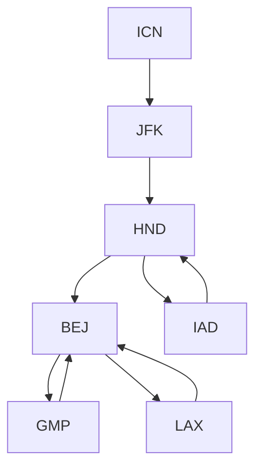

### 출처
* [DFS VS BFS](https://stackoverflow.com/questions/3332947/what-are-the-practical-factors-to-consider-when-choosing-between-depth-first-sea)
____
### 개요
* [[#DFS]]
* [[#DFS의 동작방식]]
* [[#DFS의 구현]]
* [[#DFS의 특징과 사용처]]
* [[#DFS와 캐싱 그리고 DP]]
___
### DFS

**DFS는 Depth First Search의 약자로 그래프나 트리 형태의 데이터를 탐색할 때 활용된다**. 깊이 우선 탐색이라는 말은 같은 레벨의 위치한 원소들을 탐색하기 보단 아래로 계속해서 이동하며 탐색하는 방식을 말한다. 아래의 이미지를 보자.


<span class="red red-bg">DFS의 특징은 현재 분기를 완전히 탐색하기 전까지 다른 분기의 탐색을 미룬다는 것이다.</span> 체스 게임을 시뮬레이션을 한다고 가정해보자. 내가 둔 수를 기점으로 체스 게임이 진행되는 방법은 계속해서 수십가지가 발생할 것이다. DFS는 특정한 수를 계속해서 선택해나가며 게임이 완전히 종료될때 까지 탐색을 진행한다. 이때 게임이 만약 100수 번째에서 종료 됐다 한다면 99수 번째의 분기로 이동해 재 탐색을 진행한다. 따라서 <u><b>DFS는 특정한 분기의 끝까지 이동하는 속도는 빠른 편이다.</b></u>

* **DFS VS BFS**
	DFS와 BFS중 어떤 것을 선택하는 것이 적절한지 망설여지는 순간이 존재한다. 직관적으로 이를 구분하는 방법은 <b><u>하나의 완전한 분기를 우선적으로 탐색하는 것과 최적의 분기를 탐색하는 것 중에 어떤 것이 더 유리한지 비교하면 된다.</b></u> 체스게임을 예로 들면 체스게임이 끝나는 경우를 구한다면 DFS가 유리할 것이지만, 체스게임이 가장 빨리 끝나는 경우를 탐색한다면 BFS가 유리할 것이다. ([출처](https://stackoverflow.com/questions/3332947/what-are-the-practical-factors-to-consider-when-choosing-between-depth-first-sea))

____
### DFS의 동작방식

**DFS는 계속해서 분기를 스택에 담고 가장 최근에 담긴 것 부터 처리하는 LIFO 방식으로 동작한다. LIFO를 따르기 때문에 특정 분기가 종료되고 나면 스택의 상단에는 바로 이전 분기가 놓이게 된다.**


**DFS는 위의 이미지와 같이 자식을 스택에 집어 넣고 이를 우선적으로 pop해 사용하기 때문에 형제는 자식 보다 이후에 탐색**하게 된다. 형제도 탐색을 진행한다는 것을 기억하자. DFS는 완전 탐색 알고리즘의 대표격이다.

<span class="red red-bg">DFS는 하나의 분기에 대한 자식만 스택에 계속해서 쌓아 나가는 방식이기 때문에 동 레벨에 위치한 모든 노드를 저장하는 BFS보다 사용하는 메모리의 양이 적다.</span> 만약 BFS 였다면 D,E를 추가하고 F,G를 추가로 큐에 추가해야 했을 것이다.
___
### DFS의 구현

DFS는 두가지 방법으로 구현할 수 있다.

* 재귀 함수를 활용한 방법
* 지역변수 스택을 활용한 방법

재귀함수는 DFS의 각 분기를 함수의 콜 스택에 저장하는 방식으로 동작하기에 큰 관점에서 본다면 스택을 활용한다고 볼수 있을 것 같기도 하다. 두가지 방법으로 [프로그래머스 문제](https://school.programmers.co.kr/learn/courses/30/lessons/43164)를 해결하는 DFS 코드를 작성해보자.

문제는 전부 연결된 요소들이 주어졌을 때 연결된 모든 요소를 알파벳 적은 순으로 순회하는 코드를 작성하는 것이다. 이때 전부 연결된 요소들을 탐색하기 위해 DFS를 사용해 탐색한다.

* **재귀함수를 활용한 구현**
```python
def dfs(tickets, departure, path):
    path.append(departure)
    answer = None
    
    if len(tickets) == 0:
        return path
    
    for i, (dep, dest) in enumerate(tickets):
        if dep == departure:
            answer = dfs(tickets[:i] + tickets[i + 1:], dest, path)
            if answer: 
                return answer #리턴을 잘해줘야 한다.
    
    path.pop() #분기를 다시 원상 복구 해준다
    return answer #여기서 반환을 안하면 평생 None이 반환된다.
        
def solution(tickets):
    tickets.sort(key=lambda x: (x[0], x[1]))
    answer = dfs(tickets, "ICN", [])
    return answer
```

코드를 살펴보면 사용한 티켓을 제거하고 계속해서 분기를 내려가는 것을 확인할 수 있다. 분기를 내려감에 따라 티켓은 점차 줄어들고 경로는 점점 추가되는 것을 확인할 수 있다. 주요하게 봐야할 부분은 **경로 변수인데 조건을 만족할 때마다 추가하고 함수 종료직전에 pop해주는 것을 확인할 수 있다.**

**이는 경로 변수가 전체 공유 변수이기 때문으로 특정 분기가 끝나면 해당 분기에 담았던 요소도 다시 제거해주는 것이다.** 예를 들어 내가 A->B, A->C 총 두가지의 순회가 가능할 때 전자를 먼저 진행하고 후자를 진행할 경우 방문 경로는 A->C 이지만 B가 남아 A->B->C가 경로가 되는 불상사가 발생할 수 있다. 이에 따라 **B를 방문한 분기가 종료될때 B를 제거해주는 것이다.**

<u><b>추가적으로 재귀함수를 사용할 경우 반환 절을 신중히 작성해야 한다. 재귀 내부에서 반환하는 것 뿐만 아니라 재귀 밖에서 함수가 종료되는 것 까지 신경을 써줘야 한다.</b></u>

* **스택을 활용한 구현**
```python
def solution(tickets):
    tickets.sort(key=lambda x: (x[0], x[1]))
    stacks = ["ICN"]
    answer = []
    visited = [False] * len(tickets)

    while len(stacks):
        cur_loc = stacks[-1] #스텍의 가장 위
        for i, (dept, dest) in enumerate(tickets):
            if not visited[i] and cur_loc == dept: #방문 가능하면
                stacks.append(dest) #스텍에 추가
                visited[i] = True #방문 표시
                break #알파벳 순으로 이미 정렬돼 있으므로

        else:
            answer.append(stacks.pop()) #끝점이면 경로에 추가
    
    answer.reverse()
    return answer
```

재귀로 짰을 때는 단순했던 로직이 조금더 복잡해졌다. 스택으로 작성한 코드가 재귀로 작성한 코드보다 이해하기 어려웠는데, 핵심 아이디어는 동일하다. 

스택에는 방문한 공항이 저장되고 반복문을 실행하며 방문하지 않았고 방문 가능한 공항을 스택에 저장한다. 이때 알파벳 순으로 미리 정렬을 해놨기 때문에 다음에 방문할 공항은 가장 먼저 탐색되는 공항이 된다. 만약 더이상 방문할 공항이 없을 경우 끝점에 다다른 것이므로  스택에서 제거하고 정답 배열에 추가 해준다. 

* **왜 끝점에 다다르기만 하면 곧장 정답 배열에 추가하나요?**
이는 우리가 알파벳 순서로 배열을 미리 정렬해뒀기 때문이다. 
 


**코드는 DFS의 방식으로 계속해서 아래로 내려가며 더 이상 방문 가능한 정점이 존재하지 않을 때까지 이동한다.** 해당 문제의 입력 예시는 모든 정점을 방문할 수 있는 형태로 전달되므로 복수 개의 노드가 존재할 경우 반드시 이전 노드로 돌아오는 간선이 존재해야 한다.

**==간선을 오름차 순으로 정렬한 후 해당 순서대로 접근을 하고 있으므로 가장 먼저 이동할 간선이 고갈되는 노드가 가장 늦게 방문해야 하는 노드가 된다.==** 규칙을 준수한 채로 간선 이동을 계속해서 반복하다 더 이상 이동이 불가능해진 점이 종착점이기 때문이다. 위의 예제에서는 BEJ이 된다.

**종착점은 스택에서 제거해준다. 따라서 스택의 마지막에는 종착점 이전에 방문한 정점이 존재하게 된다.** 이후 해당 정점에서 또다시 사용 가능한 간선이 존재하면 이동을 반복한다. 위의 예제에서 BEJ 이전의 정점은 LAX이고 LAX에서 사용 가능한 간선이 존재하지 않으므로 두번째 종착점은 LAX가 된다. 이후에 이를 계속해서 반복한다.

 <span class="red red-bg">백 트래킹의 방식으로 조건을 최대한 만족하는 케이스 부터 거슬러 올라가며 경우를 살펴보는 방식으로 탐색을 진행하는 것이다. </span> DFS의 탐색후에 도달하는 종착 점은 알파벳 순서로 방문이라는 성질을 최대한 만족하는 경우이다.
___
### DFS의 특징과 사용처

DFS의 장점중 하나는 <b><u>메모리를 적게 사용한다는 것으로 특정 레벨에 존재하는 모든 리프를 메모리에 올려야 하는 BFS와 달리 하나의 분기에 대한 내용만 메모리에서 관리하면 된다.</u></b>

또한 DFS는 리프 노드에 도달하는 과정이 빠르고 서브트리 부터 부분적으로 바텀-업 방식으로 분할 정복하는 것이 유리하므로 백 트래킹과 같은 방식에서 사용이 용이하다.

DFS는 다음과 같은 상황에 적절하게 사용할 수 있다.

1. 특정 그래프의 사이클 탐색
2. 강한 연결 요소 추출
3. 게임 상황 시뮬레이션
4. 트리 순회
5. 백 트래킹 알고리즘
___
### DFS는 재귀로 짜는게 더 쉽다

일반적으로 DFS를 작성할 때는 스택이나 재귀를 활용해 구현한다. 하지만 여기서 한가지 확실히 짚고 넘어갈 점이 있다. 바로 DFS는 재귀를 활용하는게 더 쉽다는 것이다.  [문제](https://leetcode.com/problems/word-search/description/)를 읽어보자.

문제는 2차원 배열을 탐색하며 연속하는 문자열을 찾는 것을 목표로 한다. 해결 방법은 간단한데, 찾아야하는 문자열의 첫번째 글자와 같은 값을 갖는 배열 인덱스마다 DFS를 실행하며 연속 탐색을 진행하는 것이다.

우선 스택 방식으로 문제를 해결할 생각을 해보자. 특정 인덱스의 상하좌우를 살피고 다음 칸이 찾고자 하는 문자와 일치하고 이미 방문하지 않았을 경우 방문하고 스텍에 추가 해준다. 그럴듯 하지만 해당 방식은 아래와 같은 예제를 해결하지 못한다.

```python
["A", "B", "C", "E"]
["S", "F", "E", "S"]
["A", "D", "E", "E"]

"ABCESEEEFS"
```

(0,0)부터 탐색을 진행한다. 이후 B->C로 이동하고 다음 문자인 E가 (0,3)과 (1,2)에 복수 존재 하므로 스택에 2개의 노드를 추가 해준다. 따라서 스텍에는 E(0,3), E(1,2)가 존재하고 E(1,2)를 먼저 추출 했다고 해보자. 이후 S(1,3)으로 이동한 후 또 다른 E(0,3)을 추가하고 E(2,3)으로 이동한다.  A->B->C->E->S->E -> E의 순서로 이동한다.

이러한 경로의 진행은 잘못된 경로 진행이므로 다시 거꾸로 진행해야 한다. 위의 경우를 생각해보면 우리는 E(2,3)이 실패하면 E(0,3)으로 이동하고 이때 E(2,3)까지 이동하며 **방문했던 정점을 모두 비 방문으로 다시 처리해줘야 한다.** 

이를 위해선 **==더 이상 방문 할 수 없을 때 지금까지 지나온 길을 원복하는 작업이 필요한데 스택은 보통 이러한 정보를 저장하지 않는다. 스택에는 일반적으로 앞으로 방문할 정점의 정보만 저장하지 현재까지의 히스토리를 저장하지는 않기 때문이다.==** (스택은 pop과 push이지 push만 하진 않는다)

<span class="red red-bg">따라서 원상 복구를 위해선 히스토리를 기억하는 재귀 방식으로 작업하는게 유리하다. 재귀의 경우 함수 간의 체인이 만들어지면서 히스토리를 관리하는 것이 용이하기 때문이다. </span> 아래의 코드를 보자.

```python
    def dfs(self, x, y, index, board, word, visited):
        res = False
        if index == len(word) - 1:
            return True

        directions = [(0, 1), (0, -1), (1, 0), (-1, 0)]
        cx, cy, index = x, y, index

        visited[cx][cy] = True

        for dx, dy in directions:
            nx, ny = cx + dx, cy + dy
            if (nx >= 0 and nx < len(board)) and (ny >= 0 and ny < len(board[0])):
                if visited[nx][ny]:
                    continue

                elif board[nx][ny] == word[index + 1]:
                    res = self.dfs(nx, ny, index + 1, board, word, visited) #재귀 호출
                    if res: #정답을 찾은 경우
                        break

        visited[cx][cy] = False #원상 복구

        return res
```

**재귀를 사용하면 함수가 살아있는 상태로 또 다른 함수를 연이어 호출하는 상황이 발생**한다. 그러므로 더 이상 **아래로 내려가지 못하는 상황이 발생하면 방문한 값을 복구하고 함수를 종료하면, 이전 분기로 돌아오게 되고 복귀한 분기는 아직 for문이 실행 중이므로 실패한 분기가 어떤 분기인지를 구분할 수 있게 된다.** 

**만약 스택을 활용할 경우 이러한 함수의 상태를 활용하지 못하기 때문에 스택 내부에 이러한 데이터를 전부 저장해서 관리해야 한다.** 또한 스택은 **pop후에 push를 진행하는 방식으로 동작하기에 모든 히스토리가 스택에 저장되어 있진 않으므로 지나온 경로를 전부 되짚으며 복구를 진행함에 어려움이 존재**한다.

이미지로 표현하면 다음과 같다. 스택은 아래와 같이 동작한다. 계속해서 pop하고 push하기 때문에 히스토리를 추적 하기가 굉장히 어렵다.

```python
["*A", "B", "C", "E"] 
["S", "F", "E", "S"]
["A", "D", "E", "E"]

["A", "B", "*C", ("E")] #stack [E(0,3),E(1,2)] 추가
["S", "F", ("E"), "S"]
["A", "D", "E", "E"]

["A", "B", "C", "*E"] #stack [E(1,2), S(1,3)] E(0,3)을 pop하고 S를 푸시
["S", "F", ("E"), ("S")]
["A", "D", "E", "E"]

["A", "B", "C", "E"] #stack [E(1,2), E(2,3)] S(1,2)을 pop하고 E(2,3)를 푸시
["S", "F", ("E"), "*S"]
["A", "D", "E", ("E")]

["A", "B", "C", "E"] #stack [E(1,2), E(2,2)] E(2,3)을 pop하고 E(2,2)를 푸시
["S", "F", ("E"), "S"]
["A", "D", ("E"), "*E"]

["A", "B", "C", "E"] #stack [E(1,2)] E(2,2)을 pop
["S", "F", ("E"), "S"]
["A", "D", "*E", "E"]

["A", "B", "C", "E"] #stack [E(1,2)] E(1,2)을 pop하고 해당 분기를 버린다
["S", "F", "*E", "S"]
["A", "D", "E", "E"]
```

반대로 재귀는 다음과 같이 동작한다. 함수가 살아있는 경우는 ()로 표기한다. 이미지에서 확인하면 할 수 있듯이 재귀함수는 이전 분기로 돌아오면서 새로운 분기를 시작하는 것을 확인 할 수 있다.

```python
["A", "B", "C", "E"]
["S", "F", "E", "S"]
["A", "D", "E", "E"]

["A", "B", "*C", "E"]  #C->E
["S", "F", ("E"), "S"]
["A", "D", "E", "E"]

["A", "B", "*C", "E"] #C->E->S
["S", "F", ("E"), ("S")]
["A", "D", "E", "E"]

["A", "B", "*C", "E"] #C->E->S->E
["S", "F", ("E"), ("S")]
["A", "D", "E", ("E")]

["A", "B", "*C", "E"] #C->E->S->E->E
["S", "F", ("E"), ("S")]
["A", "D", ("E"), ("E")]

["A", "B", "*C", "E"] #C->E->S->E
["S", "F", ("E"), ("S")]
["A", "D", "E", ("E")]

["A", "B", "*C", "E"] #C->E->S
["S", "F", ("E"), ("S")]
["A", "D", "E", "E"]

["A", "B", "*C", "E"] #C->E
["S", "F", ("E"), "S"]
["A", "D", "E", "E"]

["A", "B", "*C", ("E")] #C->E NEW 분기를 이렇게 시작한다
["S", "F", "E", "S"]
["A", "D", "E", "E"]
```

___
### DFS와 캐싱 그리고 DP

<span class="red red-bg">DFS를 캐싱과 적절히 결합하면 DP를 탑-다운으로 진행하는 듯한 효과를 발생 시킬 수 있다.</span> 이는 DP와 DFS 모두가 재귀라는 특징을 보유하고 있기 때문인데 예시로 피보나치 수열 코드를 확인 해보자.

```python
def fib(n, memo={}):
    if n in memo:
        return memo[n]
    if n <= 1:
        return n
    memo[n] = fib(n-1, memo) + fib(n-2, memo)
    return memo[n]

print(fib(10))  # 출력: 55
```

피보나치는 전형적인 DP 문제중 하나로 점화식을 통해 문제를 해결한다. 코드에서도 이를 확인할 수 있는데, 재귀 호출을 통해 값을 구하는 부분을 확인해보자. `fib(n-1)` 은 계속해서 값을 타고 내려가다 1보다 작아지거나 이미 캐싱된 경우에만 값을 리턴한다. 즉 하나의 분기를 끝까지 파고든 뒤 다른 작업을 진행하는데 이는 DFS와 흡사한 방식이다. 이렇게 구한 재귀함수의 값은 해당 함수를 호출한 함수의 결과를 구할 때도 활용되고 별도의 다른 함수에서도 참조돼 사용된다.

이러한 문제들은 모두 재귀 구조와 캐싱을 통한 효율성 확보라는 특징을 띄고 있으며 특히 캐싱을 통한 효율성 확보를 위해 이전 해를 재활용 할 수 있어야 한다.

>[! DP와 DFS]
>**DP는 DFS와 연관성이 높다. DP의 핵심 아이디어인 문제별 독립성, 결과 재활용 등의 특징을 DFS를 통해 그대로 적용할 수 있기 때문이다.** DFS의 특정 분기의 해를 구하기 위해 더 깊은 분기의 해를 먼저 구하고 이를 재활용해 다른 해를 구할 수 있다면 DFS를 통해서 DP를 구현하는 것이 가능해진다.

DFS와 캐싱을 통해 문제를 하나 해결해보자. [문제](https://leetcode.com/problems/word-break/)
해당 문제의 내용은 리스트에 있는 단어 집합을 조합 함으로써 주어진 문자열을 생성할 수 있는지를 검증하는 것이다.

초기에 생각한 방식은 아래와 같았다.
1. 단어 집합의 모든 부분집합을 추출
2. 해당 부분 집합을 기준으로 문자열 생성 여부 검증
	1. 부분집합 내부에 존재하는 단어들을 탐색하고 전부 제거한다.
	2. 문자열이 전부 빌 경우 문자열 조합 가능
3. 어떠한 부분집합에서 문자열이 만들어지면 종료

이 방식으론 문제를 풀지 못했는데, 캐싱을 적용하기 어려울 뿐더러 전체 단어 배열의 길이가 최대 1000이였기에 부분집합은 2^1000까지 나올 수 있는 까닭이다. 이에 따라 개선이 필요 했는데 캐싱을 활용하는 것에 중점을 맞춰 이전의 연산을 최대한 활용할 수 있게 수정했다. 아이디어는 다음과 같다.

1. 문자열의 각 문자 사이의 벽을 세울 수 있는 부분집합을 구한다.
2. 해당 부분 집합을 기준으로 문자열을 분리한다.
3. 앞 문자열과 뒷 문자열이 전부 존재하면 캐싱을 진행한다.
4. 모든 부분 집합을 전부 진행할 때까지 반복한다.

```text hl:6
cars
c | ars
c | a | rs
c | ar | s
c | a | r | s
ca | rs -> rs는 이미 캐싱돼 있다
ca | r | s
car | s

>> 모든 경우 전부 확인
```

<span class="red red-bg">각 알파벳 사이에는 어떠한 벽이 존재할 수 있고 이 벽의 유무를 기준으로 문자열을 분할한 이후 해당 단어가 존재하는지를 확인하면 된다. 따라서 구분 벽이 가질 수 있는 전체 부분집합을 구하고 해당 집합을 기준으로 문자열을 분할한후 검증하면 된다. </span>

이렇게 풀이할 경우 캐싱을 활용해 연산 횟수를 줄일 수 있는데 실제로 ars에 대한 결과를 연산하는 동안 rs에 대한 연산도 캐싱되기 때문에 ca | rs의 연산은 더 이상 진행할 필요가 없다.

이제 구현을 해보자 모든 부분집합 다음과 같은 코드로 구할 수 있다. 

```python
stack: list[tuple[int, list]] = [(0, [])]
while stack:
	cur_index, sub_set = stack.pop()
	if cur_index < len(s):
		stack.append((cur_index + 1, sub_set))
		stack.append((cur_index + 1, sub_set + [cur_index]))
	else:
		for i in sub_set:
			print(s[i], end="")
		print()
```

문제는 벽의 부분 집합을 직접 구해 작업할 경우 부분 집합을 통해 벽을 세울 위치를 특정한 이후에 별도로 벽을 세우는 작업을 진행해야 한다는 점이다. 

```python
def dfs(array):
	stack = [s]
	
	while stack:
	    current_array = stack.pop()
	    for i in range(1, len(current_array)):
	        new_arr = current_array[i:]
	        print(f"{current_array[:i]} {new_arr}")
	        stack.append(new_arr)
```

위의 코드는 문자열을 한칸씩 줄여가면서 모든 문자열 마다 분기를 쪼개는 방식으로 동작하고 이에 따라 벽이 세워지는 모든 경우를 커버하는 것이 가능해지는데 이는 재귀의 방식으로 지금까지의 상태를 계속해서 기억하는 방식으로 동작하기 때문이다. 

이와 같은 로직으로 코드를 작성할 경우 뒷 문자열을 분석할 때 해당 문자열을 통해 생성되는 모든 문자열 부분집합을 확인할 수 있다.  `cars` 부분 문자열을 검증한다고 해보자.

```text
c | ars 

c | a | rs
c | a | r | s

c | ar | s
```

c와 ars로 문자열을 구분한 순간 분기가 나눠지고 이후에는 ars에서만 분기를 구분한다. 이에 따라 c를 분리 했다는 상태는 유지된다. 이를 반복하면 c와 ars로 분리 됐을 상황의 모든 경우의 수를 확인할 수 있고 이후에는 ca와 rs로 분리해 동일한 작업을 반복한다. 

이를 활용해 해답 코드를 작성해보자.

1. 증가하는 수 i를 기준으로 문자열을 분리한다.
2. i를 기준으로 앞단에 위치한 문자열이 캐시나 단어 집합에 존재하는지 확인한다.
3. 뒷단에 위치한 문자열의 경우 재귀로 또 다시 1,2를 반복한다.
4. 뒷단의 문자열 또한 캐시에 존재하거나 단어 집합에 존재하는 것이 검증되면 해당 문자열을 캐싱한다.
5. 이를 모든 분기가 종료될 때까지 반복한다.


```python
from typing import List

class Solution:
    def dfs(self, s, word_set, cache):
        if s in word_set:
            return True
        elif s in cache:
            return cache[s] #캐시에는 False 여부도 저장돼 있다
        for i in range(1, len(s)):
            prefix = s[:i] #앞 문자열
            if prefix in word_set and self.dfs(s[i:], word_set, cache): #앞 문자열과 뒷 문자열이 둘다 존재하면
                cache[s] = True
                return True

        cache[s] = False
        return False

    def wordBreak(self, s: str, wordDict: List[str]) -> bool:
        res = self.dfs(s, set(wordDict), {})
        return res

```

```text
word = {"c", "ar", "s"}

-> cars 분기
c | ars
(c, ars)

-> ars 분기 
a | rs  (a는 없으므로 종료)

ar | s
ar은 존재 s도 존재하므로 ars 캐싱
(ar, s)

-> s 분기
-> s존재 하므로 캐시


-> cars 분기
-> c도 존재하고 ars도 존재하므로 cars를 캐싱한다
```

