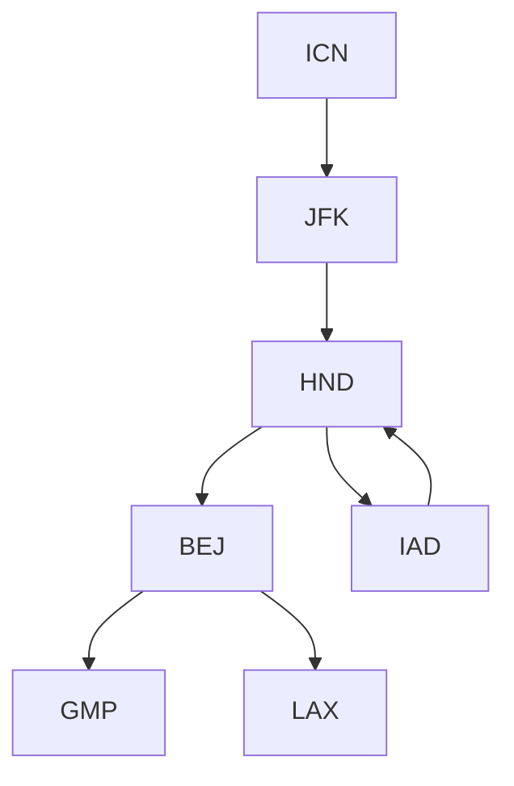

### 출처
* [DFS VS BFS](https://stackoverflow.com/questions/3332947/what-are-the-practical-factors-to-consider-when-choosing-between-depth-first-sea)
____
### 개요
* [[#DFS]]
* [[#DFS의 동작방식]]
* [[#DFS의 구현]]
* [[#DFS의 특징과 사용처]]
___
### DFS

**DFS는 Depth First Search의 약자로 그래프나 트리 형태의 데이터를 탐색할 때 활용된다**. 깊이 우선 탐색이라는 말은 같은 레벨의 위치한 원소들을 탐색하기 보단 아래로 계속해서 이동하며 탐색하는 방식을 말한다. 아래의 이미지를 보자.

![[Depth-First-Search.gif|300]]

<span class="red red-bg">DFS의 특징은 현재 분기를 완전히 탐색하기 전까지 다른 분기의 탐색을 미룬다는 것이다.</span> 체스 게임을 시뮬레이션을 한다고 가정해보자. 내가 둔 수를 기점으로 체스 게임이 진행되는 방법은 계속해서 수십가지가 발생할 것이다. DFS는 특정한 수를 계속해서 선택해나가며 게임이 완전히 종료될때 까지 탐색을 진행한다. 이때 게임이 만약 100수 번째에서 종료 됐다 한다면 99수 번째의 분기로 이동해 재 탐색을 진행한다. 따라서 <u><b>DFS는 특정한 분기의 끝까지 이동하는 속도는 빠른 편이다.</b></u>

* **DFS VS BFS**
	DFS와 BFS중 어떤 것을 선택하는 것이 적절한지 망설여지는 순간이 존재한다. 직관적으로 이를 구분하는 방법은 <b><u>하나의 완전한 분기를 우선적으로 탐색하는 것과 최적의 분기를 탐색하는 것 중에 어떤 것이 더 유리한지 비교하면 된다.</b></u> 체스게임을 예로 들면 체스게임이 끝나는 경우를 구한다면 DFS가 유리할 것이지만, 체스게임이 가장 빨리 끝나는 경우를 탐색한다면 BFS가 유리할 것이다. ([출처](https://stackoverflow.com/questions/3332947/what-are-the-practical-factors-to-consider-when-choosing-between-depth-first-sea))

____
### DFS의 동작방식

**DFS는 계속해서 분기를 스택에 담고 가장 최근에 담긴 것 부터 처리하는 LIFO 방식으로 동작한다. LIFO를 따르기 때문에 특정 분기가 종료되고 나면 스택의 상단에는 바로 이전 분기가 놓이게 된다.**

![[Depth-First-Tree-Traversal.gif]]

**DFS는 위의 이미지와 같이 자식을 스택에 집어 넣고 이를 우선적으로 pop해 사용하기 때문에 형제는 자식 보다 이후에 탐색**하게 된다. 형제도 탐색을 진행한다는 것을 기억하자. DFS는 완전 탐색 알고리즘의 대표격이다.

<span class="red red-bg">DFS는 하나의 분기에 대한 자식만 스택에 계속해서 쌓아 나가는 방식이기 때문에 동 레벨에 위치한 모든 노드를 저장하는 BFS보다 사용하는 메모리의 양이 적다.</span> 만약 BFS 였다면 D,E를 추가하고 F,G를 추가로 큐에 추가해야 했을 것이다.
___
### DFS의 구현

DFS는 두가지 방법으로 구현할 수 있다.

* 재귀 함수를 활용한 방법
* 지역변수 스택을 활용한 방법

재귀함수는 DFS의 각 분기를 함수의 콜 스택에 저장하는 방식으로 동작하기에 큰 관점에서 본다면 스택을 활용한다고 볼수 있을 것 같기도 하다. 두가지 방법으로 [프로그래머스 문제](https://school.programmers.co.kr/learn/courses/30/lessons/43164)를 해결하는 DFS 코드를 작성해보자.

문제는 전부 연결된 요소들이 주어졌을 때 연결된 모든 요소를 알파벳 적은 순으로 순회하는 코드를 작성하는 것이다. 이때 전부 연결된 요소들을 탐색하기 위해 DFS를 사용해 탐색한다.

* **재귀함수를 활용한 구현**
```python
def dfs(tickets, departure, path):
    path.append(departure)
    answer = None
    
    if len(tickets) == 0:
        return path
    
    for i, (dep, dest) in enumerate(tickets):
        if dep == departure:
            answer = dfs(tickets[:i] + tickets[i + 1:], dest, path)
            if answer: 
                return answer #리턴을 잘해줘야 한다.
    
    path.pop() #분기를 다시 원상 복구 해준다
    return answer #여기서 반환을 안하면 평생 None이 반환된다.
        
def solution(tickets):
    tickets.sort(key=lambda x: (x[0], x[1]))
    answer = dfs(tickets, "ICN", [])
    return answer
```

코드를 살펴보면 사용한 티켓을 제거하고 계속해서 분기를 내려가는 것을 확인할 수 있다. 분기를 내려감에 따라 티켓은 점차 줄어들고 경로는 점점 추가되는 것을 확인할 수 있다. 주요하게 봐야할 부분은 **경로 변수인데 조건을 만족할 때마다 추가하고 함수 종료직전에 pop해주는 것을 확인할 수 있다.**

**이는 경로 변수가 전체 공유 변수이기 때문으로 특정 분기가 끝나면 해당 분기에 담았던 요소도 다시 제거해주는 것이다.** 예를 들어 내가 A->B, A->C 총 두가지의 순회가 가능할 때 전자를 먼저 진행하고 후자를 진행할 경우 방문 경로는 A->C 이지만 B가 남아 A->B->C가 경로가 되는 불상사가 발생할 수 있다. 이에 따라 **B를 방문한 분기가 종료될때 B를 제거해주는 것이다.**

<u><b>추가적으로 재귀함수를 사용할 경우 반환 절을 신중히 작성해야 한다. 재귀 내부에서 반환하는 것 뿐만 아니라 재귀 밖에서 함수가 종료되는 것 까지 신경을 써줘야 한다.</b></u>

* **스택을 활용한 구현**
```python
def solution(tickets):
    tickets.sort(key=lambda x: (x[0], x[1]))
    stacks = ["ICN"]
    answer = []
    visited = [False] * len(tickets)

    while len(stacks):
        cur_loc = stacks[-1] #스텍의 가장 위
        for i, (dept, dest) in enumerate(tickets):
            if not visited[i] and cur_loc == dept: #방문 가능하면
                stacks.append(dest) #스텍에 추가
                visited[i] = True #방문 표시
                break #알파벳 순으로 이미 정렬돼 있으므로

        else:
            answer.append(stacks.pop()) #끝점이면 경로에 추가
    
    answer.reverse()
    return answer
```

재귀로 짰을 때는 단순했던 로직이 조금더 복잡해졌다. 스택으로 작성한 코드가 재귀로 작성한 코드보다 이해하기 어려웠는데, 핵심 아이디어는 동일하다. 

스택에는 방문한 공항이 저장되고 반복문을 실행하며 방문하지 않았고 방문 가능한 공항을 스택에 저장한다. 이때 알파벳 순으로 미리 정렬을 해놨기 때문에 다음에 방문할 공항은 가장 먼저 탐색되는 공항이 된다. 만약 더이상 방문할 공항이 없을 경우 끝점에 다다른 것이므로  스택에서 제거하고 정답 배열에 추가해준다. 

* **왜 끝점에 다다르기만 하면 곧장 정답 배열에 추가하나요?**
이는 우리가 알파벳 순서로 배열을 미리 정렬해뒀기 때문이다. 아래의 이미지를 살펴보자.



GMP를 마지막 순서로 방문 해야 한다. **각 공항에서 탐색을 진행할 때마다 알파벳 순으로 방문하는 속성이 지켜져야 하기 때문이다**. 따라서 해당 성질을 모두 만족한 GMP가 가장 하단에 위치하고 이후 BEJ으로 돌아와 해당 성질을 만족하는 경우와 만족하지 않는 경우들을 탐색한다. 

즉 <span class="red red-bg">백 트래킹의 방식으로 성질을 최대한 보존하는 케이스 부터 거슬러 올라가며 경우를 살펴보는 방식으로 탐색을 진행하는 것이다. </span> 따라서 각 DFS의 탐색마다 도달하게 되는 리프는 알파벳 순서로 방문이라는 성질을 최대한 만족하는 경우로 끝점 이전에 방문하는 정점이 된다. (2번째  DFS후 도달한 리프는 끝점 이전에 방문한 점이 된다)

> [!info]
> **가장 핵심적인 원리는 서브트리 부터 정복해 나가는 방식이라는 것이다.**

___
### DFS의 특징과 사용처

DFS의 장점중 하나는 <b><u>메모리를 적게 사용한다는 것으로 특정 레벨에 존재하는 모든 리프를 메모리에 올려야 하는 BFS와 달리 하나의 분기에 대한 내용만 메모리에서 관리하면 된다.</u></b>

또한 DFS는 리프 노드에 도달하는 과정이 빠르고 서브트리 부터 부분적으로 바텀-업 방식으로 분할 정복하는 것이 유리하므로 백 트래킹과 같은 방식에서 사용이 용이하다.

DFS는 다음과 같은 상황에 적절하게 사용할 수 있다.

1. 특정 그래프의 사이클 탐색
2. 강한 연결 요소 추출
3. 게임 상황 시뮬레이션
4. 트리 순회
5. 백 트래킹 알고리즘
