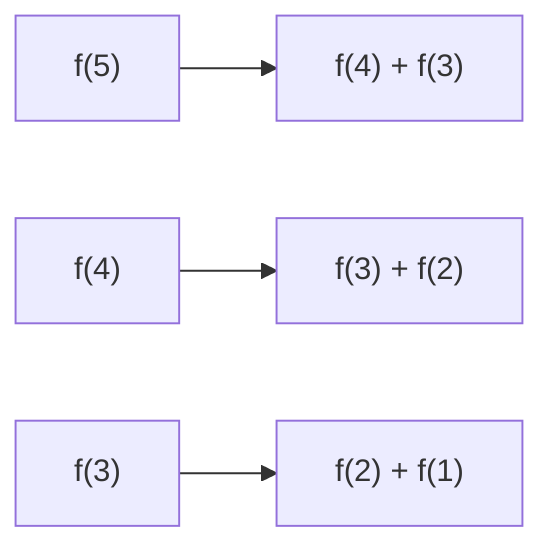

### 출처
* [dp란?](https://ai-sinq.tistory.com/entry/%EB%8F%99%EC%A0%81-%ED%94%84%EB%A1%9C%EA%B7%B8%EB%9E%98%EB%B0%8D-Dynamic-Programming-DP)
* [dp 문제](https://leetcode.com/problems/unique-paths/description)
___
### 개요
* [[#DP란?]]
* [[#DP VS Divide Conquer]]
* [[#Memozation]]
* [[#최적해]]
* [[#활용하기]]
___
### DP란?

<span class="red red-bg">다이나믹 프로그래밍은 중복된 부 문제들을 소유하고 있는 복잡한 문제를 바텀-업 방식으로 해결하는 알고리즘이다.</span> 다이나믹 프로그래밍은 작은 문제의 결과를 기억한 후 이를 재활용해 큰 문제를 해결할 때 활용한다.

다이나믹 프로그래밍을 활용하기 위해서는 이하의 조건들을 만족해야 한다.
- **최적 부분 구조(Optimal Substructure)**: 전체 문제의 최적해가 부분 문제의 최적해로부터 구해질 수 있어야 한다.
- **중복되는 부분 문제(Overlapping Subproblems)**: 부분 문제가 중복되어 여러번 반복 계산되어야 한다.

> [!info]
> **작은 해를 여러번 활용해서 큰 해를 구할 수 있음을 보장해야 한다.**

____
### DP VS Divide Conquer

- DP: 큰 문제를 작게 쪼갠 후 해결한 **작은 문제의 결과 값을 활용해 큰 문제를 해결한다. 이때 큰 문제와 작은 문제는 의존 관계이다**
- divide and conquer : 큰 문제를 작게 쪼갠후 각각의 문제를 해결한다. 이때 쪼갠 작은 문제의 결과를 큰 문제를 해결하는데 활용하진 않는다. **즉, 각 문제가 독립적으로 존재한다고 생각한다**. 일반적으로 top - down

다이내믹 프로그래밍은 원 문제를 작은 부분문제로 쪼개어 푼 뒤 그 결과를 합치는 분할정복(divide and conquer)과는 차이가 존재한다. <span class="red red-bg">분할정복은 부분문제의 해를 재사용하지 않고 그저 합치기만 한다. 하지만 다이내믹 프로그래밍은 부분문제의 해를 재사용해 큰 문제를 풀어낸다.</span>

분할 정복의 예시인 병합 정렬과 다이나믹 프로그래밍의 예시인 피보나치 수열을 기준으로 생각해보자. 

병합 정렬은 배열을 계속해서 반 씩 쪼개 나가며 정렬을 해나가는 방식이다. 주요한 점은 어떤 순서로 정렬을 진행하든 탑-다운이라는 성질만 유지되면 문제가 발생하지 않는다는 것이다. (좌 - 우는 중요치 않다) 
**이는 좌측의 원소를 정렬하는 행위가 우측의 원소를 정렬하는 작업에 영향을 미치지 않기 때문이다.**

피보나치는 순서가 중요하다. 만약 내가 `f(n)`의 값을 알고 싶다면 `f(n-1)`과 `f(n-2)`의 값이 필요하다. 다이나믹 프로그래밍은 이처럼 **각 문제 간의 의존도가 존재하고 큰 문제를 해결하고 싶다면 기반이 되는 작은 문제를 우선적으로 해결해야 한다.**
___
### Memozation

메모제이션은 문제의 일부분을 해결한 결과 값을 어느 한곳에 저장해 놓고 이를 활용하는 방식을 말한다. 주로 **캐싱 방식을 응용해 함수의 실행 결과를 저장한 뒤 반복 사용할 경우 재 계산을 진행하지 않고 저장한 값을 반환할 때 활용한다.**

메모제이션을 사용할 경우 연산을 반복 수행할 필요 없어지기 때문에 **중간 결과 값이 자주 활용될 경우 빛을 본다.**  앞서 말한 divde - conquer와의 차이점이 여기서 발생하는데 DP의 경우 이전의 연산한 결과를 여러번 활용해야 할 경우도 있다. 피보나치만 생각해봐도 결과 값을 2번 사용한다.

만약 피보나치 같은 문제를 divide-conquer로 접근한다면, 각 수를 그때 그때 연산해야하고 2번씩 연산해야하는 비효율이 발생할 것이다. (분할 정복으로 문제를 풀면 `f(5) = f(3) + f(2) + f(3)` 이 된다.)



___
### 최적해 

<span class="red red-bg">DP는 최소, 최대 등의 최적해를 찾는 경우에 주로 활용된다. 이는 최소, 최대는 특정 부분까지의 값이 최적임을 보장할 수 있기 때문이다.</span>

다익스트라를 생각해보자. 다익스트라는 최단 경로를 구하기 위해 우선적으로 해당 경로에 놓인 노드들 까지의 최단 경로를 우선적으로 구하고 해당 경로들을 조합해 전체 최단 경로를 만들어 낸다. **일부의 최적해를 누적해 전체에 대한 최적해를 찾아간다고 생각하면 쉽다.** 

이에 따라 그리디와 흡사하게 최적의 해를 계속해 찾아가는 식을 성립할 필요가 있다. 이를 주로 점화식이라 표현하고 이러한 점화식을 세우는 것이 다이나믹 프로그래밍에서 가장 핵심이 된다.


> [! info]
> **작은 문제를 풀었을 때 해당 부분까지의 최적 값을 명확히 구해낼 수 있어야 한다.**

___
### 활용하기

[[#출처]]에 언급된 문제 1을 확인해보자. 문제 1은 배열의 끝에 다다르게 하는 유일한 경로의 수를 탐색하는 문제이다. 이는 대표적인 DP 활용 예시로 작은 문제를 통해 큰 문제를 해결하고 같은 값을 반복해서 활용한다는 특징을 갖고 있다.

`(0,1)`과 `(1,0)`과 같이 0이 들어간 좌표로 최단 거리 이동을 하기 위한 방법은 1가지 밖에 없다. 반면 `(m, n)`의 좌표의 경우 `(m - 1, n)` 좌표 까지의 경우의 수와 `(m, n - 1)` 좌표 까지의 경우의 수의 합으로 구해진다. (이는 문제에서 우측과 하단으로 밖에 이동을 못한다고 강제했기 때문에 성립하는 식이다.)

따라서 점화식을 세우면 `f(m,n) = f(m - 1, n) + f(m, n - 1)`로 정리할 수 있다. `f(m + 1, n)` 의 값을 구한다고 하면 `f(m + 1,n) = f(m, n) + f(m + 1, n - 1)`이 되고 `f(m, n)`이 반복된다. 이에따라 메모제이션을 활용해야 한다.

```python
class Solution:
    def uniquePaths(self, m: int, n: int) -> int:
        cache = [[0 for _ in range(n)] for _ in range(m)]
        for i in range(m):
            for j in range(n):
                if i == 0 or j == 0:
                    cache[i][j] = 1 #벽에 붙은 값들은 경우가 1개
                else:
                    cache[i][j] = cache[i - 1][j] + cache[i][j - 1]
        
        return cache[m - 1][n - 1]
```

재귀를 활용해 top-down으로 구현할 수도 있다. 탑 다운으로 구현할 경우 일반적으로 재귀를 활용해 구현한다. 이 경우 재귀가 갖는 장단을 그대로 갖는 방식으로 구현된다고 보면 된다.

```python
class Solution:
    def dp(self, x, y, cache):
        if x == 0 or y == 0:
            return 1
        if cache[x - 1][y] == -1:
            cache[x - 1][y] = self.dp(x - 1, y, cache)
        if cache[x][y - 1] == -1:
            cache[x][y - 1] = self.dp(x, y - 1, cache)

        cache[x][y] = cache[x - 1][y] + cache[x][y - 1]
        return cache[x][y]

    def uniquePaths(self, m: int, n: int) -> int:
        cache = [[-1 for _ in range(n)] for _ in range(m)]
        cnt = self.dp(m - 1, n - 1, cache)
        return cnt
```

>[!바텀-업 VS 탑-다운]
> 간단한 로직을 작성할 때는 탑 다운이 빠를 때도 있지만, **바텀-업이 작은 문제를 쌓아 올려 큰 문제를 해결한다는 뉘앙스를 주기 때문에 더 직관적이다.** 