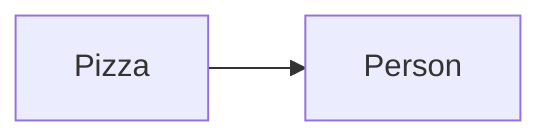
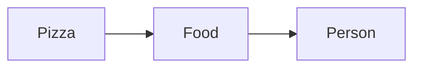
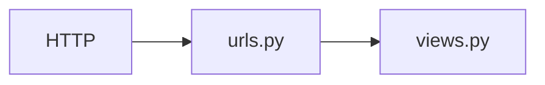

### 출처
* [약결합과 강결합](https://velog.io/@damiano1027/Java-%EA%B0%95%ED%95%9C-%EA%B2%B0%ED%95%A9%EA%B3%BC-%EC%95%BD%ED%95%9C-%EA%B2%B0%ED%95%A9)
___
### 개요
* [[#간단한 뷰와 URL 만들기]]
___
### 간단한 뷰와 URL 만들기

장고를 활용하기 위한 초 간단한 뷰를 하나 생성 해보자. 코드는 아래와 같다.

```python title:'views.py'
#views.py
from django.http import HttpResponse, HttpRequest

def hello(request: HttpRequest):
	return HttpResponse("Hello World")
```

장고의 각 뷰 함수는 규칙에 의한 요청 이라는 매개변수를 하나 이상 사용한다. 여기서는 request를 통해 해당 매개변수를 받고 있고 이는 HTTP 요청 정보를 포함한다. 또한 뷰 함수는 반환 값으로 HTTPResponse를 반환해야 한다. (이 역시 규칙이다.)

이제 위에서 작성한 뷰를 호출하기 위해선 적절한 URL과 해당 뷰를 매핑하는 작업이 필요하다. urls.py로 이동해 URL 매핑을 수정해주자. /hello 위치로 요청이 들어오면 hello 함수를 실행하게 매핑을 진행한다.

```python title:'urls.py'
from django.contrib import admin
from django.urls import path
from views import hello

urlpatterns = [path("admin/", admin.site.urls), path("hello", hello)]
```

___
### 장고가 요청을 처리하는 방법

장고가 처리하는 작업은 모두 `settings.py` 에서 시작된다. 요청을 전달 받을 경우 장고는 `settings.py` 내부에 존재하는 `ROOT_URLCONF`를  찾고 해당 변수 값을 통해 사용할 모듈을 파악한다.
`ROOT_URLCONF`는 기본적으로는 `urls.py`를 가리킨다. 

이후 urls.py로 이동한 후 URL 패턴이 일치 하는지를 패턴 리스트를 전부 순회하며 검색한다. 일치하는 패턴을 발견하면 이에 할당된 뷰 함수를 호출한다. ==**이때 뷰 함수는 첫번째 매개 변수로  HTTPRequest를 전달 받아야고 HTTPResponse 타입의 객체를 반환해야 한다.**== (함수와 URL이 매칭 되는 것을 유심히 봐야한다. 이는 [[WSGI]]의 특징이다.)

> [!info]
> **요약하면 설정에서 url 패턴의 위치를 확인하고 이후 패턴을 확인해 적절한 함수를 호출해주는 방식으로 동작한다는 것이다.**

___
### 동적인 웹 페이지 생성하기

간단하게 현재 서버 시간을 측정해 반환하는 함수를 작성해보자.  아래는 현재 시간을 측정하는 파이썬 코드 조각이다.

```python title:views.py
import datetime

def current_time(request: HttpRequest):
    now = datetime.datetime.now()
    return HttpResponse(now)
```

새로운 함수를 생성 했으므로 새로운 URL과 매핑 해주자.

```python title:urls.py
from views import hello, current_time

urlpatterns = [
    path("admin/", admin.site.urls),
    path("hello/", hello),
    path("time/", current_time),
]
```

이제 time/의 경로로 접속할 경우 연결한 링크로 정상적으로 로드 되는 것을 확인할 수 있다. 여기서 또 깸짝 놀라야 한다. 스크립트가  HTTP 요청에 따라 실행되는 것은 파격적인 일이기 때문이다. HTTP 요청을 함수로 연결하는 WSGI의 존재를 잊지 말자.
___
### URLConf를 활용한 약결합

**장고에선 이러한 뷰 <-> URL의 관계를 약결합 관계라 하며 이를 통해 유지보수가 쉽고 유연한 구조를 구현했다고 말한다.** 굉장해 보이지만, 사실 이는 거진 모든 웹 프레임워크가 갖는 특성이다. 여기서 말하는 약결합 관계란 간단히 말해 두개의 코드 조각 (혹은 객체)가 서로에게 큰 영향을 끼치지 않는 형태로 존재한다는 것이다.

**장고로 예시를 들자면 뷰 함수를 수정한다고 해서 URL 설정을 변경할 일은 거의 없다. 마찬가지로 URL을 수정한다해서 뷰 함수에 큰 영향을 끼치진 않는다.** 

예시를 장고로 든다면 묘하다... 사실 이러한 개념이 강하게 동작하는 곳은 자바이기에 자바 예시를 통해 강결합과 약결합에 대해 학습해보자. **강결합은 두 객체가 서로 깊게 연관돼 하나의 수정이 다른 객체에 큰 영향을 끼치는 경우를 말한다.** 아래의 코드를 보자.

```java title:strong.java
public class Person {
    private Chicken chicken;
    
    public Person() {
        this.chicken = new Chicken();
    }

    public void startEat() {
        chicken.eat();
    }
}

public class Chicken {
    public void eat() {
        System.out.println("치킨을 먹습니다.");
    }
}
```

사람 클래스는 치킨을 먹는다. 치킨 클래스는 "치킨을 먹습니다"라는 문구를 출력하는 기능을 수행한다. 이때 먹는 음식을 피자로 변경한다고 해보자. 코드는 다음과 같이 수정된다.

```java title:strong.java hl:2,5,15
public class Person {
    private Pizza pizza;
    
    public Person() {
        this.pizza = new Pizza();
    }

    public void startEat() {
        pizza.eat();
    }
}

public class Pizza {
    public void eat() {
        System.out.println("피자를 먹습니다.");
    }
}

```

먹는 음식을 하나 변경했을 뿐인데 Person 클래스의 내용을 대부분 수정해야 한다. 인터페이스를 활용해 이 상황을 해결해보자. 너무 딱 붙어있기 때문에 중간에 하나를 둬 결합 의존도를 낮추자는 아이디어이다. Food라는 인터페이스를 하나 생성해 강결합을 약결합으로 전환 해보자.

```java title:weak.java
public interface Food {
    void eat();
}

public class Chicken implements Food {
    @Override
    public void eat() {
        System.out.println("치킨을 먹습니다.");
    }
}

public class Pizza implements Food {
    @Override
    public void eat() {
        System.out.println("피자를 먹습니다.");
    }
}

public class Person {
    private Food food;

    public Person(Food food) {
        this.food = food;
    }

    public void startEat() {
        food.eat();
    }
}
```

Food는 eat라는 메서드를 갖고 있고 이를 피자와 치킨은 각각 다르게 구현한다. 이후 사람은 푸드 클래스를 생성해 먹는다. 이에 따라 Person 클래스는 이제 먹는 음식이 변경될 때 마다 코드를 수정할 필요가 없어졌다. 복잡하게 말했지만, 결국 인터페이스라는 중간 단계를 생성해 의존도를 낮춘 것이다. 

강결합의 그림은 아래와 같다.


약결합의 그림은 아래와 같다.


이를 통해 사람은 Food만 신경쓰면 된다.

장고에서 주장하는 약결합을 다이어그램으로 표현하면 아래와 같다. 장고는 URL과 뷰를 각자 다른 곳에서 관리한다. 따라서 아마 아래와 같은 구조를 통해 약결합을 구현했다 말하고 싶은 것 같다. 이렇지 않았다면 view 내부에서 url처리도 진행해야 했을 것이고 만약 url 처리 부분에 수정이 발생하면 뷰를 수정해야 했을 것이다. ([[초 간단 웹서버 만들고 실험하기]]를 참고하자 여긴 초 강결합이다)


___
### 동적 URL

동적인 컨텐츠를 생성하는 것에는 성공했다. 그렇다면 동적인 URL을 사용하고 싶다면 어떻게 해야할까? 예를 들어 URL경로로 `time/1`을 하면 현재부터 1시까지 몇시간이 남았는지 알려주는 방식으로 동작하게 만든다 해보자.

우선 URL 경로에서 모든 time 경로 아래의 정수들을 수신할 수 있어야 한다. 장고 매칭 패턴을 활용해 이를 가능케 한다. 

```python title:urls.py hl:4
urlpatterns = [
    path("admin/", admin.site.urls),
    path("hello/", hello),
    path("time/<int:hour>", current_time),
]
```

특정 경로 이후에 오는 값을 int형 변수 hour에 저장한다. 이 변수는 자동으로 등록한 뷰 함수에 전달된다. 뷰 함수는 다음과 같이 수정해준다.

```python title:views.py hl:1
def current_time(request: HttpRequest, hour: int):
    now = datetime.datetime.now()
    if now.hour < hour:
        next_hour = now.hour + 24
    else:
        next_hour = hour - now.hour

    dt = datetime.timedelta(hours=next_hour)

    return HttpResponse(dt)
```

hour가 매개변수로 전달되는 것을 확인할 수 있다. 만약 url 경로로 정수 변환이 불가한 문자열을 전달하면 어떻게 될까? foo를 집어 넣어보자. **이 경우 404 에러가 발생하는 것을 확인할 수 있다. 시간을 입력하지 않는 경우도 마찬가지로 에러가 발생한다.**
___
