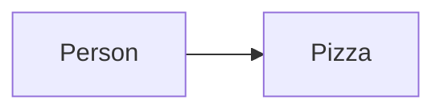
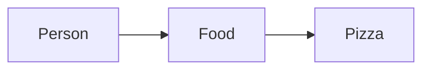
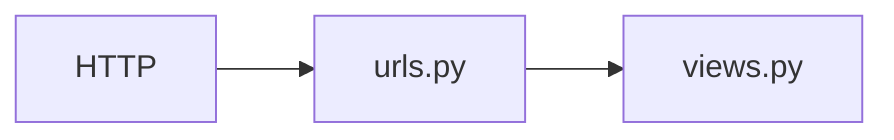

### 출처
* [약결합과 강결합](https://velog.io/@damiano1027/Java-%EA%B0%95%ED%95%9C-%EA%B2%B0%ED%95%A9%EA%B3%BC-%EC%95%BD%ED%95%9C-%EA%B2%B0%ED%95%A9)
* [경로 파라미터](https://velog.io/@sjp5554/Shoot-for-a-Clean-Elegant-URL-Scheme)
___
### 개요
* [[#간단한 뷰와 URL 만들기]]
* [[#장고가 요청을 처리하는 방법]]
* [[#동적인 웹 페이지 생성하기]]
* [[#URLConf를 활용한 약결합]]
* [[#동적 URL]]
* [[#URL 파라미터]]
* [[#include]]
* [[#URL 네임스페이스]]
___
### 간단한 뷰와 URL 만들기

장고를 활용하기 위한 초 간단한 뷰를 하나 생성 해보자. 코드는 아래와 같다.

```python title:'views.py'
#views.py
from django.http import HttpResponse, HttpRequest

def hello(request: HttpRequest):
	return HttpResponse("Hello World")
```

장고의 각 뷰 함수는 규칙에 의한 요청 이라는 매개변수를 하나 이상 사용한다. 여기서는 request를 통해 해당 매개변수를 받고 있고 이는 HTTP 요청 정보를 포함한다. 또한 뷰 함수는 반환 값으로 HTTPResponse를 반환해야 한다. (이 역시 규칙이다.)

이제 위에서 작성한 뷰를 호출하기 위해선 적절한 URL과 해당 뷰를 매핑하는 작업이 필요하다. urls.py로 이동해 URL 매핑을 수정해주자. /hello 위치로 요청이 들어오면 hello 함수를 실행하게 매핑을 진행한다.

```python title:'urls.py'
from django.contrib import admin
from django.urls import path
from views import hello

urlpatterns = [path("admin/", admin.site.urls), path("hello", hello)]
```

___
### 장고가 요청을 처리하는 방법

장고가 처리하는 작업은 모두 `settings.py` 에서 시작된다. 요청을 전달 받을 경우 장고는 `settings.py` 내부에 존재하는 `ROOT_URLCONF`를  찾고 해당 변수 값을 통해 사용할 모듈을 파악한다.
`ROOT_URLCONF`는 기본적으로는 `urls.py`를 가리킨다. 

urls.py로 이동한 후 URL 패턴이 일치 하는지를 `urlpatterns`에 저장된 패턴 리스트를 전부 순회하며 검색한다. 이후 일치하는 패턴을 발견하면 이에 할당된 뷰 함수를 호출한다. ==**이때 뷰 함수는 첫번째 매개 변수로  HTTPRequest를 전달 받아야고 HTTPResponse 타입의 객체를 반환해야 한다.**== (함수와 URL이 매칭 되는 것을 유심히 봐야한다. 이는 [[WSGI]]의 특징이다.)

꼭 HTTPResponse 객체를 반환할 필요는 없다. 미들웨어 등을 활용하면 별도의 처리가 가능하기 때문에 뷰에서 딕셔너리와 같은 파이썬 객체를 반환해도 상관은 없다. 하지만 통상적으로는 HTTP 응답을 돌려준다. (JSON이, HTML 등...)

> [!info]
> **요약하면 설정에서 url 패턴의 위치를 확인하고 이후 패턴을 확인해 적절한 함수를 호출해주는 방식으로 동작한다는 것이다.**

___
### 동적인 웹 페이지 생성하기

간단하게 현재 서버 시간을 측정해 반환하는 함수를 작성해보자.  아래는 현재 시간을 측정하는 파이썬 코드 조각이다.

```python title:views.py
import datetime

def current_time(request: HttpRequest):
    now = datetime.datetime.now()
    return HttpResponse(now)
```

새로운 함수를 생성 했으므로 새로운 URL과 매핑 해주자.

```python title:urls.py
from views import hello, current_time

urlpatterns = [
    path("admin/", admin.site.urls),
    path("hello/", hello),
    path("time/", current_time),
]
```

이제 time/의 경로로 접속할 경우 연결한 링크로 정상적으로 로드 되는 것을 확인할 수 있다. 여기서 또 깸짝 놀라야 한다. 스크립트가  HTTP 요청에 따라 실행되는 것은 파격적인 일이기 때문이다. HTTP 요청을 함수로 연결하는 WSGI의 존재를 잊지 말자.
___
### URLConf를 활용한 약결합

**장고에선 이러한 뷰 <-> URL의 관계를 약결합 관계라 하며 이를 통해 유지보수가 쉽고 유연한 구조를 구현했다고 말한다.** 굉장해 보이지만, 사실 이는 거진 모든 웹 프레임워크가 갖는 특성이다. 여기서 말하는 약결합 관계란 간단히 말해 두개의 코드 조각 (혹은 객체)가 서로에게 큰 영향을 끼치지 않는 형태로 존재한다는 것이다.

**장고로 예시를 들자면 뷰 함수를 수정한다고 해서 URL 설정을 변경할 일은 거의 없다. 마찬가지로 URL을 수정한다해서 뷰 함수에 큰 영향을 끼치진 않는다.** 

예시를 장고로 든다면 묘하다... 사실 이러한 개념이 강하게 동작하는 곳은 자바이기에 자바 예시를 통해 강결합과 약결합에 대해 학습해보자. **강결합은 두 객체가 서로 깊게 연관돼 하나의 수정이 다른 객체에 큰 영향을 끼치는 경우를 말한다.** 아래의 코드를 보자.

```java title:strong.java
public class Person {
    private Chicken chicken;
    
    public Person() {
        this.chicken = new Chicken();
    }

    public void startEat() {
        chicken.eat();
    }
}

public class Chicken {
    public void eat() {
        System.out.println("치킨을 먹습니다.");
    }
}
```

사람 클래스는 치킨을 먹는다. 치킨 클래스는 "치킨을 먹습니다"라는 문구를 출력하는 기능을 수행한다. 이때 먹는 음식을 피자로 변경한다고 해보자. 코드는 다음과 같이 수정된다.

```java title:strong.java hl:2,5,15
public class Person {
    private Pizza pizza;
    
    public Person() {
        this.pizza = new Pizza();
    }

    public void startEat() {
        pizza.eat();
    }
}

public class Pizza {
    public void eat() {
        System.out.println("피자를 먹습니다.");
    }
}

```

먹는 음식을 하나 변경했을 뿐인데 Person 클래스의 내용을 대부분 수정해야 한다. 인터페이스를 활용해 이 상황을 해결해보자. 너무 딱 붙어있기 때문에 중간에 하나를 둬 결합 의존도를 낮추자는 아이디어이다. Food라는 인터페이스를 하나 생성해 강결합을 약결합으로 전환 해보자.

```java title:weak.java
public interface Food {
    void eat();
}

public class Chicken implements Food {
    @Override
    public void eat() {
        System.out.println("치킨을 먹습니다.");
    }
}

public class Pizza implements Food {
    @Override
    public void eat() {
        System.out.println("피자를 먹습니다.");
    }
}

public class Person {
    private Food food;

    public Person(Food food) {
        this.food = food;
    }

    public void startEat() {
        food.eat();
    }
}
```

Food는 eat라는 메서드를 갖고 있고 이를 피자와 치킨은 각각 다르게 구현한다. 이후 사람은 푸드 클래스를 생성해 먹는다. 이에 따라 Person 클래스는 이제 먹는 음식이 변경될 때 마다 코드를 수정할 필요가 없어졌다. 복잡하게 말했지만, 결국 인터페이스라는 중간 단계를 생성해 의존도를 낮춘 것이다. 

강결합의 그림은 아래와 같다.


약결합의 그림은 아래와 같다.


이를 통해 사람은 Food만 신경쓰면 된다.

장고에서 주장하는 약결합을 다이어그램으로 표현하면 아래와 같다. 장고는 URL과 뷰를 각자 다른 곳에서 관리한다. 따라서 아마 아래와 같은 구조를 통해 약결합을 구현했다 말하고 싶은 것 같다. 이렇지 않았다면 view 내부에서 url처리도 진행해야 했을 것이고 만약 url 처리 부분에 수정이 발생하면 뷰를 수정해야 했을 것이다. ([[초 간단 웹서버 만들고 실험하기]]를 참고하자 여긴 초 강결합이다)


___
### 동적 URL

동적인 컨텐츠를 생성하는 것에는 성공했다. 그렇다면 동적인 URL을 사용하고 싶다면 어떻게 해야할까? 예를 들어 URL경로로 `time/1`을 하면 현재부터 1시까지 몇시간이 남았는지 알려주는 방식으로 동작하게 만든다 해보자.

우선 URL 경로에서 모든 time 경로 아래의 정수들을 수신할 수 있어야 한다. 장고 매칭 패턴을 활용해 이를 가능케 한다. 

```python title:urls.py hl:4
urlpatterns = [
    path("admin/", admin.site.urls),
    path("hello/", hello),
    path("time/<int:hour>", current_time),
]
```

특정 경로 이후에 오는 값을 int형 변수 hour에 저장한다. 이 변수는 자동으로 등록한 뷰 함수에 전달된다. 뷰 함수는 다음과 같이 수정해준다.

```python title:views.py hl:1
def current_time(request: HttpRequest, hour: int):
    now = datetime.datetime.now()
    if now.hour < hour:
        next_hour = now.hour + 24
    else:
        next_hour = hour - now.hour

    dt = datetime.timedelta(hours=next_hour)

    return HttpResponse(dt)
```

hour가 매개변수로 전달되는 것을 확인할 수 있다. 만약 url 경로로 정수 변환이 불가한 문자열을 전달하면 어떻게 될까? foo를 집어 넣어보자. **이 경우 404 에러가 발생하는 것을 확인할 수 있다. 시간을 입력하지 않는 경우도 마찬가지로 에러가 발생한다.**
___
### URL 파라미터

**장고는 URL을 통해 특정한 파라미터를 전달받아 이를 뷰로 넘겨주는 작업을 수행할 수 있다. 즉, 패스 파라미터를 캡쳐해 뷰로 전달하는 것이 가능하다.**  예를 들어 year라는 경로 변수가 존재하고 이를 뷰로 넘겨줘야 한다고 생각해보자.

우선적으로 생각해봐야 할 것은 경로 파라미터의 입력 방식과 유효성 검증 방식이다. URL로 전달된 변수의 위치를 정확히 캡쳐해 추출해야 하고 이후 숫자가 아닌 잘못된 타입이 전달 됐는지 검증해야 한다. 장고의 경로 파라미터는 아래와 같은 방식으로 두 문제를 모두 해결한다.

```python
urlpatterns = [url("data/<int:year>", year_view)] #정수가 아닌 타입이 전달되면 오류
```

이를 통해 우리는 우리가 URL에서 원하는 부분만을 추출하고 이것이 정수 타입인지 검증하는 과정까지 수행가능해졌다. 하지만 년도는 단순 정수 값이 아니라 4자리로 이뤄진 형태를 띄고있기 때문에 좀 더 까다로운 설정이 요구된다. **이런 경우 정규식을 통해 파라미터의 형태를 더욱 상세히 지정할 수 있다.**

`<int:parameter_name>` 와 같은 구조도 정규식을 편하게 표현하기 위해 추가된 기능으로 해당 태그를 장고는 `[0-9]+` 형태의 정규식으로 이해한다. 아래와 같이 URL 패턴을 작성할 경우 4개의 정수 형태로 값이 전달 돼야만 뷰 함수를 호출 할 수 있다.

```python
urlpatterns = [url("data/<year>[0-9]{4}", year_view)] #정수 4개가 아니면 오류
```

___
### include

url이 많아지고 앱의 규모가 커지게 되면 하나의 urls.py에서 모든 경로를 관리하기 어려워진다. `include()`를 사용하면 이러한 경로 관리가 수월해지는데 아래의 코드를 보자.

```python

from django.contrib import admin
from django.urls import path, include
from django.urls import include, path

urlpatterns = [
    path("admin/", admin.site.urls),
    path("post/", include("post.urls")),
    path("user/", include("user.urls")),
]

```

`include`를 활용하면 장고는 앞에 매칭된 부분까지의 url을 제거하고 include에서 명시한 url conf 모듈로 요청을 전달한다. 따라서 `post/`로 시작하는 요청의 경우 `post.urls` 로 요청이 전달되고 해당 파일에서 추가적으로 요청 처리를 진행한다.

모듈외에 별도의 url 패턴을 지정해 포함시키는 것 또한 가능하다. 아래의 코드를 보자.

```python
extra_patterns = [
    path("view/", view_post),
    path("posts/", posts),
]

urlpatterns = [
    path("admin/", admin.site.urls),
    path("post/", include(extra_patterns)),
]

```

별도의 모듈을 정의하지 않고 url 패턴을 정의해 포함시키는 방식도 가능하다. 하지만 통상적으로 하위 경로가 많아진다면 앱을 생성하고 해당 앱 내부의 `urls.py`에서 라우팅을 관리해주는 것이 좋다.
___
### URL 네임스페이스

**URL은 길어지거나 많아지면 관리가 어려워진다. 만약 URL 하나의 이름을 수정하는 상황이 발생하면 해당 URL을 하드코딩해 사용하고 있던 모든 코드는 수정을 진행해야 한다.** 이에 따라 URL을 별도의 이름을 통해 관리하는 URL 별칭 개념이 등장했다.

```python hl:4
from django.urls import path
from .views import PostView, PostListView

app_name = "post" #name space 
urlpatterns = [
    path("<int:post_id>", PostView.as_view(), name="view"),
    path("", PostView.as_view(), name="create"),
    path("list", PostListView.as_view(), name="list"),
]

```

별칭을 붙여 놓을 경우 URL 경로를 직접 입력할 필요 없이 별칭을 통해 경로를 획득할 수 있다. 이는 장고의 URL 매퍼가 `reverse()`를 통해 역방향으로 URL을 획득하는 절차를 지원하기 때문이다. `reverse`는 별칭을 입력 받으면 해당 별칭과 매칭되는 URL을 반환한다. 이 경우 별칭을 통해서 URL을 획득하는 방식으로 동작하기 때문에 **URL이 변경 되더라도 기존 코드의 변경을 최소화 할 수 있다. 또한 불편하게 모든 경로를 입력할 필요가 없어진다**

아래는 `reverse()`를 통해 별칭으로 URL을 획득하는 예제이다. 별칭 앞에 post라는 의문의 문자열이 추가로 존재하는데 이는 별칭의 네임 스페이스를 의미한다. (app_name 변수로 설정한다) **URL이 많아 질수록 별칭 또한 중복의 여지가 존재하고 이름 중복에 따른 충돌 가능성이 높아진다.** 이를 활용하면 네임 스페이스 별로 별도의 별칭 공간을 확보 받으므로 별칭의 충돌을 회피할 수 있다.

```python
url = reverse("post:view", kwargs={"post_id": 1})
```

