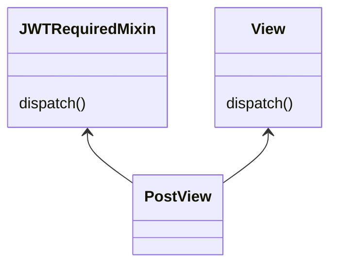

#django #super #python #다중상속
### 출처
* [mro](https://dojang.io/mod/page/view.php?id=2388)
* [mixin](https://medium.com/@bobbykboseoffice/mastering-mixins-in-django-acda05b34dd6)
___
### 개요
* [[#장고의 다양한 뷰]]
* [[#클래스 뷰의 동작]]
* [[#믹스인]]
* [[#다중상속이 싫어요]]
* [[#파이썬의 super]]
___
### 장고의 다양한 뷰

앞서 [[뷰와 URL conf]]를 살펴보며 장고에서의 뷰에 대해 학습했다. 뷰는 특정한 HTTP 리퀘스트에 매핑되는 로직으로 요청에 대한 처리를 진행하고 응답을 반환하는 객체였다. 

앞서 살펴본 뷰는 함수 형태로 `request` 변수를 전달받고 `HTTPResponse`를 반환했다. 요청에 대한 정보는 `request` 매개변수에 모두 저장돼 전달 됐고 적절한 처리를 위해서는 유저가 직접 데이터를 파싱해 작업할 필요가 있었다. 아래의 코드를 보자. 

```python
def my_view(request):
	method = request.method
	if methond == "GET":
		return HTTPResponse("index.html")
	if method == "POST":
		return HttpResponseNotAllowed()
```

**메서드 타입을 유저가 직접 파싱해 처리하는 모습을 볼 수 있다.** 내가 GET 메서드 하나를 제공하는 뷰를 작성하려고 할 때마다 위와 같이 파싱 작업 및 잘못된 메서드 요청에 대한 예외처리를 진행해야 하는데 이는 여간 번거로운 작업이 아니다.

이에 따라 장고는 정해진 진 틀에 맞춰 작업할 수 있게 클래스 기반의 뷰를 제공한다. 아래의 코드를 보자.

```python
from django.views import View

class MyView(View):
	def get(request):
		return HTTPResponse("index.html")

	def post(request):
		return HttpResponseNotAllowed()
```

클래스를 활용하면 `get`과 `post`를 오버라이딩 하는 방식으로 구현 되며 ==장고는 알아서 전달받은 HTTP 요청에 따라 적절한 메서드를 호출하고 예외처리를 진행한다.==

클래스 기반의 뷰를 사용할 경우 주요 로직은 별도의 내부 메서드로 구현하고 리퀘스트에 대한 응답은 `get,post` 등의 메서드에서 처리하면 되기 때문에 구조를 구분하는데 장점이 존재한다. 아래 코드를 보자.

```python
from django.views import View
from .models import User

class MyView(View):
	def get_user(id_):
		user = User.get(id = id_)
		return user
		
	def get(request):
		id_ = request.POST["id"]
		user = self.get_user(id_)
		return HTTPResponse("index.html", {"user":user})

	def post(request):
		return HttpResponseNotAllowed()
```

위와 같이 ORM을 사용하는 부분이나 주요 로직을 별도의 메서드로 정의하고 요청에 관한 처리는 정해진 메서드 내부에서 처리하면 되기 때문에 더욱 직관적인 구조를 설정할 수 있다.

이렇게 설명하면 클래스 기반의 뷰를 사용하는 것이 무조건 유리할 것으로 보이지만, 단점 또한 존재한다. 

* **번잡함**
	**장고는 하나의 URL에 하나의 클래스 뷰만을 연결할 수 있다.** 따라서 간단한 GET 요청 하나만을 처리해야할 경우 이 요청 하나를 처리하기 위해 클래스를 정의하고 메서드를 작성해야 한다. 이는 무척 번거로운 작업이고 코드 상의 낭비도 커진다.

* **딱딱함**
	클래스 뷰는 장고에서 정해준 형식이기 때문에 별도의 응답이나 예외처리를 진행하고 싶은 경우 커스텀에 어려움이 존재한다. 

>[!info]
> **따라서 복잡한 로직이 많고 재사용 가능성이 높은 경우에는 클래스를 사용하는 것이 유리하고 아닌 경우 간단하게 함수로 처리하는 것이 효과적이다.**

___
### 클래스 뷰의 동작

함수 뷰는 URL과 매핑된 함수를 직접적으로 바로 호출하는 방식으로 동작한다. 그렇다면 클래스로 구현된 뷰는 어떻게 동작할까?

```python title:urls.py
from django.urls import path
from user.views import LoginView, RegisterView

app_name = "user"
urlpatterns = [
    path("login", LoginView.as_view(), name="login"),
    path("register", RegisterView.as_view(), name="register"),
]

```

클래스로 구현된 뷰는 `as_view()`를 통해 함수로 변환된다.==**`as_view()`는 전달받은 리퀘스트 정보를 파싱해 객체의 각종 속성을 초기화한 후 `dispatch()`메서드를 래핑하는  뷰를 반환한다. `as_view()`는 URL로 요청이 전달될 때마다 실행되며  이때 `View` 클래스의 인스턴스를 생성하고 속성을 초기화하는 작업을 수행한다.**==

```python title:base.py hl:2, hl:2,17,44
@classonlymethod
    def as_view(cls, **initkwargs):
        """Main entry point for a request-response process."""
        for key in initkwargs:
            if key in cls.http_method_names:
                raise TypeError(
                    "The method name %s is not accepted as a keyword argument "
                    "to %s()." % (key, cls.__name__)
                )
            if not hasattr(cls, key):
                raise TypeError(
                    "%s() received an invalid keyword %r. as_view "
                    "only accepts arguments that are already "
                    "attributes of the class." % (cls.__name__, key)
                )

        def view(request, *args, **kwargs):
            self = cls(**initkwargs)
            self.setup(request, *args, **kwargs)
            if not hasattr(self, "request"):
                raise AttributeError(
                    "%s instance has no 'request' attribute. Did you override "
                    "setup() and forget to call super()?" % cls.__name__
                )
            return self.dispatch(request, *args, **kwargs)

        view.view_class = cls
        view.view_initkwargs = initkwargs

        # __name__ and __qualname__ are intentionally left unchanged as
        # view_class should be used to robustly determine the name of the view
        # instead.
        view.__doc__ = cls.__doc__
        view.__module__ = cls.__module__
        view.__annotations__ = cls.dispatch.__annotations__
        # Copy possible attributes set by decorators, e.g. @csrf_exempt, from
        # the dispatch method.
        view.__dict__.update(cls.dispatch.__dict__)

        # Mark the callback if the view class is async.
        if cls.view_is_async:
            markcoroutinefunction(view)

        return view
```

이 디스패치 함수가 중요한데, 이는 요청으로 전달 받은 인자를 기준으로 알맞은 함수에 적절한 파라미터를 전달해 호출하는 역할을 수행한다.

```python title:base.py
class View:
	...
	...
    def dispatch(self, request, *args, **kwargs):
        # Try to dispatch to the right method; if a method doesn't exist,
        # defer to the error handler. Also defer to the error handler if the
        # request method isn't on the approved list.
        if request.method.lower() in self.http_method_names:
            handler = getattr(
                self, request.method.lower(), self.http_method_not_allowed
            ) #HTTP 메서드에 알맞는 메서드 획득
        else:
            handler = self.http_method_not_allowed
        return handler(request, *args, **kwargs) #적절한 메서드 호출
```

디스패치 함수는 모든 메서드가 시작되기 이전 뷰 함수를 초기화하는 부분에서 동작한다. 따라서 **특정 뷰를 호출하기 이전에 수행 할 작업이 있는 경우 이를 오버라이딩해 유리하게 사용할 수 있다.**

> [!info]
> **클래스 뷰는 요청 정보를 적절한 속성으로 초기화하고 `dispatch`를 통해 적절한 메서드를 호출 한다.**

____
### 믹스인

**믹스인은 재사용 가능한 코드 조각으로 클래스에 다양한 부가기능을 추가하기 위해 사용된다.** 믹스인 자체가 하나의 클래스로 관리돼며 각종 모델, 뷰, 폼에 추가돼 사용된다. 

==**믹스인은 상속을 통해 사용되며 특히 다중상속을 주로 활용한다. (이 부분이 몹시 구리다)**== 아래의 코드를 보자.

```python title:views.py hl:8,22
class JWTRequiredMixin(AccessMixin):
    def set_payload(self, payload: PayloadValidator):
        self.payload = payload

    def get_payload(self) -> PayloadValidator:
        return self.payload

    def dispatch(self, request: HttpRequest, *args, **kwargs):
        auth_header: str = request.headers["Authorization"]
        protocol, _, token = auth_header.partition(" ")
        if protocol.lower() != "bearer":
            raise PermissionDenied("Invalid Protocol")

        jwt = JWT()
        if payload := jwt.decode(token):
            self.set_payload(payload)
        else:
            raise PermissionDenied("Invalid Token")

        return super().dispatch(request, *args, **kwargs)  # dispatch from View

class PostView(JWTRequiredMixin, View):
    def get(self, request: HttpRequest, post_id: int) -> JsonResponse:
        post = Post.objects.get(id=post_id)
        if post:
            data = post.to_dict()
        else:
            data = {"msg": "No posts"}
        return JsonResponse(data=data, safe=False)

    def post(self, request: HttpRequest) -> JsonResponse:
        body = json.loads(request.body)
        post_data = PostValidator(**body)
        post = Post(**post_data.model_dump())
        post.save()
        return JsonResponse(data={"msg": f"success {post}"}, status=201)


```

`JWTRequiredMixin`은 JWT 로그인과 관련된 기능을 제공하는 믹스인으로 API를 호출하기 전에 사용자가 로그인을 진행했는지 여부를 검사한다. **따라서 로그인이 필요한 특정 뷰에 추가해 사용할 경우 유용한데 이때 다중상속으로 인한 몇가지 문제가 발생한다.** 

`PostView`를 살펴보면 뷰를 상속 받음으로 매핑된 URL로 요청이 들어올 경우 `dispatch()` 메서드가 호출된다. 이때 흥미로운 부분은 `JWTRequiredMixin, View` 모두 해당 메서드를 구현하고 있다는 점이다. **따라서 어디에 구현된 `dispatch()`를 호출 할지가 모호한데 파이썬은 `mro(Method Resolution Order)`라는 상속 순서를 기준으로 호출을 진행한다.**


**파이썬의 mro는 먼저 상속한 클래스가 빠른 순서에 위치하며 파이썬의 상속은 왼쪽에서 오른쪽 방향으로 진행된다.** 즉 `PostView` 관점에서 메서드 탐색 순서는 `self -> JWTRequiredMixin -> View`에 순서를 띄게된다. 따라서 `JWTRequiredMixin`에 존재하는 `dispatch`가 우선적으로 호출된다.

순서를 정리하면 다음과 같다. `View.as_view() -> PostView -> JWTRequiredMixin.dispatch()`
`urls.py`에서 `as_view()`를 통해 `PostView`를 상속 받고 디스패치 메서드를 호출하는 방식으로 동작한다.

>[!Info]
>**다중상속의 경우 메서드 탐색 순서를 지정할 필요가 있고 파이썬은 이를 MRO로 결정한다. 또한 MRO는 왼쪽에서 오른쪽 순서로 결정된다.**

____
### 다중상속이 싫어요

진짜 너무 어지러운 부분은 여기서 시작된다. 아래 코드를 다시 살펴보자.

```python title:views.py hl:20
class JWTRequiredMixin(AccessMixin):
    def set_payload(self, payload: PayloadValidator):
        self.payload = payload

    def get_payload(self) -> PayloadValidator:
        return self.payload

    def dispatch(self, request: HttpRequest, *args, **kwargs):
        auth_header: str = request.headers["Authorization"]
        protocol, _, token = auth_header.partition(" ")
        if protocol.lower() != "bearer":
            raise PermissionDenied("Invalid Protocol")

        jwt = JWT()
        if payload := jwt.decode(token):
            self.set_payload(payload)
        else:
            raise PermissionDenied("Invalid Token")

        return super().dispatch(request, *args, **kwargs)  # AccessMixin의 디스패치 호출??
```

`JWTRequiredMixin`의 `dispatch` 함수가 우선적으로 호출된다는 것은 확인했다. `dispatch` 함수의 내부를 살펴보면 마지막 줄에서 `super().dispatch(request, *args, **kwargs)` 함수를 다시금 호출하는 것을 확인할 수 있는데, 이 `super().dispatch()`는 어디에 정의돼 있을까?

*당연히 `AccessMixin`에 정의돼 있는거 아닌가요?*

```python title:mixins.py
class AccessMixin:
    """
    Abstract CBV mixin that gives access mixins the same customizable
    functionality.
    """

    login_url = None
    permission_denied_message = ""
    raise_exception = False
    redirect_field_name = REDIRECT_FIELD_NAME

    def get_login_url(self):
        """
        Override this method to override the login_url attribute.
        """
        login_url = self.login_url or settings.LOGIN_URL
        if not login_url:
            raise ImproperlyConfigured(
                f"{self.__class__.__name__} is missing the login_url attribute. Define "
                f"{self.__class__.__name__}.login_url, settings.LOGIN_URL, or override "
                f"{self.__class__.__name__}.get_login_url()."
            )
        return str(login_url)

    def get_permission_denied_message(self):
        """
        Override this method to override the permission_denied_message attribute.
        """
        return self.permission_denied_message

    def get_redirect_field_name(self):
        """
        Override this method to override the redirect_field_name attribute.
        """
        return self.redirect_field_name

    def handle_no_permission(self):
        if self.raise_exception or self.request.user.is_authenticated:
            raise PermissionDenied(self.get_permission_denied_message())

        path = self.request.build_absolute_uri()
        resolved_login_url = resolve_url(self.get_login_url())
        # If the login url is the same scheme and net location then use the
        # path as the "next" url.
        login_scheme, login_netloc = urlparse(resolved_login_url)[:2]
        current_scheme, current_netloc = urlparse(path)[:2]
        if (not login_scheme or login_scheme == current_scheme) and (
            not login_netloc or login_netloc == current_netloc
        ):
            path = self.request.get_full_path()
        return redirect_to_login(
            path,
            resolved_login_url,
            self.get_redirect_field_name(),
        )
```

코드를 아무리 살펴봐도 `dispatch()` 는 보이지 않는다. 해당 메서드는 어디에 정의돼 있는 것일까? 정답은 같이 상속을 받는 `View` 함수에 있다. 
#### 파이썬의 super
==**파이썬의 `super()`는 부모 클래스의 메서드를 호출하지 않는다.  super()는 자신 클래스의 MRO에서 자기 자신 다음에 위치한 클래스를 기준으로 메서드를 호출한다.**==
따라서 현재 클래스의 MRO가 `PostView -> JWTRequiredMixin -> View -> AccessMixin`
의 순서를 따르기 때문에 `JWTRequiredMixin`에서 `super`를 호출하면 `View`에 접근하게 되는 것이다.

이 방식은 몹시 복잡하면서도 난해한데 코드의 흐름을 파악하기도 어렵고 잘 와 닿지도 않는다. 어지러운 부분들은 다음과 같다.

* **공통 구현으로 인한 충돌**
	코드 흐름을 따라가기 어려운 부분있다. 어떤 메서드가 호출 될지 파악하는 것이 어렵다.

* **이상한 실행흐름**
	super를 호출할 때 부모가 아닌 다른 클래스에 접근되는 플로우 자체가 직관성이 떨어진다.

* **에디터 미지원**
	VScode는 다중상속 코드를 이해하지 못한다. 

>[!다중상속은 죄가 없다]
>**다중상속 자체는 적절히 사용하면 좋은 기능이다. 적절한 사용을 위해선 상속하는 각 객체가 독립성을 가져야하고 책임이 명백히 분리돼 충돌이 존재하지 않아야 한다.**

> [!MRO는 클래스마다 존재한다]
> **MRO는 클래스마다 존재하는 속성이며 다행히 런타임에 수정이 발생하지는 않는다. 인스턴스 별로 MRO가 다르거나 하는 끔찍한 일은 다행히 발생하지 않는다.** 

___
### super 없이 직접 호출하기

천만다행이지만, 파이썬에는 `super` 이외에도 어떠한 클래스에 존재하는 메서드를 사용할 것인지를 직접적으로 정해줄 수 있다. 아래 코드를 보자.

```python hl:10,11
class Parent1:
    def greeting(self):
        print("Hello from Parent1")
class Parent2:
    def greeting(self):
        print("Hello from Parent2")
class Child(Parent1, Parent2):
    def greeting(self):
        print("Hello from Child")
        Parent1.greeting(self)  # Parent1의 greeting 메서드 호출
        Parent2.greeting(self)  # Parent2의 greeting 메서드 호출
```

10, 11번 줄의 코드를 확인 해보자. **클래스에 존재하는 메서드에 self를 직접적으로 넘겨줌으로써 특정 클래스에 존재하는 메서드를 명시적으로 호출할 수 있다.**  따라서 만약 `super`를 사용하는 것이 모호 하다면 위와 같이 직접적으로 호출하게 코드를 수정할 수 있다. `self`에는 객체의 인스턴스가 오는 것이 정상이지만, 파이썬은 타입체킹을 딱히 실시하지 않기 때문에 `self` 위치에 무엇인가 전달 되기만 하면 위와 같은 호출은 가능하다.

그렇다고 아무 값이나 전달하면 다음의 문제가 발생할 수 있다.

```python hl:20,22
class Parent1:
    a = 10

    def greeting(self):
        print("Hello from Parent1: ", self.a)


class Parent2:
    b = 20

    def greeting(self):
        print("Hello from Parent2: ", self.b)
        Parent1.greeting(self)


class Child(Parent1, Parent2):
    def greeting(self):
        print("Hello from Child")
        Parent1.greeting(self)  # Parent1의 greeting 메서드 호출
        Parent2.greeting(self)  # runs ok
        p2 = Parent2()
        p2.greeting()  # error
```

클래스에 몇가지 속성을 추가하고 인스턴스를 직접 생성해 호출하는 경우를 추가했다. 흥미로운 점은 20번 줄은 성공하지만 22번 줄은 실패한다는 점이다. 20번에서 `self`에 전달하는 객체는 child 객체가 되고 이는 다중상속을 받기 때문에 모든 속성 `a,b`에 접근이 전부 가능하다. 하지만 22번줄에서 전달하는 `self`는 `Parent2`객체이고 이에 따라 속성 참조에 오류가 발생한다.  이러한 방식은 **`self`에는 해당 클래스의 인스턴스만 전달돼야 한다는 디자인 패턴을 어기고 코드를 난해하게 만든다.**

*따라서 적절한 호출을 위해선 인스턴스를 기반으로 호출을 진행해야 한다. 그러나 이 또한 호락호락하지 않다.*

```python hl:5,6
class JWTRequiredMixin(AccessMixin):
	...
	...
	return super().dispatch(self,request, *args, **kwargs) # 원본
	return View.dispatch(self, request, *args, **kwargs)  # 실행가능
	return View(*args, **kwargs).dispatch(self, request) # 에러 발생
  
class PostView(JWTRequiredMixin, View):
	...
```
6번에서 발생하는 에러부터 살펴보자 이는 내가 생성한 `View` 인스턴스의 속성이 적절히 초기화 되지 않았기 때문에 발생한다. [[#클래스 뷰의 동작]]에 정의된 `as_view()` 메서드의 코드를 보면 직관적으로 확인할 수 있는데 우리가 만든 뷰는 URL을 통해 접근하지 않았기 때문에 `as_view()`가 실행되지 않았고 이로 인해 객체 내부의 속성이 초기화 되지 못했다.

하지만 5번의 경우 `self`를 전달하고 있고 이는`PostView` 객체를 의미한다. 해당 객체는 `View`를 상속받기 때문에 `url` 요청이 발생할 때 `as_view()`를 통해 뷰 객체 내부의 적절한 초기화가 진행된다. 이에 따라 5번 코드는 정상 동작이 가능하다.

> [!super()를 쓰는 이유]
> 다중 상속에서 인스턴스를 신규로 생성해 메서드를 호출하면 속성이 언제 초기화 됐을지 모르는 문제가 발생한다. 이에 따라 `self`를 최대한 활용해야 하는데 앞서 말했듯 특정 클래스의 메서드에 다른 클래스의 인스턴스를 전달하는 것은 안티패턴이다. 이에 따라 super()를 활용해 이를 다른 방식으로 표기한다.
> 


