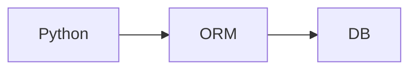
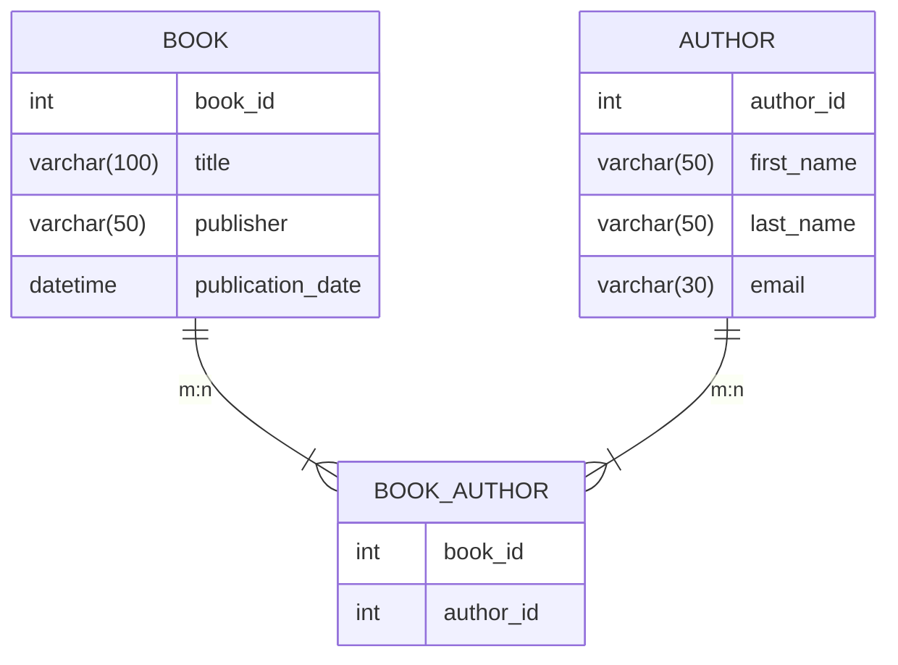

### 출처
* [django app vs project](https://stackoverflow.com/questions/19350785/what-s-the-difference-between-a-project-and-an-app-in-django-world)
* [ORM이 뜻대로 안될 때](https://medium.com/@heeee/til-django-raw-sql-%EC%BF%BC%EB%A6%AC-%EC%82%AC%EC%9A%A9%ED%95%98%EA%B8%B0-ac427965ca79)
___
### 개요

___
### 모델이란

웹 사이트를 동작 시키기 위해선 수많은 데이터가 필요하고 이를 관리하기 위해선 데이터베이스의 존재가 필수 불가결이다. 데이터 베이스를 활용하기 위해선 여러가지 방법을 떠올릴 수 있는데 가장 기본적인 방법으로는 직접 SQL 쿼리를 작성해 DB에 전송하는 방법이 있다. 아래의 코드를 보자.

```python title:raw_query.py
from django.db import connection
cursor = connection.cursor()
query = "SELECT * FROM auth_permission"
result = cursor.execute(query) #쿼리 전송
cursor.fetchall() #결과 파싱
```

`python3 manage.py shell` 을 입력해 장고 쉘을 활성화 한 후에 위 스크립트를 입력해보자. 아래와 같은 결과가 출력되는 것을 확인해 볼 수 있다. 

```bash
[(1, 1, 'add_logentry', 'Can add log entry'), (2, 1, 'change_logentry', 'Can change log entry'), (3, 1, 'delete_logentry', 'Can delete log entry'), (4, 1, 'view_logentry', 'Can view log entry'), (5, 2, 'add_permission', 'Can add permission'), (6, 2, 'change_permission', 'Can change permission'), (7, 2, 'delete_permission', 'Can delete permission'), (8, 2, 'view_permission', 'Can view permission'), (9, 3, 'add_group', 'Can add group'), (10, 3, 'change_group', 'Can change group'), (11, 3, 'delete_group', 'Can delete group'), (12, 3, 'view_group', 'Can view group'), (13, 4, 'add_user', 'Can add user'), (14, 4, 'change_user', 'Can change user'), (15, 4, 'delete_user', 'Can delete user'), (16, 4, 'view_user', 'Can view user'), (17, 5, 'add_contenttype', 'Can add content type'), (18, 5, 'change_contenttype', 'Can change content type'), (19, 5, 'delete_contenttype', 'Can delete content type'), (20, 5, 'view_contenttype', 'Can view content type'), (21, 6, 'add_session', 'Can add session'), (22, 6, 'change_session', 'Can change session'), (23, 6, 'delete_session', 'Can delete session'), (24, 6, 'view_session', 'Can view session')]
```

이렇게 raw query를 활용하는 방식으로도 DB와 통신하는데는 큰 문제가 존재하진 않는다. 하지만 몇가지 불편이 발생하게 된다. 
* DB 연결을 위한 호스트 주소나 비밀번호 등을 장고 설정과 별도로 관리해야한다.
* 특정한 DB 엔진에만 적용되는 쿼리일 수 있어 만약 DB엔진을 변경할 경우 쿼리를 전부 수정해야 할 수도 있다.
* 쿼리의 결과 값을 특정한 파이썬 객체로 대응하기 위해선 다시 변환하는 과정이 필요하다.
* DB의 정확한 구조를 파악하기 어렵고 스키마에 변화가 존재할 때마다 쿼리를 직접 수정해야하는 강결합의 형태이다.

이러한 불편을 해결하고자 <span class="red red-bg">DB와 장고 사이 중간에서 추상화및 약결합을 제공해주는 요소가 필요 해졌는데 이것이 바로 장고의 모델이다. 모델은 데이터베이스에 존재하는 데이터의 구조를 파이썬 객체로 표현한 것이다. </span>

> [!info]
> **A model is the single, definitive source of information about your data. It contains the essential fields and behaviors of the data you’re storing. Generally, each model maps to a single database table.**

___
### ORM이란

<span class="red red-bg">ORM은 모델이 DB와 통신할 수 있게 매핑을 진행한다. 즉, ORM은 파이썬 객체로 정의된 장고 모델을 실제 데이터베이스의 테이블과 대응 시키는 작업을 수행한다. </span> ORM을 활용하면 파이썬 객체가 데이터베이스와 대응되며 raw query가 아닌 파이썬 메서드나 파이썬 내부의 처리를 통해 DB와 통신하는 것이 가능해진다.

이러한 형태로 통신하는 방식이 바뀐다고 생각하면 좋다.  중간에 ORM이라는 단계가 생성되며 DB와 파이썬 사이의 결합도가 낮아진 것을 확인할 수 있다.



> [!ORM을 쓰면 빨라지나요?]
> 이 질문은 마치 아이젠을 신으면 더 빨라지나요? 와 비슷한 느낌이다. 아이젠의 목적은 미끄럼 방지에 있지 빨리 달리기에 있지 않다. 이와 마찬가지로 **ORM의 목적 역시 객체를 통해 DB와 통신하고 싶다는 욕구에 있지 속도 향상에 존재하진 않는다.** 
> ORM을 사용하면 쿼리가 빨라지진 않는다. 오히려 약간 더 늦어질 확률이 높다. **중요한 것은 ORM을 도입을 고민할 때 속도는 일반적으로 고려 대상이 아니라는 것이다.** 

다시 돌아와서 속도도 안빨라지는데 ORM을 왜 쓰는지를 정리해보자. ORM의 장점은 아래와 같다.

>[!ORM의 장점]
> 1. 객체를 통해 관리하고 메서드를 통해 쿼리를 전송하는 것이 가능하기에 가독성이 높다.
> 2. 미리 쿼리를 어떠한 형태로 정의해 둘 수 있으므로 간편성이 높다.
> 3. 의도치 않은 쿼리를 전송하거나 보안 이슈가 발생할 확률이 적다.
> 4. DB와의 결합도를 낮춰 유연한 개발을 가능하게 한다.

이렇게나 좋으면 ORM을 무조건 쓰는게 맞지 않을까? 꼭 그렇지만은 않다 ORM은 쿼리를 어떤 방식으로 보낼지를 미리 전부 정해놓기 때문에 특수한 경우 ORM을 통해 생성된 쿼리의 성능이나 반환 형태가 만족스럽지 않을 수 있다. [예시](https://medium.com/@heeee/til-django-raw-sql-%EC%BF%BC%EB%A6%AC-%EC%82%AC%EC%9A%A9%ED%95%98%EA%B8%B0-ac427965ca79)

> [! ORM의 단점]
> 1. **미리 만들어지거나 정해져 있는 규칙이 많아 특수한 경우 오버헤드가 발생할 수 있다.**
> 2. 쿼리의 자유도가 떨어진다.

___
### Django 모델 만들기

ORM은 DB의 구성 요소를 어떠한 객체로 변환하는 작업을 수행하고 이때 해당 객체가 모델이라는 이야기까지 위에서 진행했다. 따라서 ORM을 사용하기 위해선 우선적으로 모델을 생성해야 한다.

> [!django app?]
> 장고에서 모델을 생성하기 위해선 우선 app을 만들 필요가 있다. 장고에서 **app은 특정한 기능을 담당하는 패키지(모듈)을 의미하는데 이 안에는 앱 고유의 뷰, 템플릿, 모델이 존재한다. 장고 프로젝트는 여러 개의 앱의 조합으로 만들어지고 앱은 여러 프로젝트에서 사용될 수 있다.**

만약 커머스 사이트를 만든다면, 결제, 상품 등록, 상품 조회 등으로 파트를 쪼갤 수 있고 이 각각의 쪼개진 기능이 app으로 구현되는 것이라고 생각하면 쉽다. **앱은 모두 공통된 프로젝트 내부에 존재하지만 각각의 앱은 독립적으로 존재하는 것이 효율적이다.**

장고에서 앱을 생성하는 방법은 간단하다. `python3 manage.py startapp MYAPP` 으로 곧장 app을 생성할 수 있다. 우리는 가장 기초적인 도서 조회 사이트를 만들 것이기 때문에 `books`이라는 앱을 만든다고 가정해보자.

```bash
books
- migration
- __init__.py
- models.py
- tests.py
- views.py
```

이제 모델을 생성해보자. 모델은 파이썬 코드를 통해 데이터 베이스의 구조를 설명한다. 

```python title:models.py hl:11,17,22,23
from django.db import models


# Create your models here.
class Publisher(models.Model):
    name = models.CharField(max_length=30)
    address = models.CharField(max_length=50)
    city = models.CharField(max_length=60)
    state_province = models.CharField(max_length=30)
    country = models.CharField(max_length=50)
    website = models.URLField()


class Author(models.Model):
    first_name = models.CharField(max_length=30)
    last_name = models.CharField(max_length=40)
    email = models.EmailField()


class Book(models.Model):
    title = models.CharField(max_length=30)
    authors = models.ManyToManyField(Author)
    publisher = models.ForeignKey(Publisher, on_delete=models.CASCADE)
    publication_date = models.DateField()
```

이 얼마나 직관적인가! 장고 모델은 이런 간단한 방법으로 데이터 스키마를 파이썬 객체로 표현할 수 있다. 모델은 간략하게 살펴보자.
* CharField는 MYSQL의 VARCHAR와 대응된다. 문자열 타입의 컬럼을 생성하는 것이다.
* URLField와 EmailField는 장고 ORM에서 제공하는 특별 타입으로 URL 타입 혹은 이메일 타입의 객체만을 값으로 전달 받는다. 실제 컬럼 타입은 VARCHAR이다.
* ManyToManyField를 확인해보자. 이는 다대다 관계 표현을 위한 컬럼으로 장고에서 제공해주는 해당 타입을 활용시 **다대다 관계 구축에 필수적인 중간 테이블을 자동으로 생성 해준다.**

> [!다대다? (Many to Many?)]
> 다대다 관계를 표현하기 위해서는 2개의 테이블로는 불가능하다. 예제를 생각해보자. 책은 공동 집필이 가능하고 한명의 작가가 여러 개의 작품을 작성하는 것도 가능하다. 
> 
> 그렇다면 `Book` 모델의 `authors` 컬럼의 타입이 배열이여야 하고 `Author` 모델의 `book` 컬럼 타입이 배열이여야 한다. 이는 [정규화 1 원칙](https://inpa.tistory.com/entry/DB-%F0%9F%93%9A-%EC%A0%9C-1-2-3-%EC%A0%95%EA%B7%9C%ED%99%94-%EC%97%AD%EC%A0%95%EA%B7%9C%ED%99%94)에 어긋남으로, **이를 표현하기 위해서 아래와 같은 중간 테이블을 생성해 표현한다.**




이제 모델을 설치해보자. 모델을 반영하기 위해선 우선적으로 설정 파일에 사용할 모델 내역을 업데이트 해줘야 한다.

```python title:settings.py hl:8
INSTALLED_APPS = [
    "django.contrib.admin",
    "django.contrib.auth",
    "django.contrib.contenttypes",
    "django.contrib.sessions",
    "django.contrib.messages",
    "django.contrib.staticfiles",
    "books",
]
```

이제 작성한 모델이 문법상 문제가 없는지 확인해보자. `python3 manage.py check`를 통해 모델의 무결성을 확인 할 수 있다. 이제 DB 반영을 위해 사용할 마이그레이션 파일을 생성해보자. 

> [!잠깐! 마이그레이션이 뭔데요?]
> **마이그레이션은 일반적으로 데이터를 기존에 있던 곳에서 다른 위치로 이동시키는 과정을 의미한다.** 이는 생각보다 굉장히 위험한 과정인데 몇만 명의 회원정보가 존재하던 DB의 엔진을 변경한다거나, 기존 여러 서비스에 산재해 있던 주요 데이터들을 합치거나 하는 과정 등에서 주로 발생하기 때문이다. <span class="red red-bg">이때 장고에서 말하는 마이그레이션은 내가 로컬 모델 파일에서 변경한 내역을 실제 DB 스키마에 반영하는 과정을 의미한다.</span>

`python3 manage.py makemigratios`을 실행하면 모델에서 발생한 변화 값을 DB에 반영하기 위한 마이그레이션 파일을 생성한다. 입력 후 정상 작동 시 다음과 같은 결과가 터미널에 표시된다.

```bash
books/migrations/0001_initial.py
- Create model Author
- Create model Publisher
- Create model Book
```

이후 migrations 폴더 내부를 살펴보면 내가 방금 생성한 마이그레이션이 존재하는 것을 확인할 수 있다. <span class="red red-bg">장고는 마이그레이션 폴더의 최신 파일을 살펴보며 현재 DB의 상태를 파악하고 이를 활용해 현재 모델 상태를 반영할 마이그레이션 파일을 생성한다.</span> 따라서 마이그레이션 기록 없이 외부에서의 쿼리로 스키마가 변경될 경우 마이그레이션 충돌 문제가 발생할 수 있다. 

**마이그레이션 파일은 로컬에 저장되는 단순 파일이며 DB의 현 상태가 아닌, 가장 최근의 마이그레이션 기록을 저장해 둔다.** 이제 마이그레이션 파일의 내용을 살펴보자 장고는 이를 활용해 DB와 현재 모델 파일을 동기화 한다.

```python title:"00001_initial.py"
import django.db.models.deletion
from django.db import migrations, models


class Migration(migrations.Migration):

    initial = True

    dependencies = [
    ]

    operations = [
        migrations.CreateModel(
            name='Author',
            fields=[
                ('id', models.BigAutoField(auto_created=True, primary_key=True, serialize=False, verbose_name='ID')),
                ('first_name', models.CharField(max_length=30)),
                ('last_name', models.CharField(max_length=40)),
                ('email', models.EmailField(max_length=254)),
            ],
        ),
        migrations.CreateModel(
            name='Publisher',
            fields=[
    ...
    ...
```

마이그레이션 파일 내용을 살펴보면 `CreateModel` 이 파일에 기록된 것을 확인할 수 있는데 이는 추후 SQL의 Create 구문으로 변환돼 처리된다. 마이그레이션 파일이 어떻게 SQL로 변환돼 반영 되는지를 확인하고 싶다면 `python3 manage.py sqlmigrate APP_NAME MIGRATE_NUMBER`를 입력하면 된다. 결과는 아래와 같다.

```SQL title:migration_process
BEGIN;
--
-- Create model Author
--
CREATE TABLE "books_author" ("id" integer NOT NULL PRIMARY KEY AUTOINCREMENT, "first_name" varchar(30) NOT NULL, "last_name" varchar(40) NOT NULL, "email" varchar(254) NOT NULL);
--
-- Create model Publisher
--
CREATE TABLE "books_publisher" ("id" integer NOT NULL PRIMARY KEY AUTOINCREMENT, "name" varchar(30) NOT NULL, "address" varchar(50) NOT NULL, "city" varchar(60) NOT NULL, "state_province" varchar(30) NOT NULL, "country" varchar(50) NOT NULL, "website" varchar(200) NOT NULL);
--
-- Create model Book
--
CREATE TABLE "books_book" ("id" integer NOT NULL PRIMARY KEY AUTOINCREMENT, "title" varchar(30) NOT NULL, "publication_date" date NOT NULL, "publisher_id" bigint NOT NULL REFERENCES "books_publisher" ("id") DEFERRABLE INITIALLY DEFERRED);
CREATE TABLE "books_book_authors" ("id" integer NOT NULL PRIMARY KEY AUTOINCREMENT, "book_id" bigint NOT NULL REFERENCES "books_book" ("id") DEFERRABLE INITIALLY DEFERRED, "author_id" bigint NOT NULL REFERENCES "books_author" ("id") DEFERRABLE INITIALLY DEFERRED);
CREATE INDEX "books_book_publisher_id_189e6c56" ON "books_book" ("publisher_id");
CREATE UNIQUE INDEX "books_book_authors_book_id_author_id_8714badb_uniq" ON "books_book_authors" ("book_id", "author_id");
CREATE INDEX "books_book_authors_book_id_ed3433e7" ON "books_book_authors" ("book_id");
CREATE INDEX "books_book_authors_author_id_984f1ab8" ON "books_book_authors" ("author_id");
COMMIT;
```

흥미로운 점은 장고가 자동으로 기본 키를 추가해 DB에 반영해 준다는 것이다. SQL 쿼리를 확인하면 자동으로 id 컬럼이 추가된 것을 확인할 수 있다. 이외에도 장고가 SQL 쿼리를 생성할 때 우선적으로 따르는 몇가지 규칙이 존재한다. (추후 설명) 

이제 `migrate` 명령을 통해 모델을 DB에 반영하자. `python3 manage.py migrate. books 0001` 을 입력하면 마이그레이션 내용이 SQL로 번역돼 DB에 반영된다. 성공시 아래와 같은 화면이 출력된다.

```bash
Operations to perform:
  Target specific migration: 0001_initial, from books
Running migrations:
  Applying books.0001_initial... OK
```
