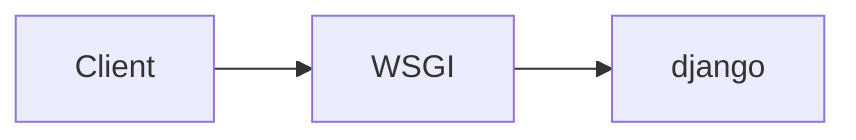

### 출처
* [MVC패턴](https://www.geeksforgeeks.org/mvc-design-pattern/)
* [장고의 특징](https://docs.djangoproject.com/en/5.0/faq/general/#does-django-scale)
* 장고 마스터하기 서적
___
### 개요
* [[#장고란?]]
* [[#장고 시작하기]]
* [[#장고 설정]]
* [[#MVC 패턴]]
* [[#MVC 왜 쓰나요?]]
___
### 장고란?

**장고는 파이썬 웹 프레임워크로 파이썬을 활용한 웹 개발에 사용한다. 장고는 관리형 웹사이트 제작에 뿌리를 두고 시작 됐는데 이로 인해 어드민 페이지 등을 생성하고 관리하는 것이 용이하다**. 이외 장고의 특징은 아래와 같다.

* **개발 속도가 빠르다**
	장고의 핵심적인 요소로 벡엔드 플로우의 대다수의 기능들이 이미 만들어져있다. (로그인, 게시판, 등등..)
	또한 파이썬을 활용하기 때문에 타입이나 컴파일로 부터 자유로울 수 있다.

* **보안성이 높다**
	장고는 SQL 인젝션 등의 기본적인 보안에 대한 처리를 전부 수행 해준다. 이에 따라 유저가 보안보다 다른 부분에 관심을 갖고 빠른 작업을 가능케 해준다.

* **스케일 확대에 유리하다**
	**장고는 shared-nothing 아키텍쳐를 채택해 동작하므로 각 요청은 모두 독립적으로 동작**한다. 또한 장고는 데이터베이스 - 서버 등을 모두 구분해 동작하기 때문에 어느 곳을 스케일 업해도 성능이 개선되는 효과를 갖는다. (사실 이건 요즘 모든 웹 프레임워크의 속성이다)

___
### 장고 시작하기

장고를 설치하기 앞서서 가상환경을 설정하자 우리는 가상환경 관리를 위해 [poetry](https://python-poetry.org/docs/)를 활용한다.
poetry를 활용하는 이유는 간단하다.

* 패키지 설치 및 버전 변경시 자동으로 설정 파일에 반영
* 패키지 간의 의존성 문제 자동해결
* 버전관리 등이 용이함

이제 poetry를 활용해 장고를 설치해보자. 우선 프로젝트를 생성할 위치로 이동하자.
해당 디렉토리로 이동해 다음의 명령어를 입력한다.

```bash
poetry new first_django
cd first_django
```

이후 생성된 가상환경에 django를 설치해준다. 장고를 설치하면 자동으로 toml 파일에 설치된 장고 패키지가 반영된다.

```bash
poetry add django
```

이제 장고가 설치된 가상환경을 활성화한다.

```bash
poetry shell
```

이제 장고를 시작할 준비가 완료됐다. 장고를 시작해보자. 다음의 명령어를 입력해 장고 프로젝트를 생성한다.

```bash
django-admin startproject first_django #기존의 first_django 삭제 후 진행
```

해당 명령어를 수행하고 나면 다음과 같은 디렉토리 구조가 완성된다. 이제 각 파일이 무엇을 의미하는지 확인해보자.

```
first_django
	manage.py
	first_django
		__init__.py
		asgi.py
		wsgi.py
		urls.py
		settings.py
```

 * **manage.py**
	 설정 파일로 `django-admin` 커맨드를 실행하는 것과 동일한 작업을 수행한다. `django-admin` 은 앞서 사용했던 부분에서 짐작하듯이 장고와 관련된 각종 작업 등을 수행할 때 활용된다. (마이그레이션, 서버시작 등등..)

* **wsgi.py**
	wsgi 서버의 진입점으로 장고에서 활용할 wsgi 설정을 등록하고 관리하는 작업을 처리한다. 위스기 자체에 대해서는 이전에 [[WSGI]]에서 자세히 설명했다.

* **asgi.py**
	asgi 서버의 진입점으로 활용할 asgi 서버의 설정을 관리한다. asgi는 장고 3.0부터 지원하기 시작했다. 비동기 처리를 위해 사용하는 서버이다.

* **urls.py**
	장고에서 활용할 각종 url 매칭 패턴들을 정의하는 곳이다. 해당 소스 파일에서 url과 특정 콜러블 오브젝트를 매핑하는 작업을 수행한다.

* **settings.py**
	장고 프로젝트에 대한 여러 설정을 정의한다. 이곳에는 사용할 프로젝트와 비밀키 설정등이 기록된다. 아래에서 자세히 설명한다.
___
### 장고 설정

장고의 설정 파일은 다음의 내용을 포함한다.

* 사용할 응용 프로그램
* 사용할 미들웨어
* URL 매칭 루트
* 템플릿
* 사용할 WSGI 어플리케이션
* 사용할 데이터베이스
* 인증 정보
* 언어설정
* 타임존

사용할 응용 프로그램부터 살펴보자 장고는 기본적으로 다음의 응용 프로그램을 제공한다. 

```python

INSTALLED_APPS = [
    'django.contrib.admin', #관리자 웹 사이트
    'django.contrib.auth', #인증 시스템
    'django.contrib.contenttypes', #콘텐츠 타입에 따른 프레임워크
    'django.contrib.sessions', #세션 프레임워크
    'django.contrib.messages',#메시징 프레임워크
    'django.contrib.staticfiles', #정적 파일 관리를 위한 프레임워크
]
```

사용 가능한 미들 웨어는 다음과 같고 더욱 추가할 수 있다.

```python
MIDDLEWARE = [
    'django.middleware.security.SecurityMiddleware', #보안인증 미들웨어
    'django.contrib.sessions.middleware.SessionMiddleware',#세션 미들웨어
    'django.middleware.common.CommonMiddleware', #url 재작성 등을 수행
    'django.middleware.csrf.CsrfViewMiddleware', #csrf 제공 미들웨어
    'django.contrib.auth.middleware.AuthenticationMiddleware',#인증 미들웨어
    'django.contrib.messages.middleware.MessageMiddleware', #메시지 미들웨어
    'django.middleware.clickjacking.XFrameOptionsMiddleware',
]
```

사용할 데이터베이스는 다음과 같이 설정할 수 있다.

```python
DATABASES = {
    'default': {
        'ENGINE': 'django.db.backends.sqlite3',
        'NAME': BASE_DIR / 'db.sqlite3',
    }
}
```

이제 데이터베이스 테이블을 사용하기 위해 기본적인 서버를 생성하는 작업을 수행해보자. 아래의 명령어를 입력하면 된다.

```bash
python manage.py migrate 
```

* **왜 여기서는 django-admin이 아니에요?**
	django-admin 또한 migrate 명령어를 제공한다. 단 어떤 설정 파일을 기준으로 migrate를 진행할지를 명시해줘야 django-admin을 통해 마이그레이션이 진행 가능하다. 
	반대로 manage.py의 경우 설정 에 대한 정보를 스크립트 내부에서 환경변수로 정의하기 때문에 마이그레이션을 수행할 수 있다. 따라서 별도의 설정을 관리하기 힘들 경우 manage.py를 통해 직접 호출하는게 편리할 수도 있다.


명령어를 실행하고 나면 사용할 어플리케이션에 필요한 테이블들이 자동적으로 생성된다.  `migrate` 명령어는 마이그레이션 파일들을 전부 SQL로 치환해 실제 DB에 적용한다. 마이그레이션에 대해서는 추후 자세히 설명한다.

이제 장고 서버를 동작 시켜보자. **우리가 동작 시키는 서버는 장고가 기본적으로 제공하는 WSGI 서버이다. 해당 서버는 HTTP 요청을 수신해 장고의 콜러블 오브젝트와 연결하는 작업을 수행한다.** 



서버는 다음의 명령어를 통해 실행할 수 있다.

```bash
python manage.py runserver

Watching for file changes with StatReloader
Performing system checks...

System check identified no issues (0 silenced).
May 21, 2024 - 08:36:12
Django version 5.0.6, using settings 'first_django.settings'
Starting development server at http://127.0.0.1:8000/
Quit the server with CONTROL-C.
```

명령어 실행시 위와 같은 결과가 출력되면 성공이다. 이제 접속을 진행해보자. 크롬을 통해 접속해보면 장고가 정상적으로 동작하는 것을 확인할 수 있다.


___
### MVC 패턴

MVC는 그냥 근본 패턴이다. 거의 모든 웹 프레임워크가 해당 패턴을 따른다. MVC는 벡, 프론트 관계 없이 두루 채용되고 있는 패턴이므로 필히 알아둘 필요가 있다. 아래에서는 일반적인 벡엔드 기준으로 MVC를 설명한다.

* **Model?**
	**모델은 데이터 구조를 의미하며 실제 데이터가 아닌 데이터베이스에 존재하는 데이터를 다루는 인터페이스를 의미한다.** 모델을 활용하면 실제 데이터베이스의 상태를 파악하지 않고 모델 객체를 활용해 데이터를 관리하는 작업이 가능해진다.

* **View?**
	뷰는 실질적으로 보이는 화면을 의미한다. 클라이언트의 화면에 노출되는 화면 그 자체를 의미한다고 생각하면 쉽다.

* **Controller?**
	컨트롤러는 모델과 뷰 사이의 정보 흐름을 제어하고 모델을 통해 가져온 데이터를 어떻게 처리할지를 결정한다. 비즈니스 로직의 전반적인 부분을 구현하는 곳이라고 생각하면 쉽다. 

MVC 패턴을 한줄로 요약하면 **모델을 통해 가져온 데이터를 컨트롤러를 통해 처리해 적절한 뷰를 유저에게 보여주는 방식으로 동작하는 패턴을 의미**한다.

장고 또한 이러한 MVC 패턴을 따라 설계됐다. 장고에선 뷰가 템플릿으로 대체되고 컨트롤러를 뷰라고 부른다. 이러한 약간의 용어 차이를 제외하곤 실상 비슷하다.

#### MVC 왜 쓰나요?

당연하지만 장점이 존재하기에 모두가 MVC를 사용할 것이다. MVC 패턴의 장점은 뭘가?

* **작업 영역의 분할**
	데이터, 로직, UI를 분리해 코드의 관리를 용이하게 하고 유지보수에 큰 장점을 부여한다. (부분적인 수정이 가능하므로) 또한 각각의 요소 별로 개발과 테스트가 진행하기에 빠른 작업이 가능하다. 

* **모듈화가 쉽다**
	하나의 컨트롤러를 여러 곳에서 재 사용하는 등 코드의 재사용성이 증가하는 효과도 존재한다. 

* **유연한 개발**
	각각의 요소가 독립적으로 존재하기에 유연하게 개발할 수 있다는 장점이 존재한다. 


> [!info]
> **핵심은 "분리"이다 MVC를 활용하면 각 요소 별로를 분할 할 수 있고 이를 통해 독립적인 개발, 유연한 대응, 높은 확장성 등을 갖게 된다.** (네트워크 레이어 분리와 비슷한 이유이다)

대다수의 프레임워크가 모두 이러한 패턴을 따르는 것을 확인해보면 MVC가 마치 완전무결한 패턴 처럼 여겨진다. MVC는 단점이 없을까? 단점은 아래와 같다.

* **복잡성**
	단순한 작업도 굳이 3단계로 구분지어야 하기 때문에 자칫하면 번잡해 질 수 있다.

* **관리의 어려움**
	100개의 뷰가 하나의 컨트롤러를 활용하고 있다 생각해보자. 이 경우 아무리 뷰와 컨트롤러가 독립적이라곤 하지만 해당 컨트롤러를 수정했을 때 뷰에서 전부 대응하는 작업이 상당히 번거로울 것이다. 이에 따라 컨트롤러나 뷰를 적절히 관리하기 위한 규칙 등이 필요한데 이러한 작업이 번잡함을 초래할 수 있다.

* **오버 엔지니어링의 가능성**
	위에서 연결되는 문제이다. 지나친 추상화, 다른 아키텍쳐 및 패턴 복수 적용 등을 연구하다 오히려 안하는 것보다 못한 결과를 도출할 수도 있다.

>[!info]
>필자가 생각하기에 **MVC의 가장 큰 단점은 적절한 관리의 어려움**이다. 하지만 이것만 잘 수행해 낸다면  장점이 너무 많은 패턴이므로 대다수의 프레임워크에서 선택한 것이 아닐까 싶다.

___
