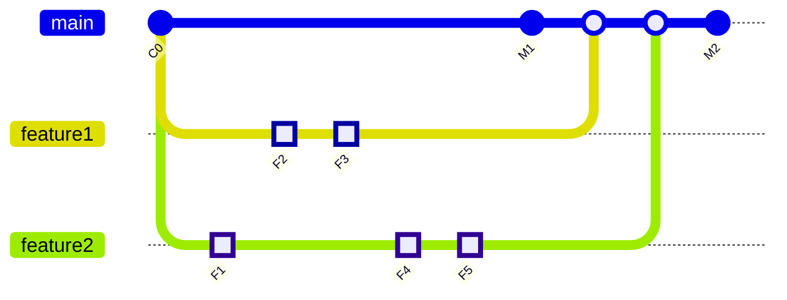
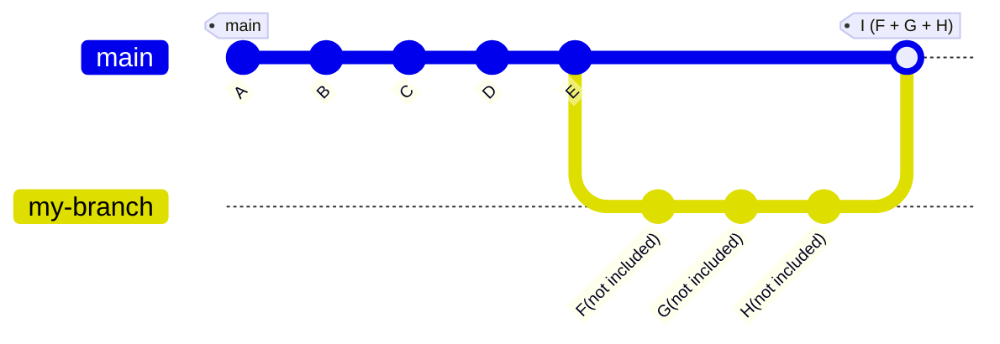
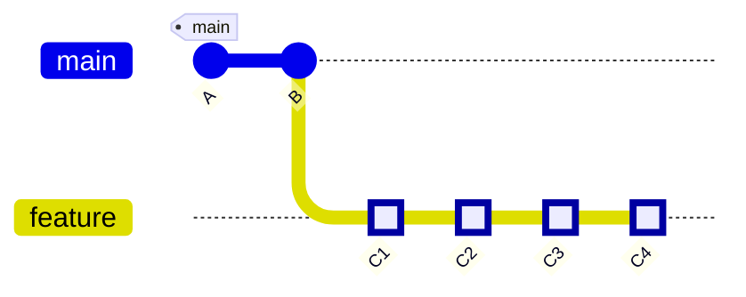
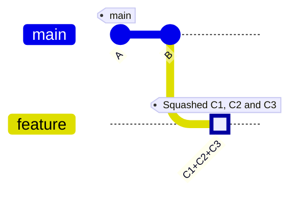
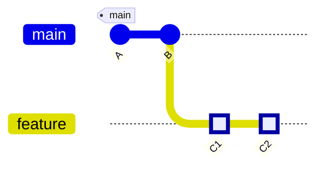
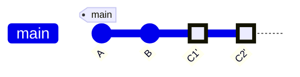
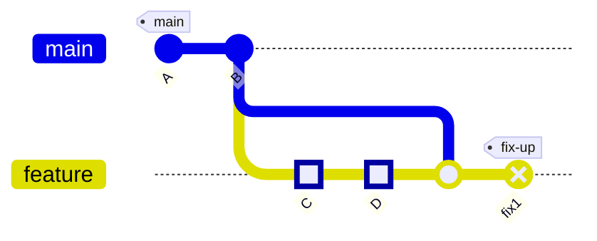

### 출처
* [인터랙티브 리베이스](https://wormwlrm.github.io/2020/09/03/Git-rebase-with-interactive-option.html)
* [깃 공식문서](https://git-scm.com/book/ko/v2/Git-%EB%B8%8C%EB%9E%9C%EC%B9%98-Rebase-%ED%95%98%EA%B8%B0)
___
### 개요

깃을 모르면 업무 효율에 엄청난 저하가 발생한다는 것을 느꼈다. 특히`Merge`와 `Rebase` 그리고`Squash` 같은 개념은 협업을 하다보면 필연적으로 알아야하는 필수 개념이다. 오늘 크게 당했기 때문에 평소 대충 알고 지냈던 이 개념들을을 이 기회에 완전히 정리해 볼 생각이다.
___
### Merge

 
 ```mermaid
 gitGraph
   commit id: "C0"
   commit id: "C1"
   commit id: "C2"
   branch experiment
   checkout experiment
   commit id: "C3"
   
   checkout main
   commit id: "C4"
  
   merge experiment
```

가장 기본적인 `merge` 부터 살펴보자. 일반적인 병합은 두개의 커밋을 합치는 방법으로 분기에서 발생한 `C3, C4` 와 공동 부모 `C2` 커밋 총 3개를 활용한 3-way merge 방식으로 진행된다.
여기서 **핵심적인 부분은 병합을 하기 위해서는 `C3,C4`의 변경사항을 전부 합치는 별도의 커밋을 생성해야 한다는 것**이다. 따라서 병합을 하는 시점에 자연스럽게 `main` 브랜치에는 병합을 의미하는 `C5` 커밋이 생성된다.
또한 이러한 커밋으로 인헤 브랜치와 브랜치가 맞다는 지점이 발생하게 되고 깃 플로우가 일직선이 아닌 여러 겹쳐진 선들의 집합으로 나타나게 된다.

지저분한 플로우는 머지의 장점이자 단점인데 아래의 그림을 보자.


`feature1, feature2`의 브랜치를 생성하고 각각 커밋을 진행한 후 `main` 브랜치에 머지되는 것을 확인할 수 있다. 통상적으로 협업을 할 경우 이러한 방향으로 작업을 하는데, **이는 브랜치를 분기하는 방식이 안정성이 높기 때문**이다. 브랜치를 분기하면 히스토리 관리도 쉽고 충돌 등이 발생 했을때 탐지가 용이하다. (분기 시점 중에 충돌이 발생한 것이므로)
또한 원본 브랜치를 수정하는 경우가 없기 때문에 포스 푸시를 진행해야하는 상황 등을 최소한으로 만들 수 있다.

>[!callout]
>**브랜치를 분기하고 합병하는 방식을 채택하면 안정성은 높지만, 그래프가 지저분해지고 히스토리 추적에는 어려움이 존재할 수 있다.**

* **fast-forward**
	**각 브랜치가 서로의 끝에서 이어질때 이러한 방식으로 병합을 진행할 수 있다.** 브랜치 A와 B가 존재할 때 B에만 신규 커밋이 존재하고 A에는 커밋이 없는 상황을 가정 해보자. 이때 A와 B를 합병하면, A의 헤드를 B의 끝으로 이동 시키면서 별도의 병합 커밋 없이 병합이 진행된다. 이때 `no-ff` 옵션을 주면 강제로 머지 커밋을 생성할 수 있다.

* **recursive**
	일반적으로 진행하는 방식으로 두개의 브랜치에 각각의 커밋이 존재할 때 별도의 병합 커밋을 생성하며 합치는 방식을 말한다. 3-way-merge의 다른 말이다.
___
### Squash Merge

스쿼시 머지는 병합의 고질적인 문제였던 지저분한 로그는 해결하고 브랜치를 통한 쉬운 충돌 파악과 원상 복구를 활용하기 위해 고안된 방식이다. **스쿼시 머지는 일반적인 병합과 동일한 방식으로 동작하나 해당 브랜치에서 생성된 커밋을 하나로 압축해버린다는 특징이 존재한다.**


위의 이미지를 확인해보면 `F,G,H` 커밋이 별도의 브랜치에서 진행된 것을 확인할 수 있다. 흥미로운 점은 병합을 진행할 때는 해당 브랜치에서 진행 됐던 커밋이 모두 한번에 합쳐져 병합 커밋에 변경내역에 전부 반영된다는 것이다. **따라서 병합 커밋 내부에는 해당 브랜치에서 발생한 모든 변경사항이 압축돼 기록된다.**

**스쿼시 머지의 장점은 브랜치의 장점인 분기가 나눠 진다는 특징을 유지하면서도 깃 플로우가 깔끔하게 관리 된다는 것**이다. 문제가 발생했을 경우 해당 브랜치를 뒤로 돌리면 되기 때문에 직괸적인 플로우 관리가 가능해진다. (PR 관리도 쉽다 리뷰 한번 하면 기능 하나 추가)

다만 브랜치 내부의 세부 내역이 전부 삭제 되기 때문에 커밋 로그를 잘 관리해야한다. 큰 단위로 롤백을 진행해야 하기 때문에 추후 히스토리 추적이나 디버깅에는 여러 문제가 존재할 가능성도 다분하다.

>[!info]
>**이상적인 스쿼시 머지는 테스트가 충분히 끝난 피쳐 단위의 브랜치를 병합할 때이다. 이 경우 스쿼시 머지를 활용하면 기능 단위로 히스토리를 추적할 수 있다.**

___
### Rebase

리베이스는 merge와는 다른 병합 방법으로 특정 브랜치의 시작점을 이동시키는 방법으로 병합을 진행한다.
실제로 일어나는 일을 설명하자면 **일단 두 브랜치가 나뉘기 전인 공통 커밋으로 이동하고 나서 그 커밋부터 지금 Checkout 한 브랜치가 가리키는 커밋까지 diff를 차례로 만들어** 어딘가에 임시로 저장해 놓는다. 이후 Rebase 할 브랜치(역주 - experiment)가 합칠 브랜치(역주 - master)가 가리키는 커밋을 가리키게 하고 아까 저장해 놓았던 변경사항을 차례대로 적용한다. 

**쉽게 말해서 rebase는 두 갈래로 나눠진 브랜치를 다시 순서대로 한 갈래로 합치는 과정을 진행한다.즉 , 순서대로 각 브랜치의 변경 사항을 나열한 후에 fast-forward 방식으로 병합하는 작업이다.**

**공통 커밋으로 이동한다는 점이 중요한데 이는 커밋의 HEAD를 이동 시킨다는 것을 의미한다.** 이후 순차대로 변경사항을 적용하는 것인데, 이를 잘 활용하면 과거의 커밋 로그들을 수정하는 것 또한 가능해진다. (병합 용도가 아닌 리베이스)


위의 이미지를 확인해보면 `C4`의 커밋을 `C3`이후에 적용하고 이후 `master` 브랜치와 `experiment` 브랜치를 `fast-forward` 방식으로 병합한다.

Rebase를 하든지, Merge를 하든지 최종 결과물은 같고 커밋 히스토리만 다르다는 것이 중요하다. Rebase 의 경우는 브랜치의 변경사항을 순서대로 다른 브랜치에 적용하면서 합치고 Merge 의 경우는 두 브랜치의 최종결과만을 가지고 합친다. 이 부분이 굉장히 중요한데 **병합은 마지막 병합 커밋에서 변경사항을 전부 반영 하지만 리베이스는 순차적으로 변경사항을 반영한다.**
___
### 리베이스 해보기
리베이스를 직접 해보는 작업을 수행해보자. 리베이스는 주로 다음과 같은 상황에서 활용한다. 

#### HEAD를 이동시켜 과거 커밋 히스토리를 정리할 때
앞서 말했듯이 ==**리베이스를 진행할 경우 HEAD가 지정한 커밋이나 특정 브랜치의 끝으로 이동하게 된다.**== 이에 따라 해당 커밋 이후의 변경 사항들을 변경할 수 있는데, 이를 활용해 특정 커밋을 수정하거나 합치는 작업들을 진행할 수 있다. (수정하고자 하는 커밋의 직전 커밋으로 이동해야 한다.)

`rebase -i`를 사용할 경우 이를 더 쉽게 적용할 수 있는데, 해당 명령어의 사용법을 활용해보자. 이를 활용하면 다음과 같은 화면이 출력된다.

```bash
  1 pick 4bf2b0e Add registry to test broadcast
  2
  3 # Rebase 09ca41c..4bf2b0e onto 09ca41c (1 command)
  4 #
  5 # Commands:
  6 # p, pick <commit> = use commit
  7 # r, reword <commit> = use commit, but edit the commit message
  8 # e, edit <commit> = use commit, but stop for amending
  9 # s, squash <commit> = use commit, but meld into previous commit
 10 # f, fixup <commit> = like "squash", but discard this commit's log message
 11 # x, exec <command> = run command (the rest of the line) using shell
 12 # b, break = stop here (continue rebase later with 'git rebase --continue')
 13 # d, drop <commit> = remove commit
 14 # l, label <label> = label current HEAD with a name
 15 # t, reset <label> = reset HEAD to a label
 16 # m, merge [-C <commit> | -c <commit>] <label> [# <oneline>]
 17 # .       create a merge commit using the original merge commit's
 18 # .       message (or the oneline, if no original merge commit was
 19 # .       specified). Use -c <commit> to reword the commit message.
 ```

주석을 확인하면 `-i` 옵션에서 활용할 수 있는 다양한 명령어들을 활용할 수 있는데 이를 활용하면 리베이스를 진행한 시점 이후의 커밋들을 손쉽게 수정할 수 있다. 명령어 별로 구체적인 사용 사례를 살펴보자.

* **pick**
	pick은 말 그대로 커밋을 보존하겠다는 의미를 갖는다. 이를 활용하면 **커밋의 순서를 변경하거나 특정 커밋을 삭제하는 작업도 가능**해진다. (기존의 pick된 순서를 변경하거나 pick된 커밋을 삭제) 
	`git rebase HEAD~2 -i` 를 입력하면 pick된 커밋이 2개 노출될 것이다. 이때의 해당 커밋들을 수정하는 방식으로 순서 변경이나 삭제를 진행 할 수 있다.

* **reword**
	리워드는 커밋 메시지를 수정할 수 있게 해준다. 사용법은 pick과 동일하며 수정하고 싶은 커밋의 앞에 명령어를 입력하고 이후에 커밋 메시지를 작성하면 커밋 메시지를 수정할 수 있다.

* **edit**
	**edit는 작업 내역 또한 수정 할 수 있는 명령어로 과거로 돌아가 특정 커밋을 수정하는 것을 가능하게 해준다.** 문제가 되는 코드를 수정하거나 들어가서는 안되는 파일이 발생한 상황에서 유용하게 활용할 수 있다.
	수정을 진행한 후 `git commit --amend` 로 기존 커밋을 덮어 쓴 후 `git rebase --continue`를 통해 리베이스 작업을 완료하면 된다.

* **squash**
	**squash는 커밋을 합치는 작업을 수행한다. 여러개의 커밋을 하나로 합치는 작업을 진행해주는데 이때 각 커밋들의 메시지는 하나로 병합된다.** 스쿼시를 진행하는 방법은 단순한데 합**칠 커밋 앞에 명령어를 명시해주면 이전 커밋과 병합**된다.



```bash
git checkout feature
git rebase -i main

pick C1 커밋 메시지 1

squash C2 커밋 메시지 2 #커밋 1과 합쳐진다

squash C3 커밋 메시지 3 #커밋 2와 합쳐진다.

drop C4 커밋 메시지 4
```

스쿼시를 연속으로 진행하면 전부 합쳐진다. 따라서 커밋 3개가 한번에 스쿼시 된다.



#### 깔끔한 병합을 진행할 때
`feature`라는 브랜치가 존재할 때 리베이스를 `git rebase main` 와 같이 진행할 경우 `feature` 브랜치의 시작점이 `main` 브랜치의 시작점으로 이동하게 된다. 이후 `main` 브랜치의 변경사항을 우선적으로 적용하고 순차적으로 `feature` 브랜치의 변경사항을 적용한다. **이에 따라서 깔끔하게 fast-forward 병합을 진행하는 것이 가능해진다.**




#### PR 수정 사항을 Squash해서 반영할 때
리뷰 중에 발생한 자잘한 이슈들을 해결하고 이전의 PR 커밋과 Sqaush해서 업로드하면 깔끔하게 관리할 수 있다.


이때 rebase를 활용해 fix1 커밋을 squash하면 D커밋에 변경사항을 추가로 반영해서 커밋을 진행할 수 있다. 이에따라 깔끔한 커밋 관리가 가능해진다.