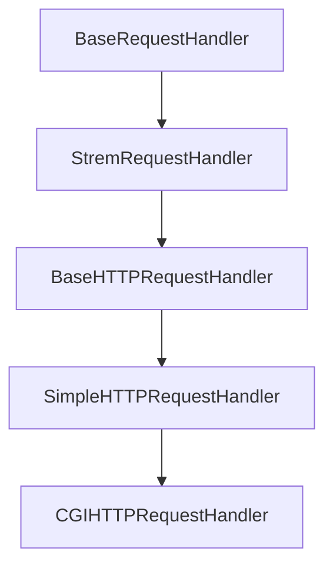
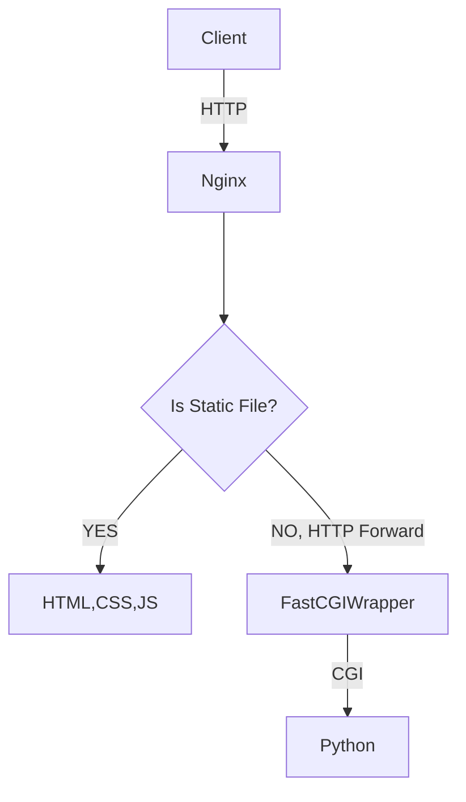

### 출처
* [CGi,.WSGI, ASGI](https://kangbk0120.github.io/articles/2022-02/cgi-wcgi-asgi)
* [WAS, CGI, WSGI](https://brownbears.tistory.com/350)
* [CGI 코드 분석](https://devocean.sk.com/search/techBoardDetail.do?ID=165508&boardType=&query=wsgi&searchData=&page=&subIndex=&idList=)
* [FCGI 참고](https://sirzzang.github.io/dev/Dev-fcgiwrap-python/)
* [FCGI란](https://www.joinc.co.kr/w/man/12/fastcgi)
___
### 개요
* [[#CGI란?]]
* [[#파이썬의 웹서버와 핸들러]]
* [[#CGI의 동작 방식]]
* [[#정리]]
* [[#nginx에 FCGI 적용해보기]]
___
### CGI란?

일전의 [[웹서버와 nginx#정적 웹서버의 한계]]에서 말했듯 정적 웹서버는 동적인 요청을 처리할 수는 없었다. 이에 따라 동적인 요청을 처리하기 위한 <b><u>스크립트 등을 동작 시켜 클라이언트에게 반환하고 싶다는 욕망이 발생하게 됐는데 이를 위해 탄생한 것이 CGI이다.</u></b>

CGI는 Common Gateway Interface의 약자로 ==**웹 서버(정적)와 응용 프로그램(파이썬, PHP 등)이 통신하는 규약을 정의한다.**== CGI는 통신 규약이기 때문에 각 언어에 맞춰 다양한 종류가 존재한다.

CGI는 웹서버가 실제 프로그램 코드를 실행하는 방식으로 동작한다. 이때 **요청을 수신할 때마다 프로세스를 생성해 프로그램을 동작 시키므로 요청이 많을 경우 부하가 심하다.**


___
### 파이썬의 웹서버와 핸들러

CGI 코드를 본격적으로 분석하기 이전에 잠깐 파이썬에서 웹서버와 요청 핸들러를 어떻게 구현 했는지 살펴보자. 파이썬은 서버 클래스와 핸들러 클래스를 조합해 웹 서버를 구축한다. 이때 **서버 클래스는 주로 커넥션의 맺고 끊음 등의 작업을 수행하고 핸들러 클래스는 커넥션을 통해 전달 받은 요청을 어떤 방식으로 처리 할지를 결정한다.**

서버 클래스의 예시는 다음과 같다. 이외에도 HTTP 요청을 처리하기 위한 [`HTTPServer`](https://docs.python.org/ko/3/library/http.server.html#http.server.HTTPServer "http.server.HTTPServer") 클래스가 존재하며 이는 TCPServer를 상속해 구현한다. 상속을 통한 구현체들을 제거하면 4가지 서버가 존재하며 **전부 동기적으로 동작한다. 이에따라 여러 요청을 처리하고 싶다면, 별도로 [`ForkingMixIn`](https://docs.python.org/ko/3/library/socketserver.html#socketserver.ForkingMixIn "socketserver.ForkingMixIn")이나 [`ThreadingMixIn`](https://docs.python.org/ko/3/library/socketserver.html#socketserver.ThreadingMixIn "socketserver.ThreadingMixIn") 를 활용해 비동기 처리를 지원해야 한다.** 

```text
+------------+
| BaseServer |
+------------+
      |
      v
+-----------+        +------------------+
| TCPServer |------->| UnixStreamServer |
+-----------+        +------------------+
      |
      v
+-----------+        +--------------------+
| UDPServer |------->| UnixDatagramServer |
+-----------+        +--------------------+
```

서버 클래스는 listen, accept, close 등의 커넥션과 관련된 작업들을 주로 처리하는데 TCPServer의 코드를 간략히 살펴보자.

```python
 def __init__(self, server_address, RequestHandlerClass, bind_and_activate=True):
        """Constructor.  May be extended, do not override."""
        BaseServer.__init__(self, server_address, RequestHandlerClass)
        self.socket = socket.socket(self.address_family,
                                    self.socket_type) # 소켓을 생성한다.
        if bind_and_activate:
            try:
                self.server_bind() #바인딩을 진행
                self.server_activate() #서버를 가동
            except:
                self.server_close() #연결 종료
                raise

    def server_bind(self):
        """Called by constructor to bind the socket.

        May be overridden.

        """
        if self.allow_reuse_address and hasattr(socket, "SO_REUSEADDR"):
            self.socket.setsockopt(socket.SOL_SOCKET, socket.SO_REUSEADDR, 1)
        if self.allow_reuse_port and hasattr(socket, "SO_REUSEPORT"):
            self.socket.setsockopt(socket.SOL_SOCKET, socket.SO_REUSEPORT, 1)
        self.socket.bind(self.server_address)
        self.server_address = self.socket.getsockname()

    def server_activate(self):
        """Called by constructor to activate the server.

        May be overridden.

        """
        self.socket.listen(self.request_queue_size) #TCP 서버이므로 리스닝을 지속한다.

    def server_close(self):
        """Called to clean-up the server.

        May be overridden.

        """
        self.socket.close()

```

핸들러는 이러한 방식으로 전달 받은 요청을 처리하고 적절한 응답을 반환하는 역할을 수행한다. 핸들러가 어떻게 동작 하는지는 아래에서 자세히 설명한다.

==**주요한 것은 파이썬의 기본 서버는 서버 클래스와 핸들러 클래스의 조합으로 구성된다는 것이다.**==
___
### CGI의 동작 방식

다시 CGI 이야기로 돌아오자. 우리는 동적 처리가 가능한 웹서버를 만들고 싶고 CGI가 이를 할 수 있다고 학습했다. 이제 CGI가 어떻게 동작 하는지 파악해보자. 파이썬 CGI는 아래와 같이 동작한다.

* 웹 서버가 클라이언트로부터 요청을 전달 받는다.
* **웹 서버는 요청에 담긴 정보를 환경 변수나 표준 입력에 전달한 후 스크립트를 실행**한다.
* 스크립트는 표준 입력을 통해 받은 데이터를 활용해 로직을 수행하고 **결과물을 표준 출력으로 웹서버에 전달한다.**
* 웹 서버는 이를 클라이언트에 전달한다.

이제 예제를 통해 기본 탑재 CGI 모듈의 코드를 샅샅이 파악해보자. 아래는 CGI가 적용된 간단 웹 서버이다. **앞서 말했듯이 사용할 서버의 타입과 리퀘스트를 처리할 방식 (핸들러)만 정의해 빠르게 서버를 생성한다.**

```python
import http.server
import socketserver

#HTTP 서버를 사용하고 CGI 핸들러를 사용
def run(server_class=http.server.HTTPServer, handler_class=http.server.CGIHTTPRequestHandler
```):
    PORT = 8000
    server_address = ('localhost', PORT)
    httpd = server_class(server_address, handler_class) #사용할 서버와 리퀘스트 처리에 사용할 핸들러
    httpd.serve_forever()

run()
```

서버의 클래스로는 멀티 스레드를 지원하는 [ThreadingMixIn](https://docs.python.org/ko/3/library/socketserver.html#socketserver.ThreadingMixIn) 활용한다. 핸들러로는 동적 요청 처리를 위한 [CGIHTTPRequestHandler](https://docs.python.org/3/library/http.server.html#http.server.CGIHTTPRequestHandler)를 활용하는데 이는 **동적 요청만을 처리하는 핸들러로 정적 파일 요청에는 대응하지 못한다. 따라서 만약 정적 파일을 송,수신하는 웹 서버를 구축하고 싶을 경우 다른 핸들러를 활용해야 한다.**

[serve_forever](https://github.com/python/cpython/blob/main/Lib/socketserver.py#L218) 함수는 이벤트 루프를 계속해서 실행하는 것과 비슷한 효과를 발생시킨다. 서버는 `select` 시스템 콜을 활용해 자신이 관심있는 소켓에서 이벤트가 발생했는지 체크한 후 처리를 진행한다.

실질적인 서버 기능은 모두 `serve_forever` 내부에 구현돼 있다. 이제 함수의 코드를 한번 살펴보자.

```python
class BaseServer:
	 def serve_forever(self, poll_interval=0.5):
        """Handle one request at a time until shutdown.

        Polls for shutdown every poll_interval seconds. Ignores
        self.timeout. If you need to do periodic tasks, do them in
        another thread.
        """
        self.__is_shut_down.clear()
        try:
            # XXX: Consider using another file descriptor or connecting to the
            # socket to wake this up instead of polling. Polling reduces our
            # responsiveness to a shutdown request and wastes cpu at all other
            # times.
            with _ServerSelector() as selector:
                selector.register(self, selectors.EVENT_READ)

                while not self.__shutdown_request: #서버 소켓이 닫횔 때까지
                    ready = selector.select(poll_interval) #멀티 IO 처리
                    # bpo-35017: shutdown() called during select(), exit immediately.
                    if self.__shutdown_request: #서버 소켓이 닫히면
                        break
                    if ready:
                        self._handle_request_noblock() #리퀘스트를 핸들링 한다

                    self.service_actions() #오버라이딩 예정
        finally:
            self.__shutdown_request = False
            self.__is_shut_down.set()


    def _handle_request_noblock(self):
        """Handle one request, without blocking.

        I assume that selector.select() has returned that the socket is
        readable before this function was called, so there should be no risk of
        blocking in get_request().
        """
        try:
            request, client_address = self.get_request() #accept를 통해 소켓 추출 (TCP 서버 일 경우) 왜 자식에서만 get_request를 구현할까?
        except OSError:
            return
        if self.verify_request(request, client_address):
            try:
                self.process_request(request, client_address) #실제 리퀘스트 처리 ()
            except Exception:
                self.handle_error(request, client_address)
                self.shutdown_request(request) #커넥션 소켓 종료
            except:
                self.shutdown_request(request)
                raise
        else:
            self.shutdown_request(request)
```

함수는 앞서 말한대로 시스템 콜을 활용해 특정 주기마다 이벤트를 감지하고 만약 이벤트가 처리 가능한 상태이면 `_handle_request_noblock` 함수를 통해 리퀘스트를 처리한다. `_handle_request_noblock` 함수는 `get_request`를 통해 신규 커넥션을 생성하고 이에 따른 적절한 처리를 `process_request`를 통해 처리 해준다.

이제 요청을 처리하는 `process_request`를 확인해보자. 코드 내부를 살펴보면 실질적인 요청 처리 및 응답 생성은 `RequestHandlerClass`에서 진행되는 것을 확인할 수 있다.

```python
class BaseServer:
    ...
    def process_request(self, request, client_address):
        self.finish_request(request, client_address)
        self.shutdown_request(request)
    ...
        
    def finish_request(self, request, client_address):
        """Finish one request by instantiating RequestHandlerClass."""
        self.RequestHandlerClass(request, client_address, self)
```

`BaseServer` 내부에 정의된 리퀘스트 핸들러는 `RequestHandlerClass`이고 해당 클래스는 아래와 같은 구조를 띄고 있다.

```python
class BaseRequestHandler:
    def __init__(self, request, client_address, server):
        self.request = request
        self.client_address = client_address
        self.server = server
        self.setup()
        try:
            self.handle()
        finally:
            self.finish()

    def setup(self):
        pass

    def handle(self):
        pass

    def finish(self):
        pass
```

`setup` -> `handle` -> `finish` 의 순서로 진행되는 것을 확인할 수 있다. 이때 각 메서드는 자식 클래스에서 오버라이딩을 통해 구현된다. 우리가 관심있는 부분은 CGI이므로 `CGIHTTPRequestHandler`가 어떻게 동작 하는지 파악해보자.

우선 `CGIHTTPRequestHandler`는 아래와 같이 상속을 받는다.



`StreamRequestHandler`는 `setup`과 `finish`를 정의한다. 해당 함수에서는 소켓을 생성하고 소켓으로 데이터를 전송하는 기능을 수행한다.

```python
class StreamRequestHandler(BaseRequestHandler):
    ...
    rbufsize = -1
    wbufsize = 0

    # A timeout to apply to the request socket, if not None.
    timeout = None

    # Disable nagle algorithm for this socket, if True.
    # Use only when wbufsize != 0, to avoid small packets.
    disable_nagle_algorithm = False

    def setup(self):
        self.connection = self.request
        if self.timeout is not None:
            self.connection.settimeout(self.timeout)
        if self.disable_nagle_algorithm:
            self.connection.setsockopt(socket.IPPROTO_TCP,
                                       socket.TCP_NODELAY, True)
        self.rfile = self.connection.makefile('rb', self.rbufsize) #소켓의 읽기 버퍼 생성
        if self.wbufsize == 0:
            self.wfile = _SocketWriter(self.connection)
        else:
            self.wfile = self.connection.makefile('wb', self.wbufsize) #소켓의 쓰기 버퍼 생성

    def finish(self):
        if not self.wfile.closed:
            try:
                self.wfile.flush() #버퍼에 있는 내용 표준 출력으로 출력
            except socket.error:
                # A final socket error may have occurred here, such as
                # the local error ECONNABORTED.
                pass
        self.wfile.close()
        self.rfile.close()
```

이후 `BaseHTTPRequestHandler` 에 정의된 `handler` 메서드를 활용해 요청을 처리한다.

```python
class BaseHTTPRequestHandler(socketserver.StreamRequestHandler):
    ...
    def handle(self):
        """Handle multiple requests if necessary."""
        self.close_connection = True

        self.handle_one_request()
        while not self.close_connection:
            self.handle_one_request()
            
    def handle_one_request(self):
        try:
            self.raw_requestline = self.rfile.readline(65537)
            if len(self.raw_requestline) > 65536:
                self.requestline = ''
                self.request_version = ''
                self.command = ''
                self.send_error(HTTPStatus.REQUEST_URI_TOO_LONG)
                return
            if not self.raw_requestline:
                self.close_connection = True
                return
            if not self.parse_request():
                # An error code has been sent, just exit
                return
            mname = 'do_' + self.command #처리할 메소드의 타입
            if not hasattr(self, mname):
                self.send_error(
                    HTTPStatus.NOT_IMPLEMENTED,
                    "Unsupported method (%r)" % self.command)
                return
            #여기서 하부의 do_GET, do_POST와 같은 method를 가지고옴
            method = getattr(self, mname)
            method()
            self.wfile.flush() #actually send the response if not already done.
```

`handle`  함수는 클라이언트의 커넥션이 살아있는 동안 요청을 처리하기 위한 `handle_one_request`는 요청을 수신해 파싱하고 메소드 명을 파악해 적절한 처리를 진행한다. 이때 각 메소드 별 처리를 담당하는 메서드는 `do_ + METHOD_TYPE`의 형태를 띄고있다.

`do_GET`은 `SimpleHTTPRequest`에 위치해 경로로 전달된 파일을 전달하는 정적 웹서버의 기능만 수행한다. 우리가 확인하고 싶은 것은 동적 요청을 처리할 수 있는 CGI의 동작이므로 CGI 핸들러에 정의된 `do_POST` 메서드의 코드를 확인해보자.


cgi를 통해 요청을 처리할 스크립트 파일들은 `/cgi-bin` 혹은 `/htbin` 위치에 두어야만 작동한다. 이는 코드단에서 작성한 요소로 [링크](https://github.com/python/cpython/blob/7dead6a33ac786465c3d927d5c2025caf0c1a71b/Lib/http/server.py#L978)에서 확인해 볼 수있다.

```python
def do_POST(self):
	"""
	Serve a POST request.
	This is only implemented for CGI scripts.
	"""

	if self.is_cgi():
		self.run_cgi() #cgi 실행
	else:
		self.send_error(
			HTTPStatus.NOT_IMPLEMENTED,
			"Can only POST to CGI scripts")
```

만약 알맞은 cgi 요청이 들어오기 전에 적절한 요청인지 확인하고 이후 `run_cgi` 요청을 수행해 스크립트를 동작시킨다.
```python
def run_cgi(self):
	"""Execute a CGI script."""
	dir, rest = self.cgi_info
	path = dir + '/' + rest
	i = path.find('/', len(dir)+1)
	while i >= 0:
		nextdir = path[:i]
		nextrest = path[i+1:]

		scriptdir = self.translate_path(nextdir)
		if os.path.isdir(scriptdir):
			dir, rest = nextdir, nextrest
			i = path.find('/', len(dir)+1)
		else:
			break

	# find an explicit query string, if present.
	rest, _, query = rest.partition('?')

	# dissect the part after the directory name into a script name &
	# a possible additional path, to be stored in PATH_INFO.
	i = rest.find('/')
	if i >= 0:
		script, rest = rest[:i], rest[i:]
	else:
		script, rest = rest, ''

	scriptname = dir + '/' + script
	scriptfile = self.translate_path(scriptname)
	if not os.path.exists(scriptfile):
		self.send_error(
			HTTPStatus.NOT_FOUND,
			"No such CGI script (%r)" % scriptname)
		return
	if not os.path.isfile(scriptfile):
		self.send_error(
			HTTPStatus.FORBIDDEN,
			"CGI script is not a plain file (%r)" % scriptname)
		return
```

우선적으로 요청 받은 url을 파싱해 실행할 스크립트의 위치를 파악하고 파이썬 파일 형식인지 검사한다.

```python
	env = copy.deepcopy(os.environ)
	env['SERVER_SOFTWARE'] = self.version_string()
	env['SERVER_NAME'] = self.server.server_name
	env['GATEWAY_INTERFACE'] = 'CGI/1.1'
	env['SERVER_PROTOCOL'] = self.protocol_version
	env['SERVER_PORT'] = str(self.server.server_port)
	env['REQUEST_METHOD'] = self.command
	uqrest = urllib.parse.unquote(rest)
	env['PATH_INFO'] = uqrest
	env['PATH_TRANSLATED'] = self.translate_path(uqrest)
	env['SCRIPT_NAME'] = scriptname
	env['QUERY_STRING'] = query
	env['REMOTE_ADDR'] = self.client_address[0]
	authorization = self.headers.get("authorization")
	if authorization:
		authorization = authorization.split()
		if len(authorization) == 2:
			import base64, binascii
			env['AUTH_TYPE'] = authorization[0]
			if authorization[0].lower() == "basic":
				try:
					authorization = authorization[1].encode('ascii')
					authorization = base64.decodebytes(authorization).\
									decode('ascii')
				except (binascii.Error, UnicodeError):
					pass
				else:
					authorization = authorization.split(':')
					if len(authorization) == 2:
						env['REMOTE_USER'] = authorization[0]
	# XXX REMOTE_IDENT
	if self.headers.get('content-type') is None:
		env['CONTENT_TYPE'] = self.headers.get_content_type()
	else:
		env['CONTENT_TYPE'] = self.headers['content-type']
	length = self.headers.get('content-length')
	if length:
		env['CONTENT_LENGTH'] = length
	referer = self.headers.get('referer')
	if referer:
		env['HTTP_REFERER'] = referer
	accept = self.headers.get_all('accept', ())
	env['HTTP_ACCEPT'] = ','.join(accept)
	ua = self.headers.get('user-agent')
	if ua:
		env['HTTP_USER_AGENT'] = ua
	co = filter(None, self.headers.get_all('cookie', []))
	cookie_str = ', '.join(co)
	if cookie_str:
		env['HTTP_COOKIE'] = cookie_str
	# XXX Other HTTP_* headers
	# Since we're setting the env in the parent, provide empty
	# values to override previously set values
	for k in ('QUERY_STRING', 'REMOTE_HOST', 'CONTENT_LENGTH',
			  'HTTP_USER_AGENT', 'HTTP_COOKIE', 'HTTP_REFERER'):
		env.setdefault(k, "")

	self.send_response(HTTPStatus.OK, "Script output follows")
	#header를 response buff에 입력한 뒤
	#header를 담고있던 list를 초기화 시켜줌
	self.flush_headers()

	decoded_query = query.replace('+', ' ')
```

이후 **환경변수를 활용해 요청의 정보를 전부 저장한다. 이렇게 할 경우 실행할 스크립트에서도 환경변수를 통해 요청 받은 요청 정보를 접근할 수 있다.** 이제 스크립트를 실행하기 위한 절차는 전부 완료됐다. 아래에서 스크립트를 실행해주면 끝이다.

```python
if self.have_fork:
	#fork가 지원되는 unix 형태의 운영체제일 경우 fork를 통해 실행한다.
	# Unix -- fork as we should
	args = [script]
	if '=' not in decoded_query:
		args.append(decoded_query)
	nobody = nobody_uid()
	self.wfile.flush() # Always flush before forking
	pid = os.fork() #스크립트 생성을 위한 포크
	if pid != 0:
		# Parent
		pid, sts = os.waitpid(pid, 0)
		# throw away additional data [see bug #427345]
		while select.select([self.rfile], [], [], 0)[0]:
			if not self.rfile.read(1):
				break
		exitcode = os.waitstatus_to_exitcode(sts)
		if exitcode:
			self.log_error(f"CGI script exit code {exitcode}")
		return
	# Child
	try:
		try:
			os.setuid(nobody)
		except OSError:
			pass
		os.dup2(self.rfile.fileno(), 0) #파일 디스크립터를 복사한다. (입력 소켓 -> 표준 입력)
		os.dup2(self.wfile.fileno(), 1) #파일 디스크립터를 복사한다. (출력 소켓 -> 표준 출력)
		os.execve(scriptfile, args, env) #스크립트 파일을 실행한다
	except:
		self.server.handle_error(self.request, self.client_address)
		os._exit(127)
	```

스크립트는 fork와 exec의 순서로 프로세스를 생성해 실행한다. 이를 통해 우리가 확인할 수 있는 것은 <span class="red red-bg">CGI서버는 동적 요청을 전달 받을 때 마다 새로운 프로세스를 생성해 파이썬 스크립트를 실행한다는 것이다.</span>

**이러한 방식은 요청 수가 적을 때는 정상적으로 동작할 수 있겠지만, 요청 수가 많아지면 서버의 부하가 가중된다.** 이제 아래에서 CGI 서버 코드를 작성해 실습 해보자.

___
### CGI 서버 만들어 보기

```python
#서버 코드
from http.server import ThreadingHTTPServer, CGIHTTPRequestHandler

def run(server_class=ThreadingHTTPServer, handler_class=CGIHTTPRequestHandler):
    server_address = ("", 8080) #서버의 주소
    handler_class.cgi_directories = ["/cgi-bin"] #스크립트 폴더 주소
    httpd = server_class(server_address, handler_class) #실행할 서버와 요청을 처리할 핸들러
    httpd.serve_forever() #서버 실행

if __name__ == "__main__":
    run()
```

위에서 만든 서버에서 수신한 요청을 적절히 처리하는 스크립트 코드를 작성해보자. 스크립트 코드는 `cgi-bin` 폴더 아래에 위치해야 한다.

```python
#!/usr/bin/python3 
#shebnag 에러 수정을 위헤 위의 주석 반드시 추가
#add.py
import cgi

print("Content-type: text/html")
print() #헤더이후 바디는 한줄 띄어야 한다.

form = cgi.FieldStorage()

a = form.getvalue("a") #쿼리 데이터 가져오기
b = form.getvalue("b")

result = int(a) * int(b)

print(f"Hello world {result}")
```

`run_cgi` 함수에서 확인할 수 있듯이 http 웹서버는 요청을 수신한 후 cgi-bin 폴더 아래에서 적절한 이름의 스크립트를 실행 해준다. 이제 서버를 실행하고 테스트를 진행해보자.

```bash
curl -X GET 127.0.0.1:8080/cgi-bin/add.py?a=4&b=3

Hello world 12

#만약 403이 뜬다면 실행권한을 줘야 한다.
```

정상적으로 곱한 값이 출력되면 서버가 문제 없이 동작하는 것이다. 하지만 여전히 몇가지 의문이 존재한다. **쿼리 값은 어떻게 가져오고 어떻게 print 출력 값이 곧장 응답 값으로 반환되는 걸까?**

`run_cgi` 함수의 이 부분을 유심히 살펴보자.

```python
	try:
		try:
			os.setuid(nobody)
		except OSError:
			pass
		os.dup2(self.rfile.fileno(), 0) #파일 디스크립터를 복사한다. (입력 소켓 -> 표준 입력)
		os.dup2(self.wfile.fileno(), 1) #파일 디스크립터를 복사한다. (출력 소켓 -> 표준 출력)
		os.execve(scriptfile, args, env) #스크립트 파일을 실행한다
	except:
		self.server.handle_error(self.request, self.client_address)
		os._exit(127)
```

**코드를 살펴보면, `dup2`시스템 콜을 통해 `rfile, wfile`의 파일 디스크립터를 `stdin, stdout`이 가리키게 하는 것을 확인할 수 있다. 이에 따라 `rifle`은 표준 입력이 되고 `wfile`은 표준 출력이 된다.** 이 작업을 수행한 후 부터는 우리가 표준 입력을 통해 데이터를 읽으면 `rfile`에서 데이터를 읽는 것이 되고 표준 출력에 무엇을 적으면 `wfile`에 적는 것이 된다.

* **dup2가 뭔데?**
	The **dup2**() system call performs the same task as **dup**(), but
    instead of using the lowest-numbered unused file descriptor, it
    uses the file descriptor number specified in _newfd_.  **In other**
    **words, the file descriptor _newfd_ is adjusted so that it now**
    **refers to the same open file description as _oldfd_.**

**`runc_cgi`는 `dup2`를 수행한 후 스크립트를 동작 시키므로 스크립트 내부에서 표준 입력을 통해 데이터를 읽으면 `rfile`에서 데이터를 읽는 것이되고 표준 출력을 통해 데이터를 출력하면 `wfile`에 데이터를 적는 것이 된다.** 따라서 별도의 처리 없이 단순히 스크립트 내부에서 `print`를 하는 것 만으로 응답을 전송하는 것이 가능해진다.

`print를` 통해 `wfile` 버퍼에 데이터를 적으면 `handle_one_request에서` `self.wfile.flush()`를 통해 버퍼를 비워주면서 실질적으로 응답을 전송한다.

입력은 어떻게 처리할까? 입력의 처리는 cgi 모듈 자체에서 제공하는 `FieldStorage`를 활용하거나 직접 표준 입력을 통해 데이터를 읽어 처리할 수 있다. `FieldStorage`를 활용할 경우 쿼리나 form을 활용해 전송한 데이터를 알아서 파싱해 key-value 형식으로 쉽게 관리할 수 있게 해준다.

만약 POST로 전송된 body 데이터를 읽고 싶다면 어떻게 해야할까? 아래의 예제를 보자.

```python
#!/usr/bin/python3
import sys
import os

length = os.getenv("CONTENT_LENGTH") #환경 변수를 통해 요청의 정보를 파싱
print("Content-type: text/html")
print()
body = sys.stdin.read(int(length)) #표준 입력을 통해 데이터를 추출
print(f"This is {body} len: {length}")
```

<b><u>코드를 살펴보면 환경 변수 값을 활용해 요청의 길이 정보를 가져오고 이후 표준 입력에서 정해진 길이만큼 데이터를 추출하는 것을 확인할 수 있다.</u></b> 이후 표준 출력으로 값을 반환한다. 이런 식으로 접근하면 POST를 통해 전달한 데이터를 읽는 것도 가능하다.

#### 진짜 프로세스가 여러개 생겨요?

모니터링을 위해 프로세스 별로 30초간 강제 대기가 발생하게 수정하고 크롬이나  curl 등의 도구를 활용해 여러 개의 리 퀘스트를 동시 다발적으로 전송 해보자. (스크립트의 어느 한 구석에 `time.sleep(30)` 을 추가해주자.)

이후 ps 명령어를 통해 이를 모니터링 해보자. add.py를 실행하는 프로세스가 여러개 실행되는 것을 확인해 볼 수 있다.

```bash
 ps -ef| grep \[.\]py #.py 프로세스만 확인해보자.
```

```bash
 0:00.18 /opt/homebrew/Cellar/python@3.10/3.10.14/Frameworks/Python.framework/Versions/3.10/Resources/Python.app/Contents/MacOS/Python /Users/jin/Library/Mobile Documents/iCloud~md~obsidian/Documents/my_study/network/code/http/cgi/server.py
  501 25428 24500   0  4:21PM ttys016    0:00.07 /Library/Developer/CommandLineTools/Library/Frameworks/Python3.framework/Versions/3.8/Resources/Python.app/Contents/MacOS/Python /Users/jin/Library/Mobile Documents/iCloud~md~obsidian/Documents/my_study/network/code/http/cgi/cgi-bin/add.py
  501 25430 24500   0  4:21PM ttys016    0:00.05 /Library/Developer/CommandLineTools/Library/Frameworks/Python3.framework/Versions/3.8/Resources/Python.app/Contents/MacOS/Python /Users/jin/Library/Mobile Documents/iCloud~md~obsidian/Documents/my_study/network/code/http/cgi/cgi-bin/add.py
  501 25453 24500   0  4:21PM ttys016    0:00.07 /Library/Developer/CommandLineTools/Library/Frameworks/Python3.framework/Versions/3.8/Resources/Python.app/Contents/MacOS/Python /Users/jin/Library/Mobile Documents/iCloud~md~obsidian/Documents/my_study/network/code/http/cgi/cgi-bin/add.py
  501 25476 24500   0  4:22PM ttys016    0:00.06 /Library/Developer/CommandLineTools/Library/Frameworks/Python3.framework/Versions/3.8/Resources/Python.app/Contents/MacOS/Python /Users/jin/Library/Mobile Documents/iCloud~md~obsidian/Documents/my_study/network/code/http/cgi/cgi-bin/add.py
```

___
### 정리

많은 내용을 숨가쁘게 달려왔다. 이제 한숨 돌리며 정리를 진행해보자. 첫 시작은 [[웹서버와 nginx#정적 웹서버의 한계]] 에서 정적 웹서버는 동적 처리에 어려움이 존재한다는 점 이였다.

**CGI는 이를 극복하기 위한 수단으로 웹 서버와 응용 프로그램 간의 소통하는 규약을 정의한다. 웹서버와 응용 프로그램은 표준 입출력을 통해 서로의 결과 값을 주고 받고 환경 변수를 통해 요청에 대한 정보를 공유한다.**

일반적인 CGI 서버는 요청을 파싱한 후 적합한 위치에 놓인 스크립트를 **fork-exec 방식으로 생성해 실행하는데 이는 요청마다 프로세스를 신규로 생성하는 방식이기 때문에 요청 수가 많아질 경우 서버 부하가 큰 방식이다.**

마지막으로 파이썬의 서버 구현 방식에 대한 이야기를 덧붙이자면 파이썬은 서버와 핸들러의 조합으로 웹 서버를 구축하며 서버는 프로토콜과 커넥션을 어떻게 관리 할지를 결정하고 핸들러는 커넥션을 통해 전달 받은 요청을 어떻게 처리할지를 결정한다.

**우리가 사용한 예제 코드에서는 멀티 쓰레드 방식의 서버와 기본적인 CGI 핸들러를 활용하기 때문에 멀티 쓰레드로 커넥션을 관리하고 각 요청은 멀티 프로세스의 방식으로 처리하게 된다.**
___
### nginx에 FCGI 적용해보기

진짜 마지막으로 nginx에 FCGI를 적용해 동적 처리를 진행하는 설정을 해보자. 우리가 만들고자 하는 서버의 구조는 다음과 같다.



클라이언트의 요청은 우선적으로 `nginx`에 당도하고 만약 정적 파일일 경우 곧장 해당 파일을 반환하고 만약 동적 요청일 경우 `FCGIWrapper`로 요청을 포워딩 한다. FastCGI는 nginx에서 지원해주며 이를 사용하기 위해선 몇가지 패키지를 설치해야한다.

```bash
brew install fcgiwrap, spawn-fcgi
```

이후 nginx의 설정을 수정 해준다. FastCGI에 넘겨줘야 할 매개변수 들을 넘겨준다. 

```nginx
  server {
    listen 8080;
    root YOUR_ROOT_PATH;
    location / {
      autoindex off;
    }
    location /cgi-bin/ {
        # FastCGI 서버의 주소와 포트
        fastcgi_pass  127.0.0.1:9000; #FCGI 프로세스의 주소
        # FastCGI 매개변수 설정
        #실행할 스크립트의 위치
        fastcgi_param SCRIPT_FILENAME YOUR_ROOT_PATH/$fastcgi_script_name;
        fastcgi_param QUERY_STRING $query_string;
        fastcgi_param REQUEST_METHOD $request_method;
        fastcgi_param CONTENT_TYPE $content_type;
        fastcgi_param CONTENT_LENGTH $content_length;
        fastcgi_param GATEWAY_INTERFACE CGI/1.1;
        fastcgi_param SERVER_SOFTWARE nginx/$nginx_version;
        fastcgi_param SCRIPT_NAME $fastcgi_script_name;
    }
  }
```

이제 nginx를 시작하고 FastCGIWraper를 실행한다. 

```bash
#FCGI가 바인딩할 엔드 포인트와 실행할 FCGI의 경로를 입력한다
sudo spawn-fcgi -a 127.0.0.1 -p 9000 -f /opt/homebrew/sbin/fcgiwrap
```

이제 아까처럼 요청을 보내보자. 

```bash
curl -X GET http://127.0.0.1:8080/cgi-bin/add.py?a=4&b=4
curl -X POST http://127.0.0.1:8080/cgi-bin/post.py -d '{"data":"data"}'
curl -X GET http://127.0.0.1:8080/index.html #정적 요청도 잘 처리된다.
```

요청이 정상적으로 처리 된다면  FCGI가 적절히 동작하고 있는 것이다. 이제 FCGI를 통하면 정말 단일한 프로세스로 여러 요청을 처리하는 방식으로 동작 하는지 확인 해보자. 아까와 동일한 방식으로 실험을 진행한다.

```bash
  501 27422  9795   0  4:31PM ??         0:00.05 /Library/Developer/CommandLineTools/Library/Frameworks/Python3.framework/Versions/3.8/Resources/Python.app/Contents/MacOS/Python /Users/jin/html//cgi-bin/add.py
  501 83903 83863   0 토12AM ??         0:01.74 /opt/homebrew/Cellar/python@3.12/3.12.2_1/Frameworks/Python.framework/Versions/3.12/Resources/Python.app/Contents/MacOS/Python /Users/jin/.vscode/extensions/ms-python.black-formatter-2024.2.0/bundled/tool/lsp_server.py --stdio
  501 83905 83863   0 토12AM ??         0:04.10 /opt/homebrew/Cellar/python@3.12/3.12.2_1/Frameworks/Python.framework/Versions/3.12/Resources/Python.app/Contents/MacOS/Python /Users/jin/.vscode/extensions/ms-python.isort-2023.10.1/bundled/tool/lsp_server.py
```

**여러 개의 요청을 전송해도 단일한 add.py 프로세스만 실행되는 것을 확인할 수 있다. 이는 fcgiwraper 프로세스가 요청을 처리하며 각 요청마다 프로세스를 생성하지 않는 방식으로 동작하기 때문이다.**

#### FCGI의 한계
FCGI는 CGI의 한계를 극복한 훌륭한 접근 법이며 PHP 등의 언어에서는 아직 까지도 종종 활용되는 기법이다. **하지만 CGI라는 프로토콜을 고수해야 한다는 특징으로 인해 스크립트에서 객체로 HTTP 응답을 진행 한다거나 매개변수 객체 등을 통해 HTTP 요청 정보를 가져오는 것에는 문제가 존재했다.**

이에 따라서 **요청 정보나 응답 정보를 특정 언어의 네이티브 환경에서 조작하고 싶다는 요구가 등장했고 이를 해결하기 위해 WSGI라는 새로운 인터페이스가 등장**했다. WSGI는 순수 파이썬으로 제작된 인터페이스로 기존의 CGI들과 달리 파이썬 객체를 통해 데이터를 주고 받는 것이 가능하다. 이에 따라 근래 사용 되는 파이썬 웹 프레임워크 django, FastAPI, Pyramid, Flask 등은 모두 WSGI나 여기서 파생된 인터페이스를 채택해 사용하고 있다.


