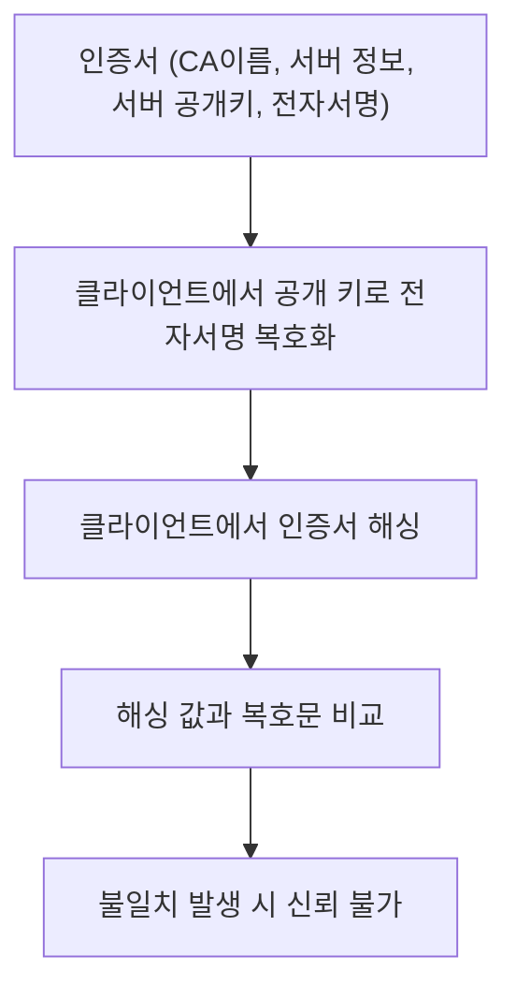

### 출처
* [HTTPS 개발](https://m.blog.naver.com/alice_k106/221468341565)
* [HTTPS 패킷 분석](https://aws-hyoh.tistory.com/39)
* [HTTPS 톺아보기](https://m.blog.naver.com/alice_k106/221468341565)
___
### 개요
* [[#HTTPS란?]]
* [[#SSL이란?]]
* [[#SSL 인증서]]
* [[#인증서의 구조]]
* [[#SSL 핸드 쉐이크]]
* [[#HTTPS 인증서 발급 받기]]
* [[#파이썬에서 HTTPS 접속하기]]
* [[#HTTPS 암호화 확인하기]]
___
### HTTPS란?

HTTPS는 기존 HTTP의 보안 취약점을 해결하고자 탄생한 방식으로 TLS(SSL) 프로토콜을 통해 HTTP의 통신 내용을 암호화 하고 이를 통해 보안성을 강화한 프로토콜을 의미한다.

#### SSL이란?
SSL(Secure Socket Layer) 프로토콜은 웹서버와 브라우저 사이의 보안을 위해 만들어진 프로토콜로 Certificate Authority(CA)를 통해 서버와 클라이언트의 인증을 진행 하는데 사용된다.


SSL은 응용 계층과 전송 계층 사이에 별도로 존재한다. SSL는 TLS와 자주 혼용 돼 사용 되는데, SSL의 업그레이드 버전이 TLS이다. 단 SSL이라는 단어가 너무 대중적으로 퍼져 TLS도 SSL이라고 칭하는 경우가 많다. 
___
### SSL 인증서

**SSL 인증서는 클라이언트와 서버간의 통신을 제 3자가 보증해주는 전자 문서이다.** SSL을 이를 이용해 통신 상대를 식별하고 안전한 통신이 가능하게 한다. SSL 인증서는 다음과 같이 사용된다.

* 서버는 클라이언트가 서버에 접속했을 때 인증서를 전달한다. 
* 클라이언트는 전달 받은 인증서가 적합한지 검증하고 통신 절차를 수행한다. 
* **인증서를 통해 클라이언트는 서버가 신뢰할만한 서버인지 검증할 수 있다.**

인증서는 클라이언트에게 신뢰성을 제공할 뿐만 아니라 SSL 통신에서 활용되는 서버의 공개 키를 클라이언트에게 전달해준다. 즉, **인증서는 통신 상대의 식별 뿐 아니라 안전한 통신을 위한 공개 키 전달이라는 두가지 작업을 진행한다고 할 수 있다**. 공적인 네트워크 상에서 SSL 통신을 실행하기 위해선 인증서가 필수적이고 이 인증서는 CA에서 구입해야 한다.

>[!info]
>**SSL은 인증서를 통해 보안성 높은 통신을 구현한다.**

___
### 인증서의 구조

<span class="red red-bg">인증서는 신뢰성을 보장하는 문서이기 때문에 누군가 신원을 보장해줄 주체가 필요하다. 이를 위해 존재하는 주체가 CA이다. CA는 최상위 인증기관으로 RootCA를 발급한다.</span>

CA는 자체 비밀 키를 가지고 있고 이에 대응하는 공개 키를 배포한다. 대다수의 브라우저에는 CA의 공개 키가 내재돼 있다. 브라우저는 서버로부터 인증서를 받아오고 자신이 가지고 있던 공개 키를 활용해 서버의 신원을 파악한다.

**그렇다면 브라우저는 공개 키와 인증서를 활용해 어떻게 서버의 신원을 확인하는 것일까?** 
우선적으로 인증서에 어떠한 정보가 내제돼 있는지를 파악할 필요가 있는데 인증서에는 아래와 같은 정보가 저장돼 있다.

```text hl:7,11,14,15,95,96,112
Certificate:
    Data:
        Version: 3 (0x2)
        Serial Number:
            03:4f:43:ab:75:4d:94:be:8b:0a:b1:a8:44:87:9d:55:a1:63
        Signature Algorithm: sha256WithRSAEncryption
        Issuer: C=US, O=Let's Encrypt, CN=R11
        Validity
            Not Before: Jun 23 00:05:54 2024 GMT
            Not After : Sep 21 00:05:53 2024 GMT
        Subject: CN=opentutorials.org
        Subject Public Key Info:
            Public Key Algorithm: rsaEncryption
                Public-Key: (4096 bit)
                Modulus:
                    00:eb:e3:9e:7a:ec:f8:06:f7:3b:ff:f0:46:e8:9c:
                    91:78:eb:58:4e:2f:cc:fc:28:e1:f9:c2:b6:9d:b5:
                    d3:d7:ba:d4:cb:9e:97:44:31:d6:b6:83:1d:83:9a:
                    59:b8:b5:83:e1:12:dc:e4:03:2f:d0:53:cc:05:7f:
                    5d:cc:47:31:2e:e3:b6:bf:2d:54:ca:d9:da:7f:32:
                    8e:cf:66:c4:7e:87:d9:e0:1c:54:77:c1:c8:c1:3d:
                    55:00:16:01:c6:ee:99:ff:69:16:96:9e:d3:15:2a:
                    6c:94:09:17:37:a6:73:b6:bc:17:cc:48:5f:ce:5e:
                    48:78:71:91:a2:93:53:aa:9f:c7:50:a9:e4:ce:98:
                    da:23:3a:dc:16:68:6a:71:28:4c:33:60:69:99:da:
                    a5:84:23:6d:cf:60:a3:35:a3:dc:0b:76:32:bc:de:
                    fd:06:7d:32:11:8c:0f:7c:07:a7:17:5f:22:ea:10:
                    ca:ec:71:bb:67:fb:9b:7b:a0:37:ea:3f:0d:0e:c6:
                    77:d7:89:ea:95:00:00:07:37:98:ef:97:ef:a8:b3:
                    70:3d:13:d4:dd:ae:20:c7:6f:ec:e9:b3:db:49:69:
                    4a:de:4b:fd:93:eb:ca:b7:3a:1a:09:83:0c:96:59:
                    d7:bb:fc:78:94:72:59:50:be:16:64:74:1c:36:db:
                    7b:61:ad:a6:0d:47:d4:c4:bc:96:94:fb:a1:5c:0d:
                    49:0d:0b:fe:08:d7:45:8a:bd:82:76:c7:d5:22:28:
                    04:e9:73:7f:a3:ba:18:1e:7a:07:5e:55:f4:f9:8c:
                    1a:da:70:c5:a5:0c:9e:77:8d:7a:b0:16:fa:d7:91:
                    63:f5:80:be:b3:5d:2e:31:3e:c6:3e:46:97:cb:6a:
                    cd:1b:b0:e5:63:68:9f:b9:d3:97:e8:89:95:22:69:
                    e4:1f:5a:31:c6:54:f9:50:a4:6f:ef:7a:4c:6c:77:
                    c8:59:51:cb:ae:73:04:2f:8d:4e:63:4e:27:ce:d6:
                    64:c3:61:8b:c9:73:ea:8f:c2:8f:b5:7c:1d:8a:f1:
                    2d:60:46:f6:9d:19:8d:71:a4:9e:09:43:2c:ff:a3:
                    a5:8e:95:69:70:4e:7d:38:5a:f3:14:64:2e:eb:fe:
                    a6:55:4a:d8:32:74:bf:66:e0:52:15:49:70:4d:07:
                    7f:25:98:72:3d:9a:90:61:1e:b4:f2:96:49:73:ca:
                    fd:49:63:2e:73:b2:c9:26:e2:ef:ea:bf:a8:eb:db:
                    d9:48:5a:c4:4e:ff:ec:f9:77:31:0f:4e:8a:00:93:
                    2b:bb:bc:a9:85:f0:1b:6b:87:df:d9:a1:75:bb:23:
                    2d:3b:1e:dd:c7:6f:68:fb:93:26:53:13:a7:18:80:
                    03:ee:c3
                Exponent: 65537 (0x10001)
        X509v3 extensions:
            X509v3 Key Usage: critical
                Digital Signature, Key Encipherment
            X509v3 Extended Key Usage:
                TLS Web Server Authentication, TLS Web Client Authentication
            X509v3 Basic Constraints: critical
                CA:FALSE
            X509v3 Subject Key Identifier:
                0A:E7:C0:4A:E7:23:71:4D:EC:1F:86:0D:A1:E3:CC:B7:6A:19:58:B2
            X509v3 Authority Key Identifier:
                C5:CF:46:A4:EA:F4:C3:C0:7A:6C:95:C4:2D:B0:5E:92:2F:26:E3:B9
            Authority Information Access:
                OCSP - URI:http://r11.o.lencr.org
                CA Issuers - URI:http://r11.i.lencr.org/
            X509v3 Subject Alternative Name:
                DNS:opentutorials.org
            X509v3 Certificate Policies:
                Policy: 2.23.140.1.2.1
            CT Precertificate SCTs:
                Signed Certificate Timestamp:
                    Version   : v1 (0x0)
                    Log ID    : 3F:17:4B:4F:D7:22:47:58:94:1D:65:1C:84:BE:0D:12:
                                ED:90:37:7F:1F:85:6A:EB:C1:BF:28:85:EC:F8:64:6E
                    Timestamp : Jun 23 01:05:54.304 2024 GMT
                    Extensions: none
                    Signature : ecdsa-with-SHA256
                                30:45:02:20:2E:16:74:79:95:1C:C6:D7:DD:92:3F:B8:
                                36:C7:0C:CE:65:66:86:5A:74:9A:41:A6:AC:2D:34:D2:
                                D8:10:48:FA:02:21:00:A3:ED:BE:75:EC:28:3B:C5:27:
                                9C:16:03:6B:8E:37:F7:70:CE:A3:86:FC:17:6F:D1:17:
                                64:BC:D3:5B:EA:FE:37
                Signed Certificate Timestamp:
                    Version   : v1 (0x0)
                    Log ID    : 19:98:10:71:09:F0:D6:52:2E:30:80:D2:9E:3F:64:BB:
                                83:6E:28:CC:F9:0F:52:8E:EE:DF:CE:4A:3F:16:B4:CA
                    Timestamp : Jun 23 01:05:54.349 2024 GMT
                    Extensions: none
                    Signature : ecdsa-with-SHA256
                                30:45:02:20:5E:CA:9C:BF:25:3B:7F:5A:1F:EC:A7:54:
                                A8:CE:A1:CE:9C:DD:F8:65:C7:53:01:41:8E:E8:99:DB:
                                B2:EA:25:30:02:21:00:CC:01:DB:8E:A2:E2:31:9C:F6:
                                35:B0:4B:E6:FB:CB:E5:62:81:B7:1E:93:52:B5:C8:E4:
                                5F:FD:51:D0:09:23:FA
    Signature Algorithm: sha256WithRSAEncryption
    Signature Value:
        7a:1b:cd:73:d2:67:f1:98:7e:f4:f3:80:67:97:63:c7:2e:00:
        13:cf:96:4a:e0:3b:c4:ba:0e:f0:88:4b:db:70:b2:9d:63:25:
        a8:b6:5f:4b:b7:62:19:12:ee:aa:dd:ca:d4:4f:33:c9:36:21:
        25:26:83:5f:e6:56:16:c9:bd:99:f6:43:17:56:99:9a:c1:61:
        4f:74:41:cc:fe:ab:6c:79:fa:76:88:99:56:32:6a:ce:c2:d0:
        78:80:7d:bd:01:0c:9e:d3:99:6d:79:57:3d:c7:c8:7a:4c:3b:
        22:06:25:bc:56:32:49:c4:93:64:00:62:bb:15:eb:6b:e4:2a:
        b5:35:f2:54:6c:63:4d:0a:68:a4:c8:fd:40:5b:d0:06:3d:dc:
        a8:3f:fe:06:2e:9e:db:97:80:9c:bf:50:36:2e:ee:67:f8:95:
        0c:7e:bc:20:94:f0:37:5a:30:27:9e:cf:78:1c:99:e7:88:fb:
        70:5b:b2:ee:27:f9:0b:88:93:c7:eb:1b:c3:bf:13:7c:98:d4:
        50:9b:8f:4b:7b:3b:84:7e:b2:c1:e1:45:76:8e:74:09:ee:03:
        ad:89:5b:9f:58:9e:ae:38:b0:da:b9:76:a3:9f:7e:4a:d7:27:
        d2:5c:f4:01:9e:34:82:49:76:d4:ee:b5:4e:a7:9f:65:30:66:
        13:21:6a:fd
-----BEGIN CERTIFICATE-----
MIIF8jCCBNqgAwIBAgISA09Dq3VNlL6LCrGoRIedVaFjMA0GCSqGSIb3DQEBCwUA
MDMxCzAJBgNVBAYTAlVTMRYwFAYDVQQKEw1MZXQncyBFbmNyeXB0MQwwCgYDVQQD
EwNSMTEwHhcNMjQwNjIzMDAwNTU0WhcNMjQwOTIxMDAwNTUzWjAcMRowGAYDVQQD
ExFvcGVudHV0b3JpYWxzLm9yZzCCAiIwDQYJKoZIhvcNAQEBBQADggIPADCCAgoC
ggIBAOvjnnrs+Ab3O//wRuickXjrWE4vzPwo4fnCtp2109e61Muel0Qx1raDHYOa
Wbi1g+ES3OQDL9BTzAV/XcxHMS7jtr8tVMrZ2n8yjs9mxH6H2eAcVHfByME9VQAW
Acbumf9pFpae0xUqbJQJFzemc7a8F8xIX85eSHhxkaKTU6qfx1Cp5M6Y2iM63BZo
anEoTDNgaZnapYQjbc9gozWj3At2Mrze/QZ9MhGMD3wHpxdfIuoQyuxxu2f7m3ug
N+o/DQ7Gd9eJ6pUAAAc3mO+X76izcD0T1N2uIMdv7Omz20lpSt5L/ZPryrc6GgmD
DJZZ17v8eJRyWVC+FmR0HDbbe2Gtpg1H1MS8lpT7oVwNSQ0L/gjXRYq9gnbH1SIo
BOlzf6O6GB56B15V9PmMGtpwxaUMnneNerAW+teRY/WAvrNdLjE+xj5Gl8tqzRuw
5WNon7nTl+iJlSJp5B9aMcZU+VCkb+96TGx3yFlRy65zBC+NTmNOJ87WZMNhi8lz
6o/Cj7V8HYrxLWBG9p0ZjXGknglDLP+jpY6VaXBOfTha8xRkLuv+plVK2DJ0v2bg
UhVJcE0HfyWYcj2akGEetPKWSXPK/UljLnOyySbi7+q/qOvb2UhaxE7/7Pl3MQ9O
igCTK7u8qYXwG2uH39mhdbsjLTse3cdvaPuTJlMTpxiAA+7DAgMBAAGjggIVMIIC
ETAOBgNVHQ8BAf8EBAMCBaAwHQYDVR0lBBYwFAYIKwYBBQUHAwEGCCsGAQUFBwMC
MAwGA1UdEwEB/wQCMAAwHQYDVR0OBBYEFArnwErnI3FN7B+GDaHjzLdqGViyMB8G
A1UdIwQYMBaAFMXPRqTq9MPAemyVxC2wXpIvJuO5MFcGCCsGAQUFBwEBBEswSTAi
BggrBgEFBQcwAYYWaHR0cDovL3IxMS5vLmxlbmNyLm9yZzAjBggrBgEFBQcwAoYX
aHR0cDovL3IxMS5pLmxlbmNyLm9yZy8wHAYDVR0RBBUwE4IRb3BlbnR1dG9yaWFs
cy5vcmcwEwYDVR0gBAwwCjAIBgZngQwBAgEwggEEBgorBgEEAdZ5AgQCBIH1BIHy
APAAdgA/F0tP1yJHWJQdZRyEvg0S7ZA3fx+FauvBvyiF7PhkbgAAAZBCoNKAAAAE
AwBHMEUCIC4WdHmVHMbX3ZI/uDbHDM5lZoZadJpBpqwtNNLYEEj6AiEAo+2+dewo
O8UnnBYDa44393DOo4b8F2/RF2S801vq/jcAdgAZmBBxCfDWUi4wgNKeP2S7g24o
zPkPUo7u385KPxa0ygAAAZBCoNKtAAAEAwBHMEUCIF7KnL8lO39aH+ynVKjOoc6c
3fhlx1MBQY7omduy6iUwAiEAzAHbjqLiMZz2NbBL5vvL5WKBtx6TUrXI5F/9UdAJ
I/owDQYJKoZIhvcNAQELBQADggEBAHobzXPSZ/GYfvTzgGeXY8cuABPPlkrgO8S6
DvCIS9twsp1jJai2X0u3YhkS7qrdytRPM8k2ISUmg1/mVhbJvZn2QxdWmZrBYU90
Qcz+q2x5+naImVYyas7C0HiAfb0BDJ7TmW15Vz3HyHpMOyIGJbxWMknEk2QAYrsV
62vkKrU18lRsY00KaKTI/UBb0AY93Kg//gYuntuXgJy/UDYu7mf4lQx+vCCU8Dda
MCeez3gcmeeI+3Bbsu4n+QuIk8frG8O/E3yY1FCbj0t7O4R+ssHhRXaOdAnuA62J
W59Ynq44sNq5dqOffkrXJ9Jc9AGeNIJJdtTutU6nn2UwZhMhav0=
-----END CERTIFICATE-----
```

* **7:CA의 종류**
	* 클라이언트는 이를 토대로 어떠한 공개 키를 사용할지를 결정한다.
* **11:인증서를 사용하는 주체**
	* 인증서를 사용하는 대상의 정보가 들어간다. 일반적으로 호스트 명이 들어간다.
* **14:인증서를 사용하는 주체의 공개 키**
	* 인증서 사용 주체의 공개 키와 어떤 암호화 방식을 활용하고 있는지를 명시한다. 웹 서버의 공개키가 된다.
* **96:서버에서 인증서 무결성 입증을 위해 입력한 해시 값**
	* 인증서의 무결성을 파악하기 위한 전자 서명으로 CA의 개인 키로 암호화된 인증서의 내용을 의미한다.

**밑에 존재하는 --BEGIN--과 --END--에 포함되는 문자열은 인증서의 내용물을 모두 Base64 인코딩한 값이다**. 이는 효율적인 전송을 위해 진행하는 절차로 실제 인증서를 활용할 때는 디코딩을 진행한 후 처리한다. 일반적으로 우리가 보는 인증서 데이터는 .pem 파일에 인코딩된 이 부분이고 위와 같이 인증서의 정보를 완전하게 조회하고 싶다면, `openssl x509 -in certificate.pem -text` 와 같은 명령어를 실행해야 한다.

<span class="red red-bg">서버의 신원을 파악하는 방법은 인증서를 사용하는 주체인 11번째 줄을 확인하면 검증할 수 있다. 주요한 것은 해당 인증서가 중간에 가로채져 위조 됐는지를 어떻게 검증할 것인지가 된다.</span>

인증서의 무결성을 보장하기 위해 인증서에는 전자 서명이 포함돼있다. 해당 서명은 인증서의 내용을 기반으로 해싱된 문자열을 CA의 개인키로 암호화 한것이다. **클라이언트는 인증서에 존재하는 CA의 이름을 파악한 후 적절한 CA의 공개키로 전자 서명을 복호화 하고 인증서의 내용을 해싱해 복호문과 대조한다.** 만약 두 문자열에 차이가 발생한다면, 인증서가 어딘가에서 위조 됐다는 것을 확인할 수 있다.



>[!info]
>**인증서를 사용하는 주체가 접속하고자 하는 곳과 일치하고 인증서의 무결성이 입증되면 연결을 시도한다.**


___
### SSL 핸드 쉐이크

인증서의 유효성이 입증되면 서버와 클라이언트는 암호화 통신을 진행하기 위해 SSL 핸드 쉐이크 과정을 실시한다. **SSL 핸드 쉐이크를 진행하면 서로의 통신에서 계속해 사용되는 대칭 키를 가질 수 있고 이러한 대칭 키를 비대칭 키를 활용해 안전하게 교환하는 작업을 수행한다.**  [[SSH를 알아보자#대칭 키와 비대칭 키|대칭 키와 비대칭 키가 궁금하다면]]

핸드 쉐이크는 아래와 같은 과정으로 진행된다.

- **우선적으로 클라이언트가 서버에 접속해 다음의 정보를 전달한다.**
    `클라이언트 측에서 생성한 랜덤 데이터:` 이후 대칭 키 생성을 위해 사용된다. 이를 통해 서버가 적절한 개인 키를 보유하고 있는지를 확인 할 수 있다. 서버의 공개키로 암호화한 데이터이다.
    
    `클라이언트가 지원 가능한 암호화 방식:` 클라이언트가 사용할 수 있는 암호화 방식들을 전송한다.

- **이후 서버는 이에 대한 응답으로 다음의 정보를 클라이언트에게 전송한다.**
	`서버에서 생성한 랜덤 데이터:` 대칭 키 생성을 위해 사용된다. 클라이언트가 전송한 데이터를 서버의 개인키로 복호화한 데이터를 돌려준다.
	
	`서버가 선택한 암호화 방식:`클라이언트가 전달해준 암호화 방식 중 서버에서도 사용가능한 방식을 전달해준다.
    
    `인증서:` SSL 인증서를 말한다.

- **클라이언트는 인증서를 검증한다.**
	검증 프로세스는 위에서 다뤘다.

- **클라이언트는 서버에게 전달 받은 랜덤 데이터와 자신에게 주어진 랜덤 데이터를 조합해  비밀 키를 생성한다.**
	이때 생성된 키는 대칭 키로 실질적인 통신의 암, 복호화 과정에 활용된다.

- **공개 키 기법을 활용해 시크릿 키를 서버에 안정적으로 전달한다.** 
	인증서를 통해 전달 받은 서버의 공개 키를 활용해 시크릿 키의 값을 암호화 해서 전달해주면 해당 시크릿 키는 서버의 개인 키로만 복호화가 가능해진다. 따라서 안전하게 대칭키를 전송할 수 있게 된다.

- 시크릿 키의 값이 서버와 클라이언트 동시에 존재하게 되면 해당 **시크릿 키 값을 세션 키로 변환하고 서버와 클라이언트의 세션 통신을 해당 세션 키를 통해 암호화 후 진행한다**. 
	이렇게 해서 서버와 클라이언트의 통신이 보안성을 띄게 된다.


> [!info]
> **HTTPS는 인증서 인증 이후 인증서와 비대칭 키를 활용한 대칭 키 생성 이후 통신이 진행된다.**

___
### HTTPS 인증서 발급 받기

HTTPS 연결을 위해 직접 서버에서 사용할 인증서와 클라이언트에서 사용할 공개 키를 만들어보자. HTTPS 활용을 위해선 다음과 같은 요소들이 필요하다.

* CA의 비밀 키
* CA의 인증서 + 공개 키
* 서버의 비밀 키
* 서버의 인증서

이 4가지의 정보를 인증서라는 매체를 활용해 검증하는 방식으로 HTTPS가 동작하기 때문에 인증서 작성을 위해선 우선적으로 이것들 부터 생성해야 한다. 키를 만드는 과정은 생각보다 번접하기 때문에 `openssl` 과 같은 RSA 암호화나 해싱에 특화된 라이브러리를 활용해 작업을 진행한다.

우선적으로 인증서 검증을 위해 활용할 CA의 비밀 키를 만드는 과정부터 진행하자. **==나 자신을 임의의 CA로 취급해 비밀 키를 생성하는 것이기 때문에 이를 기반으로 만들어진 인증서는 공신력이 존재하지 않는다.==**

비밀 키는 아래와 같은 명령어로 만들 수 있다. `openssl genrsa -out CA.key 2048` 이후 비밀 키를 활용해 CA의 인증서 파일도 생성 해준다. `openssl req -x509 -new -nodes -key CA.key -days 365 -out CA.pem`  해당 명령어는 서버의 개인 키로 서명된 암호화 되지 않은 자체 서명  인증서를 발급한다.

이제 실제 암호화 통신에서 활용할 서버의 개인 키와 인증서를 생성 해보자. 서버의 개인 키 생성 방식은 CA의 개인 키를 생성 할 때와 동일하다. `openssl genrsa -out server.key 2048`와 같은 방법으로 개인 키를 생성할 수 있다.

이제 만든 키를 기반으로 인증서 정보를 입력해 CSR 파일을 생성해보자. `openssl req -new -key server.key -out server.csr` CSR은 특정 키와 여러가지 인증 정보가 포함된 파일이다. 이는 인증서 파일이 아니며 인증서를 발급 받기 위해 필요한 데이터가 정리된 파일이라 볼 수 있다. 

이제 CSR 파일을 활용해 인증서를 발급 받자. 인증서에는 CA의 공개 키 개인 키 그리고 CSR 파일의 정보가 포함된다. `openssl x509 -req -in server.csr -CA CA.pem -CAkey CA.key -CAcreateserial -out server.crt` x509 방식의 인증서를 `server.crt` 방식으로 출력하라는 의미가 된다. 이제 이 인증서를 활용하면 HTTPS 접속이 가능해진다.

```text title:server.crt
-----BEGIN CERTIFICATE-----
MIIDdjCCAl6gAwIBAgIUIVLFlJeSW99Fno+CxFJuWGekgdwwDQYJKoZIhvcNAQEL
BQAwRTELMAkGA1UEBhMCS1IxEzARBgNVBAgMClNvbWUtU3RhdGUxITAfBgNVBAoM
GEludGVybmV0IFdpZGdpdHMgUHR5IEx0ZDAeFw0yNDA3MTAwODExMzBaFw0yNDA4
MDkwODExMzBaMGExCzAJBgNVBAYTAktSMRMwEQYDVQQIDApTb21lLVN0YXRlMSEw
HwYDVQQKDBhJbnRlcm5ldCBXaWRnaXRzIFB0eSBMdGQxGjAYBgNVBAMMEWh0dHBz
Oi8vbG9jYWxob3N0MIIBIjANBgkqhkiG9w0BAQEFAAOCAQ8AMIIBCgKCAQEAjXFT
XLQxfiIqSY6+CCeEUBTVqerv+VLfTuq5Qaq4/4I+4MYfB0YPVVrRSVEW6ZyjN5k/
Bl68PAoneFMryGVuk8MpH29/aQ+tVnbmFApaJHVNG5rUEyBIRq7mb17hIwiQraQo
nkPxizZEAtDo2w3UMHapvQWXnSGBsFH7DcIGZflIgz6dLMaAAuKtfwnNaU7io6ZZ
PEOe16Ahev35fQY9F7nxJ0GBUzfx3CaahkfTLVFLQ3/sIP94WoGolDR5U3s4O6Dh
pcwkZA1X2NAhJBK2Uo/qqqW79fQsOD8U76VB50i9CAziu0XNE+uAEmwAhrUlDDQo
4BMcvBnQZD+y3Mkx8QIDAQABo0IwQDAdBgNVHQ4EFgQU9vKiaqi/pK0grQUwr5Me
/uisIo0wHwYDVR0jBBgwFoAUgiZbKZ6NnsWRJ4ZTlT0GJfHqqhowDQYJKoZIhvcN
AQELBQADggEBALWF0qGYvTpCJmuzWYmjIYll4NTNUPI7MkSwc0Ov8OAPd+i2lDYD
P9mh4t8slP87lmI/UzJgO5Tfhp2tQjhVwUAuAY/HtN3iZgXdYgPq5782SvKVoGgl
TOhf2O6qtb3MyrPc9q0JK++kpztBlFcIh82Z+R5u0/JcR3RzGPHN+vaM9nHvNDgn
8S2zTLGA9jpWsY+Na0emfx9aF4sXNYdzHyH+PN3LZMLYkg+5zyyqUUk/s85gsN8E
YMKvKvmVBy06x9v1n+JSvCinhoIVqDBQiiIItA7L+TojAN31HQaphlDojcv1HtjP
6+9hBeHAikJPPC594ESTbvxjrwTVCj1+lBI=
-----END CERTIFICATE-----
```
___
### 파이썬에서 HTTPS 접속하기

이제 파이썬을 활용해 HTTPS 접속을 시도 해보자. 파이썬은 ssl 모듈을 통해 HTTPS 접속을 지원하고 있다.  파이썬 내부에서 ssl을 실제 처리하는 부분은 대다수 C로 구현돼 있고 파이썬 코드에서는 이를 사용하는 작업만을 수행하고 있다.

**파이썬은 SSLSocket 객체를 통해 암호화 통신을 진행하는데 이를 위해선 기존 TCP 소켓을 SSL 컨텍스트에 맞춰 포장해줄 필요가 존재한다.** SSL 컨텍스트는 인증서, 개인 키와 같이 단일 SSL 연결보다 수명이 긴 다양한 데이터를 보관하고 같은 클라이언트의 반복된 연결 속도 증대를 위한 서버 측 소켓의 SSL 캐시를 관리한다. 컨텍스트를 생성하고 포장해 암호화된 SSL 소켓을 생성하는 코드는 아래와 같다.

```python
context = ssl.SSLContext(ssl.PROTOCOL_TLS_SERVER)
context.load_cert_chain("server.crt", "server.key")

with socket.socket(socket.AF_INET, socket.SOCK_STREAM) as sock:
    sock.bind((HOST, PORT))
    sock.listen()
    print("서버가 시작되었습니다.")

    with context.wrap_socket(sock, server_side=True) as s: #ssl 소켓 생성
```

`load_certchain` 은 사용할 인증서와 서버의 개인 키를 컨텍스트에 입력하는 함수이다. 이후의 과정은 동일하다 SSL 핸드 쉐이크 등의 각종 처리는 파이썬 내부에서 수행한다. 아래는 전체 서버 코드이다.

```python hl:8,9,16
import socket
import ssl
import random

HOST = "127.0.0.1"
PORT = 443

context = ssl.SSLContext(ssl.PROTOCOL_TLS_SERVER)
context.load_cert_chain("server.crt", "server.key")

with socket.socket(socket.AF_INET, socket.SOCK_STREAM) as sock:
    sock.bind((HOST, PORT))
    sock.listen()
    print("서버가 시작되었습니다.")

    with context.wrap_socket(sock, server_side=True) as s:
        conn, addr = s.accept()
        with conn:
            answer = random.randint(1, 9)
            print(f"클라이언트가 접속했습니다:{addr}, 정답은 {answer} 입니다.")
            while True:
                data = conn.recv(1024).decode("utf-8")
                print(f"데이터:{data}")

                try:
                    n = int(data)
                except ValueError:
                    conn.sendall(f"입력값이 올바르지 않습니다:{data}".encode("utf-8"))
                    continue

                if n == 0:
                    conn.sendall(f"종료".encode("utf-8"))
                    break
                if n > answer:
                    conn.sendall("너무 높아요".encode("utf-8"))
                elif n < answer:
                    conn.sendall("너무 낮아요".encode("utf-8"))
                else:
                    conn.sendall("정답".encode("utf-8"))
                    break

```

클라이언트는 더욱 간단하다. 인증서 복호화를 위한 개인 키만 존재하면 된다. (서버의 공개 키는 인증서 내부에 존재한다) 코드는 아래와 같다.

```python hl:8,11
import socket
import ssl

HOST = "127.0.0.1"
PORT = 443

context = ssl.SSLContext(ssl.PROTOCOL_TLS_CLIENT)
context.load_verify_locations("CA.pem")

with socket.socket(socket.AF_INET, socket.SOCK_STREAM) as sock:
    with context.wrap_socket(sock, server_hostname="https://localhost") as s:
        s.connect((HOST, PORT))

        while True:
            n = input("1-9 사이의 숫자를 입력하세요(0은 게임포기):")
            if not n.strip():
                print("입력값이 잘못되었습니다.")
                continue
            s.sendall(n.encode("utf-8"))
            data = s.recv(1024).decode("utf-8")
            print(f"서버응답:{data}")
            if data == "정답" or data == "종료":
                break
```

`verify_locations`는 인증서 검증을 위해 사용하는 CA의 인증서로 내부에는 CA의 공개 키가 기록돼 있어 이를 통해 서버의 인증서를 검증하는 것이 가능하다.
___
### HTTPS 암호화 확인하기

이제 실제 패킷을 확인해 암호화가 잘 진행되고 있는지 확인해보자.  첫 번째로 전송되는 패킷은 Client Hello 이다. 이는 클라이언트가 SSL 연결을 서버에 요청하는 패킷이다.


서버가 이를 수신하면 Server Hello 패킷을 응답으로 돌려준다.


이후에는 서버가 자신의 인증서를 클라이언트에 전송하는 작업이 수행된다.
Certicate 패킷을 통해 해당 작업이 수행되며 전달 받은 인증서를 클라이언트는 검증한다.


이후에 클라이언트는 통신에 활용할 대칭 키 생성을 위해 서버에게 Client Key Exchange를 전송한다. 이는 서버의 공개 키로 암호화된 클라이언트가 생성한 랜덤 문자열이다. 서버는 개인 키로 이를 복호화해 해석 한다.


마지막으로 랜덤 문자열을 통해 대칭 키를 생성하고 나면 Change Cipher Spec 이라는 패킷이 전달되고 이후부터 암호화된 통신이 진행된다.


실제로 코드를 실행한 후 전송되는 패킷을 확인해보면 암호화가 진행된 것을 확인해 볼 수 있다.

```
51bb5899f1455d6330bba5b1e7bc100e2a43679beed620c8a8c15c86fa4c5f096a93b22cd8a8ff519dca5b6515d9e4c02451130ed57fb4f84f7d5e4597b570172b30dbc4b50ee702a276a18fbb4eebc7ad5db9107f0f7e06cd6dc3967c8294a77efcd8a0469b5a978573bf6dc94724e1546bb470ddcb0393e56ca21d0887c886df6993f59b0014c10827453fdc16a0566dbcfe100e0ab4948628ca9e2084e93857fcf140e291553a3942c0b4072e0015a8f5407cedcc3900a07a641ba522739fc224a1142b72020854ae38baeb03c5969b81716e02d9bfdfd84a838555e8082d3fda25c3835a285d55fd4c10dd6e5a3c98ed0b6c19a7442a8d5f0acaaf9340f595788ae2c2423f2bfaaad28ad65699dab713f477b20445e7c16ac77fcc9b89406e10481b97fc3b15fa52
```
