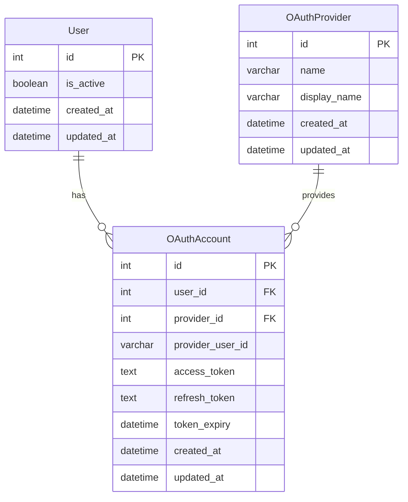

### 출처
* [Oauth란](https://showerbugs.github.io/2017-11-16/OAuth-%EB%9E%80-%EB%AC%B4%EC%97%87%EC%9D%BC%EA%B9%8C)
* [네이버 로그인 가이드](https://developers.naver.com/docs/login/devguide/devguide.md#5--%EB%84%A4%EC%9D%B4%EB%B2%84-%EB%A1%9C%EA%B7%B8%EC%9D%B8-%EC%82%AC%EC%9A%A9%EC%9E%90-%ED%94%84%EB%A1%9C%ED%95%84-%EA%B0%B1%EC%8B%A0-%EB%B0%8F-%EC%9E%AC%EC%9D%B8%EC%A6%9D)
___
### 개요
* [[#OAuth이란]]
* [[#OAuth는 왜 만들었을까?]]
* [[#OAuth2.0]]
* [[#OAuth로 회원가입이 가능한가요?]]
* [[#OAuth 직접 구현해보기]]
* [[#OAuth로 회원가입과 로그인]]
___
### OAuth이란

**OAuth(Open Authorization)는 인터넷 사용자들이 비밀번호를 공유하지 않고도 제 3의 애플리케이션이나 웹사이트가 사용자의 정보에 접근 할 수 있도록 하는 프로토콜**이다. OAuth를 활용하면 아이디나 비밀번호 등의 개인정보를 직접적으로 저장하지 않고 사용자의 정보를 제공 받는 것이 가능하다. 

네이버나 카카오로 로그인하기 등을 활용해 별도의 아이디나 비밀번호 없이 로그인 또는 회원가입을 한 경험이 다들 존재할 것이다. 이것이 대표적인 OAuth의 응용사례이다.

>[!info]
>**OAuth는 프로토콜로 제 3자가 비밀번호 없이 그들의 정보를 제공 받고 싶을 때 따르는 규칙이다.**

___
### OAuth는 왜 만들었을까?

OAuth의 시작은 옛날 트위터로 거슬러 올라간다. 이전에 별도의 서비스에서 트위터에 저장된 정보를 활용하기 위해선 해당 서비스에서 트위터의 아이디와 비밀번호를 저장하고 있어야 했다. 이는 여러 문제를 발생 시켰는데 아래를 확인해보자.

* 어플리케이션에서 사용자의 트위터 정보를 저장하고 악용이 가능하다.
* 아이디와 비밀번호가 노출되는 횟수가 빈도가 잦아진다.
* 아이디와 비밀번호를 제공함으로써 제3자가 모든 권한을 가질 수 있게 된다.
* 비밀번호 초기화 말고는 해당 어플리케이션의 권한을 폐기할 방법이 없다.

이에따라 **트위터에서 자체적으로 인증서버를 공개해 제 3자 어플리케이션에서 보다 편하게 트위터 내부의 유저 정보를 접근 가능한 구조를 개발했는데 이것이 OAuth의 시작이다.** 초기 OAuth 1.0의 생김새는 아래와 같다.


OAuth는 토큰을 발급해 관리하는 방식으로 사용자의 id와 비밀번호가 제 3자 어플리케이션에 제공될 필요가 없고 토큰에 대한 정보는 트위터 내부에서 관리 하므로 사용자는 트위터 서버를 통해 언제든지 제 3자 어플리케이션의 권한을 박탈할 수 있게 됐다.

그렇지만 OAuth 1.0은 구현이 번잡했고 http에서의 동작을 보장해야했기에 별도의 hmac 암호화 등을 제공해야 했다. 또한 엑세스 토큰의 유효기간이 존재하지 않는다는 문제점이 존재했다. 

>[!info]
>**OAuth라는 시스템의 등장은 훌륭했으나 손볼 부분들이 조금씩 존재했다.**

___
### OAuth2.0

2.0이 되면서 OAuth는 HTTPS를 필수로 지원하게 변경됐다. 이에따라 기존의 암호화를 위해 사용했던 Hmac 등의 알고리즘으로 부터 자유로워지면서 OAuth 자체의 구조는 단순하게 변경됐다.

2.0은 현재까지도 사용하는 방법이고 오늘을 기준으로 OAuth를 제공하는 모든 서비스는 2.0을 활용한다. 2.0의 구성을 살펴보자.

* Resource Owner: 사용자
* Client: 제 3자 어플리케이션으로 Resource Server의 정보를 제공 받고 싶어하는 애플리케이션이다.
* Resource Server: 사용자의 정보를 가지고 있는 서버로 카카오나 구글을 말한다.
* Authorization Server: 인증 서버로 사용자가 해당 자원에 대한 권한이 존재하는지 확인하는 서버이다.

이제 각 구성원들이 어떠한 역할을 수행해 인증과정을 마무리 하는지 확인해보자. 아래는 페이코에서 작성한 자료이다.


번잡해보이지만, 내용은 간단하다 하나씩 살펴보자.

1. 사용자가 제 3자 어플리케이션에 로그인 시도를 한다.
2. 서비스는 사용자에게 페이코의 로그인 페이지를 제공한다.
3. 사용자는 페이코의 ID, PW를 페이코 인증서버에 전달한다. (제 3자 서비스가 아닌 페이코에 제공한다)
4. 페이코는 인증이 성사될 경우 인증 코드를 사용자에게 발급한다.
5. 사용자는 인증 코드를 리다이렉트 URL을 통해 서비스에게 전달한다.
6. 서비스는 인증 코드를 기반으로 인증서버로 부터 엑세스 토큰을 발급 받는다.
7. 엑세스 토큰은 서비스 서버에 저장된다.
8. 사용자가 요청시 서비스 서버에 저장된 엑세스 토큰을 통해 페이코 서버로 전송한다.

다음과 같이 정리할 수 있다. 인증 서버를 통해 제 3자 서비스에게는 내 정보를 제공하지 않고 토큰만을 제공한다. 토큰을 통해 제 3자 서비스는 자원 서버에 접근 할 수 있게 된다. 

#### OAuth로 회원가입이 가능한가요?
가능하다. 네이버나 카카오 로그인을 통해 회원가입을 진행해본 경험이 다들 있을 것이다. 이 경우 리소스 서버에서 제공하는 정보만을 토대로 회원가입을 진행하는 것이 가능하다. 따라서 만약 리소스 서버에서 제공하지 못하는 별도의 정보를 입력 받으려면 유저가 추가적으로 정보를 입력하게 해야한다.

흥미롭게 생각해볼 부분은 아이디와 비밀번호 없이 회원가입이 가능하다는 점이다. 인증 자체를 외부에서 진행하기 때문에 서비스 DB에는 아이디나 비밀번호를 저장할 필요가 없다. 다만 이 경우 구분이 어려워 지므로 각 유저 별로 구분되는 인증 코드 등을 활용하는 방식 등을 사용해야 한다.

#### 아이디 비밀번호가 없으면 어떻게 로그인을 해요?
좋은 질문이다. OAuth로 회원가입을 진행한 유저의 경우 아이디와 비밀번호가 서비스 DB에 존재하지 않기 때문에 서비스 단에서 인증을 진행하는 것은 불가능하다. 이에 따라 서비스에서 해당 유저가 존재하는 유저라는 것을 검증하기 위해서는 다음과 같은 과정이 필요하다.

1. 사용자가 인증서버에서 로그인을 진행한다.
2. 인증서버는 서비스 서버로 엑세스 토큰을 발급한다.
3. **엑세스 토큰에 담긴 인증 코드 혹은 유저 식별 정보를 서비스 DB에서 탐색한다.**
4. 만약 존재할 경우 존재하는 유저이므로 로그인 성공 처리를 진행한다.

이 과정은 엑세스 토큰과 리프레시 토큰이 모두 만료된 경우에만 발생하는 상황이며 재 로그인이 필요할 경우 내 서비스가 아닌 리소스 서버에서 로그인을 진행해야 한다는 점이 핵심이다.

인증 코드가 존재만해도 로그인 처리를 하다니! **이러면 인증 코드를 브루트포스 방식으로 대입하다 하나 걸리면 해킹이 가능해지는 것이 아닌가?** 라는 생각이 들 수 있다. 이에 따라 서버 단에서는 인증 코드를 포함하는 엑세스 토큰을 검증 작업을 수행한다. 실제로 구글의 경우에는 해당 엑세스 토큰이 실제 구글에서 발급한 토큰인지 검증하는 API도 제공한다.

>[!info]
>**서버는 엑세스 토큰을 검증하고 페이로드에 담겨있는 인증 코드를 토대로 로그인 인증을 실시한다.**

#### 엑세스 토큰과 리프레시 토큰을 왜 서비스 서버가 관리해요?
해당 토큰의 발급 대상이 사용자가 아닌 서비스 서버이기 때문이다. OAuth과정에서 발급되는 토큰은 해당 서비스 전용으로 발급된 토큰이다. 이에따라 적절한 권한이 부여 돼있다.

#### 왜 인증 코드를 클라이언트에 전달하고 리다이렉트하나요?
서비스가 인증 코드를 전달 받는 과정을 보면 인증 서버가 인증된 사용자에게 리다이렉트 요청을 전송하고 사용자가 해당 URL로 인증 코드를 전송하는 방식으로 동작한다. 굳이 이렇게 할 필요 없이 인증 서버가 곧장 서비스의 벡엔드에 인증 코드를 전달할 수 는 없을지에 대한 궁금증이 발생한다. 

이러한 방식을 택한 이유는 **인증 서버와 연결된 주체가 사용자이기 때문**이다. **서비스는 인증서버로 
클라이언트를 보내줄 뿐 인증 서버와의 연결점은 존재하지 않는다**. 이에따라 클라이언트와 인증서버가 인증을 진행하고 이후 결과를 별도의 리다이렉팅을 통해 인증서버에 전달하는 것이다.
___
### OAuth 직접 구현해보기

네이버 로그인을 직접 구현해보자. 네이버 OAuth 서버를 활용해 네이버 로그인을 진행하고 이를 기반으로 네이버 프로필을 받아오자. 진행순서는 다음과 같다.

* **우선적으로 네이버 로그인 페이지로 접속한다.**
* **네이버 로그인을 진행한다.**
* **네이버는 사용자에게 콜백 URL을 전달한다.**
* **우리 서버의 콜백 URL에 등록된 API로 네이버의 인증 코드가 전달된다.**
* **전달 받은 인증 코드와 API 엑세스 키를 활용해 네이버 엑세스 토큰을 발급 받는다**
* **발급받은 엑세스 토큰을 활용해 네이버 프로필을 발급 받는다.**

우선적으로 네이버 인증 API 활용을 위한 엑세스 키를 발급받는 작업부터 진행해보자. OAuth 키를 발급 받기 위해서는 네이버에 키를 사용할 어플리케이션을 등록하는 작업부터 진행해야한다.


이제 네이버 로그인을 진행할 html 파일을 작성해보자. 우리는 해당 html의 링크로 접속해 네이버 로그인을 진행할 것이다.

```html
<!DOCTYPE html>
<html lang="en">
<head>
  <meta charset="UTF-8">
  <title>Title</title>
</head>
<body>
<a href="https://nid.naver.com/oauth2.0/authorize?response_type=code&client_id=dPMqyE4amp5HCyF4QdkK&state=STATE_STRING&redirect_uri=http://127.0.0.1:8080/naver">naver login</a>
</body>
</html>
```

링크에 쿼리 파라미터로 전달되는 `redirect_uri`라는 변수에 집중해보자. **이는 네이버에서 로그인이 성공할 경우 인증 코드를 전달할 우리 서버의 URL 경로를 의미한다.**

리다이렉트 URL로 클라이언트는 인증 코드를 전달하고 이를 통해 우리 서버는 네이버에 사용자가 인증된 유저라는 것을 증명할 수 있다. 인증을 받았다면 이제 우리 서비스는 네이버 엑세스 토큰을 발급 받을 수 있다.

클라이언트로 부터 인증 코드를 전달 받고 네이버 엑세스 토큰을 발급받는 API를 작성해보면 아래와 같다.

```python
@app.get("/naver")
async def get_access_token(
    code: str, state: str, token: Token = Depends(get_token_class)
):
    naver_client_id = ""
    naver_client_secret = ""
    token_issue_url = f"https://nid.naver.com/oauth2.0/token"
    resp = requests.get(
        token_issue_url,
        params={
            "grant_type": "authorization_code",
            "client_id": naver_client_id,
            "client_secret": naver_client_secret,
            "code": code, #인증 코드
            "state": state,
        },
    ) #엑세스 토큰을 발급
    token.set_token(resp.json())
    return {"access_token": token}
```

엑세스 토큰까지 발급 받았다면 사실상 네이버 프로필을 받을 모든 준비가 완료 됐다. 이제 엑세스 토큰을 활용해 네이버 프로필을 조회해보자.

```python
@app.get("/profile")
async def get_naver_profile(token: Token = Depends(get_token_class)):
    profile_url = "https://openapi.naver.com/v1/nid/me"
    header = {"Authorization": f"Bearer {token.get_token()}"}
    resp = requests.get(profile_url, headers=header)
    return resp.json()
```

결과는 아래와 같이 전달된다.

```json
{"resultcode":"00","message":"success","response":{"id":"","gender":"M","mobile":"010","mobile_e164":"+82","name":"","birthday":"","birthyear":""}}
```

___
### OAuth로 회원가입과 로그인

이제 OAuth로 회원가입하는 방법을 생각해보자. 네이버에서 기본적으로 전달 받는 데이터가 존재 하므로 이미 입력 받은 데이터는 제외하고 별도의 데이터가 필요한 경우에만 입력을 진행하면 된다.

우선적으로 OAuth를 통해 모든 정보를 입력 받는다는 것을 가정하고 작업을 진행해보자. 우리에게 필요한 테이블은 3개로 유저, OAuth 계정, OAuth 플랫폼 테이블이다. 각 테이블의 생김새는 아래와 같다.



이렇게 테이블을 분리해 관리할 경우 각 OAuth 제공 플랫폼 별로 회원 가입이 가능한 상황을 방지할 수 있고 유저와 플랫폼이 제공하는 정보를 분리해 구분할 수 있어 확장이 용이하다. 

로그인은 어떻게 진행할 수 있을까? **OAuth 계정 id를 토대로 로그인을 진행할 수 있다. 이는 각 OAuth 제공 업자에서 각 유저를 구분하기 위해 사용하는 유일한 유니크 키이기 때문에 이를 활용하면 특정 유저를 식별하는 것이 가능해진다.** 

따라서 **OAuth 로그인을 진행하고 제공자로부터 전달 받은 id를 기반으로 해당 id가 서비스 DB에 존재하는지 검증함으로써 로그인을 성사 시킬 수 있다.**

____
### OAuth를 통한 권한 획득

권한은 OAuth와 연관이 깊은데 **OAuth를 활용하면 봇이 유저를 흉내내 여러 작업을 처리하는 것이 가능하다.** 예를 들어 내가 작성한 메시지를 편집해서 번역문을 덮어주는 번역 슬랙 봇을 만든다고 가정해보자.

이를 위해선 나에게 유저의 권한을 가지고 있는 유저 토큰이 필요하다. 하지만 내 서비스에 모든 유저의 로그인 정보를 저장하는 것은 쉽지 않은 일이다. 이에 따라 로그인 정보가 없이도 유저의 권한을 획득할 방법이 필요한데 이때 활용하는 것이 OAuth를 통해 발급된 토큰이다.

**OAuth 절차를 수행해 발급된 토큰은 해당 유저가 갖는 권한을 모두 확보할 수 있고 해당 유저를 흉내내는 것이 가능해진다**. 이를 활용해 유저의 메시지를 편집, 삭제, 메시지 전송 등이 가능해진다.

이는 구글 문서에서도 동일하게 활용할 수 있다. 특정한 문서나 구글 드라이브 접근 권한을 획득할 때 OAuth를 활용한 인증을 활용하면 특정 유저를 흉내내는 것이 가능해진다.

>[!info]
>**OAuth는 곧 특정 유저를 흉내내기 위해 사용하는 인증 수단이다.**

