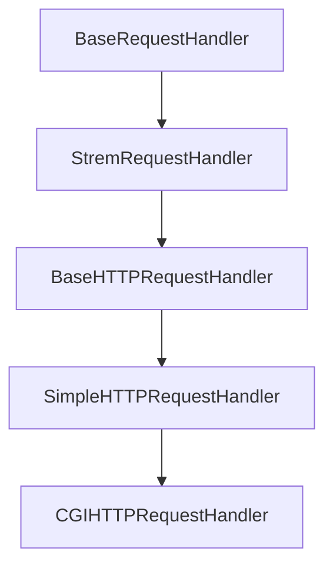

### 출처
* [CGi,.WSGI, ASGI](https://kangbk0120.github.io/articles/2022-02/cgi-wcgi-asgi)
* [WAS, CGI, WSGI](https://brownbears.tistory.com/350)
### 개요
* CGI란?
* CGI의 동작방식
* 파이썬의 CGI
* CGI의 단점
* FastCGI란
* Nginx에 FastCGI 적용하기
* FastCGI와 WSGI
* WSGI의 동작방식
* WAS란?
* 장고는 어떻게 동작하나요?
___
### CGI란?

일전의 [[웹서버와 nginx#정적 웹서버의 한계]]에서 말했듯 정적 웹서버는 동적인 요청을 처리할 수는 없었다. 이에 따라 동적인 요청을 처리하기 위한 <b><u>스크립트 등을 동작 시켜 클라이언트에게 반환하고 싶다는 욕망이 발생하게 됐는데 이를 위해 탄생한 것이 CGI이다.</u></b>

CGI는 Common Gateway Interface의 약자로 ==**웹 서버(정적)와 응용 프로그램(파이썬, PHP 등)이 통신하는 규약을 정의한다.**== CGI는 통신 규약이기 때문에 각 언어에 맞춰 다양한 종류가 존재한다.

CGI는 웹서버가 실제 프로그램 코드를 실행하는 방식으로 동작한다. 이때 **요청을 수신할 때마다 프로세스를 생성해 프로그램을 동작 시키므로 요청이 많을 경우 부하가 심하다.**
___
### CGI의 동작 방식

동작방식의 기준은 파이썬 CGI이다. 과거 파이썬 CGI는 아래와 같이 동작한다.
* 웹 서버가 클라이언트로부터 요청을 전달 받는다.
* **웹 서버는 요청에 담긴 정보를 환경 변수나 표준 입력에 전달한 후 스크립트를 실행**한다.
* 스크립트는 표준 입력을 통해 받은 데이터를 활용해 로직을 수행하고 **결과물을 표준 출력으로 웹서버에 전달한다.**
* 웹 서버는 이를 클라이언트에 전달한다.

이제 실제 파이썬에 기본 탑재 돼있는 CGI의 내부 동작을 한번 샅샅이 파악해보자. 파이썬 내장 클래스 `http.server`를 활용해 간단한 웹 서버를 작성해보자. **파이썬은 사용할 서버의 타입과 리퀘스트를 처리할 방식 (핸들러)만 전달하면 빠르게 간단한 서버를 생성할 수 있다.**

```python
import http.server
import socketserver

def run(server_class=http.server.HTTPServer, handler_class=http.server.CGIHTTPRequestHandler
```):
    PORT = 8000
    server_address = ('localhost', PORT)
    httpd = server_class(server_address, handler_class) #사용할 서버와 리퀘스트 처리에 사용할 핸들러
    httpd.serve_forever()

run()
```

[serve_forever](https://github.com/python/cpython/blob/main/Lib/socketserver.py#L218) 함수는 이벤트 루프를 계속해서 실행하는 것과 비슷한 효과를 발생시킨다. 서버는 `select` 시스템 콜을 활용해 자신이 관심있는 소켓에서 이벤트가 발생했는지 체크한 후 처리를 진행한다.

실질적인 서버 기능은 모두 `serve_forever` 내부에 구현돼 있다. 이제 함수의 코드를 한번 살펴보자.

```python
 def serve_forever(self, poll_interval=0.5):
        """Handle one request at a time until shutdown.

        Polls for shutdown every poll_interval seconds. Ignores
        self.timeout. If you need to do periodic tasks, do them in
        another thread.
        """
        self.__is_shut_down.clear()
        try:
            # XXX: Consider using another file descriptor or connecting to the
            # socket to wake this up instead of polling. Polling reduces our
            # responsiveness to a shutdown request and wastes cpu at all other
            # times.
            with _ServerSelector() as selector:
                selector.register(self, selectors.EVENT_READ)

                while not self.__shutdown_request: #서버 소켓이 닫횔 때까지
                    ready = selector.select(poll_interval) #멀티 IO 처리
                    # bpo-35017: shutdown() called during select(), exit immediately.
                    if self.__shutdown_request: #서버 소켓이 닫히면
                        break
                    if ready:
                        self._handle_request_noblock() #리퀘스트를 핸들링 한다

                    self.service_actions() #오버라이딩 예정
        finally:
            self.__shutdown_request = False
            self.__is_shut_down.set()


    def _handle_request_noblock(self):
        """Handle one request, without blocking.

        I assume that selector.select() has returned that the socket is
        readable before this function was called, so there should be no risk of
        blocking in get_request().
        """
        try:
            request, client_address = self.get_request() #accept를 통해 소켓 추출 (TCP 서버 일 경우) 왜 자식에서만 get_request를 구현할까?
        except OSError:
            return
        if self.verify_request(request, client_address):
            try:
                self.process_request(request, client_address) #실제 리퀘스트 처리 ()
            except Exception:
                self.handle_error(request, client_address)
                self.shutdown_request(request) #커넥션 소켓 종료
            except:
                self.shutdown_request(request)
                raise
        else:
            self.shutdown_request(request)
```

함수는 앞서 말한대로 시스템 콜을 활용해 특정 주기마다 이벤트를 감지하고 만약 이벤트가 처리 가능한 상태이면 `_handle_request_noblock` 함수를 통해 리퀘스트를 처리한다. `_handle_request_noblock` 함수는 `get_request`를 통해 신규 커넥션을 생성하고 이에 따른 적절한 처리를 `process_request`를 통해 처리 해준다.

이제 요청을 처리하는 `process_request`를 확인해보자. 코드 내부를 살펴보면 실질적인 요청 처리 및 응답 생성은 `RequestHandlerClass`에서 진행되는 것을 확인할 수 있다.

```python
class BaseServer:
    ...
    def process_request(self, request, client_address):
        self.finish_request(request, client_address)
        self.shutdown_request(request)
    ...
        
    def finish_request(self, request, client_address):
        """Finish one request by instantiating RequestHandlerClass."""
        self.RequestHandlerClass(request, client_address, self)
```

`BaseServer` 내부에 정의된 리퀘스트 핸들러는 `RequestHandlerClass`이고 해당 클래스는 아래와 같은 구조를 띄고 있다.
```python
class BaseRequestHandler:
    def __init__(self, request, client_address, server):
        self.request = request
        self.client_address = client_address
        self.server = server
        self.setup()
        try:
            self.handle()
        finally:
            self.finish()

    def setup(self):
        pass

    def handle(self):
        pass

    def finish(self):
        pass
```

`setup` -> `handle` -> `finish` 의 순서로 진행되는 것을 확인할 수 있다. 이때 각 메서드는 자식 클래스에서 오버라이딩을 통해 구현된다. 우리가 관심있는 부분은 CGI이므로 `CGIHTTPRequestHandler`가 어떻게 동작 하는지 파악해보자.

우선 `CGIHTTPRequestHandler`는 아래와 같이 상속을 받는다.



`StreamRequestHandler`는 `setup`과 `finish`를 정의한다. 해당 함수에서는 소켓을 생성하고 소켓으로 데이터를 전송하는 기능을 수행한다.

```python
class StreamRequestHandler(BaseRequestHandler):
    ...
    rbufsize = -1
    wbufsize = 0

    # A timeout to apply to the request socket, if not None.
    timeout = None

    # Disable nagle algorithm for this socket, if True.
    # Use only when wbufsize != 0, to avoid small packets.
    disable_nagle_algorithm = False

    def setup(self):
        self.connection = self.request
        if self.timeout is not None:
            self.connection.settimeout(self.timeout)
        if self.disable_nagle_algorithm:
            self.connection.setsockopt(socket.IPPROTO_TCP,
                                       socket.TCP_NODELAY, True)
        self.rfile = self.connection.makefile('rb', self.rbufsize) #소켓의 읽기 버퍼 생성
        if self.wbufsize == 0:
            self.wfile = _SocketWriter(self.connection)
        else:
            self.wfile = self.connection.makefile('wb', self.wbufsize) #소켓의 쓰기 버퍼 생성

    def finish(self):
        if not self.wfile.closed:
            try:
                self.wfile.flush() #버퍼에 있는 내용 표준 출력으로 출력
            except socket.error:
                # A final socket error may have occurred here, such as
                # the local error ECONNABORTED.
                pass
        self.wfile.close()
        self.rfile.close()
```

이후 `BaseHTTPRequestHandler` 에 정의된 `handler` 메서드를 활용해 요청을 처리한다.

```python
class BaseHTTPRequestHandler(socketserver.StreamRequestHandler):
    ...
    def handle(self):
        """Handle multiple requests if necessary."""
        self.close_connection = True

        self.handle_one_request()
        while not self.close_connection:
            self.handle_one_request()
            
    def handle_one_request(self):
        try:
            self.raw_requestline = self.rfile.readline(65537)
            if len(self.raw_requestline) > 65536:
                self.requestline = ''
                self.request_version = ''
                self.command = ''
                self.send_error(HTTPStatus.REQUEST_URI_TOO_LONG)
                return
            if not self.raw_requestline:
                self.close_connection = True
                return
            if not self.parse_request():
                # An error code has been sent, just exit
                return
            mname = 'do_' + self.command #처리할 메소드의 타입
            if not hasattr(self, mname):
                self.send_error(
                    HTTPStatus.NOT_IMPLEMENTED,
                    "Unsupported method (%r)" % self.command)
                return
            #여기서 하부의 do_GET, do_POST와 같은 method를 가지고옴
            method = getattr(self, mname)
            method()
            self.wfile.flush() #actually send the response if not already done.
```

`handle`  함수는 클라이언트의 커넥션이 살아있는 동안 요청을 처리하기 위한 `handle_one_request`는 요청을 수신해 파싱하고 메소드 명을 파악해 적절한 처리를 진행한다. 이때 각 메소드 별 처리를 담당하는 메서드는 `do_ + METHOD_TYPE`의 형태를 띄고있다.

`do_GET`은 `SimpleHTTPRequest`에 위치해 경로로 전달된 파일을 전달하는 정적 웹서버의 기능만 수행한다. 우리가 확인하고 싶은 것은 동적 요청을 처리할 수 있는 CGI의 동작이므로 CGI 핸들러에 정의된 `do_POST` 메서드의 코드를 확인해보자.


cgi를 통해 요청을 처리할 스크립트 파일들은 `/cgi-bin` 혹은 `/htbin` 위치에 두어야만 작동한다. 이는 코드단에서 작성한 요소로 [링크](https://github.com/python/cpython/blob/7dead6a33ac786465c3d927d5c2025caf0c1a71b/Lib/http/server.py#L978)에서 확인해 볼 수있다.

```python
def do_POST(self):
	"""
	Serve a POST request.
	This is only implemented for CGI scripts.
	"""

	if self.is_cgi():
		self.run_cgi() #cgi 실행
	else:
		self.send_error(
			HTTPStatus.NOT_IMPLEMENTED,
			"Can only POST to CGI scripts")
```

만약 알맞은 cgi 요청이 들어오기 전에 적절한 요청인지 확인하고 이후 `run_cgi` 요청을 수행해 스크립트를 동작시킨다.
```python
def run_cgi(self):
	"""Execute a CGI script."""
	dir, rest = self.cgi_info
	path = dir + '/' + rest
	i = path.find('/', len(dir)+1)
	while i >= 0:
		nextdir = path[:i]
		nextrest = path[i+1:]

		scriptdir = self.translate_path(nextdir)
		if os.path.isdir(scriptdir):
			dir, rest = nextdir, nextrest
			i = path.find('/', len(dir)+1)
		else:
			break

	# find an explicit query string, if present.
	rest, _, query = rest.partition('?')

	# dissect the part after the directory name into a script name &
	# a possible additional path, to be stored in PATH_INFO.
	i = rest.find('/')
	if i >= 0:
		script, rest = rest[:i], rest[i:]
	else:
		script, rest = rest, ''

	scriptname = dir + '/' + script
	scriptfile = self.translate_path(scriptname)
	if not os.path.exists(scriptfile):
		self.send_error(
			HTTPStatus.NOT_FOUND,
			"No such CGI script (%r)" % scriptname)
		return
	if not os.path.isfile(scriptfile):
		self.send_error(
			HTTPStatus.FORBIDDEN,
			"CGI script is not a plain file (%r)" % scriptname)
		return
```

우선적으로 요청 받은 url을 파싱해 실행할 스크립트의 위치를 파악하고 파이썬 파일 형식인지 검사한다.

```python
	env = copy.deepcopy(os.environ)
	env['SERVER_SOFTWARE'] = self.version_string()
	env['SERVER_NAME'] = self.server.server_name
	env['GATEWAY_INTERFACE'] = 'CGI/1.1'
	env['SERVER_PROTOCOL'] = self.protocol_version
	env['SERVER_PORT'] = str(self.server.server_port)
	env['REQUEST_METHOD'] = self.command
	uqrest = urllib.parse.unquote(rest)
	env['PATH_INFO'] = uqrest
	env['PATH_TRANSLATED'] = self.translate_path(uqrest)
	env['SCRIPT_NAME'] = scriptname
	env['QUERY_STRING'] = query
	env['REMOTE_ADDR'] = self.client_address[0]
	authorization = self.headers.get("authorization")
	if authorization:
		authorization = authorization.split()
		if len(authorization) == 2:
			import base64, binascii
			env['AUTH_TYPE'] = authorization[0]
			if authorization[0].lower() == "basic":
				try:
					authorization = authorization[1].encode('ascii')
					authorization = base64.decodebytes(authorization).\
									decode('ascii')
				except (binascii.Error, UnicodeError):
					pass
				else:
					authorization = authorization.split(':')
					if len(authorization) == 2:
						env['REMOTE_USER'] = authorization[0]
	# XXX REMOTE_IDENT
	if self.headers.get('content-type') is None:
		env['CONTENT_TYPE'] = self.headers.get_content_type()
	else:
		env['CONTENT_TYPE'] = self.headers['content-type']
	length = self.headers.get('content-length')
	if length:
		env['CONTENT_LENGTH'] = length
	referer = self.headers.get('referer')
	if referer:
		env['HTTP_REFERER'] = referer
	accept = self.headers.get_all('accept', ())
	env['HTTP_ACCEPT'] = ','.join(accept)
	ua = self.headers.get('user-agent')
	if ua:
		env['HTTP_USER_AGENT'] = ua
	co = filter(None, self.headers.get_all('cookie', []))
	cookie_str = ', '.join(co)
	if cookie_str:
		env['HTTP_COOKIE'] = cookie_str
	# XXX Other HTTP_* headers
	# Since we're setting the env in the parent, provide empty
	# values to override previously set values
	for k in ('QUERY_STRING', 'REMOTE_HOST', 'CONTENT_LENGTH',
			  'HTTP_USER_AGENT', 'HTTP_COOKIE', 'HTTP_REFERER'):
		env.setdefault(k, "")

	self.send_response(HTTPStatus.OK, "Script output follows")
	#header를 response buff에 입력한 뒤
	#header를 담고있던 list를 초기화 시켜줌
	self.flush_headers()

	decoded_query = query.replace('+', ' ')
```

이후 **환경변수를 활용해 요청의 정보를 전부 저장한다. 이렇게 할 경우 실행할 스크립트에서도 환경변수를 통해 요청 받은 요청 정보를 접근할 수 있다.** 이제 스크립트를 실행하기 위한 절차는 전부 완료됐다. 아래에서 스크립트를 실행해주면 끝이다.

```python
if self.have_fork:
	#fork가 지원되는 unix 형태의 운영체제일 경우 fork를 통해 실행한다.
	# Unix -- fork as we should
	args = [script]
	if '=' not in decoded_query:
		args.append(decoded_query)
	nobody = nobody_uid()
	self.wfile.flush() # Always flush before forking
	pid = os.fork() #스크립트 생성을 위한 포크
	if pid != 0:
		# Parent
		pid, sts = os.waitpid(pid, 0)
		# throw away additional data [see bug #427345]
		while select.select([self.rfile], [], [], 0)[0]:
			if not self.rfile.read(1):
				break
		exitcode = os.waitstatus_to_exitcode(sts)
		if exitcode:
			self.log_error(f"CGI script exit code {exitcode}")
		return
	# Child
	try:
		try:
			os.setuid(nobody)
		except OSError:
			pass
		os.dup2(self.rfile.fileno(), 0)
		os.dup2(self.wfile.fileno(), 1)
		os.execve(scriptfile, args, env)
	except:
		self.server.handle_error(self.request, self.client_address)
		os._exit(127)
	
	```