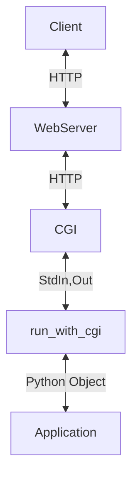
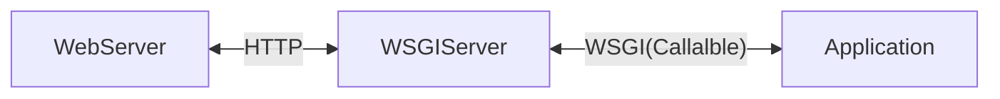

### 출처
* [pep333](https://peps.python.org/pep-0333/)
* [WSGI VS CGI](https://stackoverflow.com/questions/219110/how-python-web-frameworks-wsgi-and-cgi-fit-together)
* [WSGI 뜯어보기](https://devocean.sk.com/experts/techBoardDetail.do?ID=165282&boardType=experts&page=&searchData=&subIndex=&idList=#none)
* [WSGI 뜯어보기2](https://devocean.sk.com/search/techBoardDetail.do?ID=165337&boardType=&query=wsgi&searchData=&page=&subIndex=&idList=)
___
### 개요
* [[#WSGI란]]
* [[#WSGI의 구조]]
* [[#WSGI 정리]]
* [[#WSGI의 규칙들]]
* [[#WSGI 뜯어보기]]
* [[#WSGI 서버 돌려보기]]
___
### WSGI란

WSGI란 Web Server Gateway Interface의 약자로 웹서버와 응용 프로그램의 중간에 위치해 서로간의 통신을 가능하게 한다. 읭? 그러면 일전에 다룬 [[CGI]]와 다를게 없지 않나? 라는 생각이 든다면 당신의 생각이 맞다. 적절히 이해했다.

**WSGI는 파이썬에 특화된 인터페이스**로 CGI를 기반에 두고 있긴 하지만 엄밀히 따지자면 CGI는 아니다. CGI는 표준 입출력과 환경변수를 활용해 HTTP 요청 정보를 획득하고 응답 정보를 반환한다는 규칙만 정의할 뿐 어떤 언어를 활용해서 구현 하라는 규칙은 존재하지 않는다. (이는 FastCGI도 마찬가지이다)

이에 따라서 **HTTP 정보를 순수 파이썬으로 파싱해 파이썬 객체로 응용 프로그램에 전달하고 응용 프로그램에서도 곧장 파이썬 객체를 반환해 웹서버로 전달하고 싶다는 욕구가 발생했다.** 니즈가 많은 만큼 해결법도 다양했는데, 이로 인해 웹서버 API의 춘추 전국 시대가 열리게 된다.

사실 WSGI이전에도 웹 서버와 파이썬을 연결하는 API는 많이 존재했다. mod_python과 같이 웹 서버 소프트웨어 자체에 파이썬 인터프리터를 탑재해 웹 서버 내부에서 처리하는 방식도 존재했고 아예 웹서버 자체를 파이썬으로 작성해 곧장 파이썬 객체를 다루고 처리하는 방법도 존재했다.

문제는 웹서버와 연결하는 방법이 다양하다 보니 실질적으로 이러한 **API 뒷단에서 동작하는 프레임워크 입장에서는 지원해야하는 요소의 수가 많아지고 번잡해지는 상황이 발생했다.** 이를 위해 기준을 작성할 필요가 발생했고 이때 그 기준으로 등장한 것이 WSGI이기도 하다.

> The availability and widespread use of such a2n API in web servers for Python – whether those servers are written in Python (e.g. Medusa), embed Python (e.g. mod_python), or invoke Python via a gateway protocol (e.g. CGI, FastCGI, etc.) – would separate choice of framework from choice of web server, freeing users to choose a pairing that suits them, while freeing framework and server developers to focus on their preferred area of specialization.
> 
> **This PEP, therefore, proposes a simple and universal interface between web servers and web applications or frameworks: the Python Web Server Gateway Interface (WSGI).** [pep333](https://peps.python.org/pep-0333/)

당시 문서를 확인하면 자바와 비교를 많이 하는데 이때 자바는 서블릿 기반의 공통된 시스템을 활용하고 있었기에 어떤 프레임 워크를 사용해도 웹서버를 변경해야 한다거나 하는 문제가 존재하지 않았다. **이러한 구조를 파이썬에도 도입해 파이썬 <-> 웹 서버 간의 통일된 인터페이스를 생성하는 것이 WSGI의 탄생 비화이다.**

WSGI는 요청을 받을 경우 특정한 파이썬 콜러블 객체를 실행하고 매개 변수로는 env라는 변수에 dict 타입으로 전달해야 한다는 파이썬에 특화된 [[#WSGI의 규칙들|규칙]]이 존재한다. **==WSGI는 이런 파이썬에 특화된 규칙을 설정 함으로써 기존 CGI에서 아쉬웠던 파이썬 네이티브로 처리하지 못한다는 문제를 해결하고 난잡했던 파이썬 어플리케이션 <-> 웹서버 간의 통신 프로토콜을 통일했다.==**

>[!info]
>**This PEP, therefore, proposes a simple and universal interface between web servers and web applications or frameworks: the Python Web Server Gateway Interface (WSGI).**

___
### WSGI의 구조

**==WSGI의 가장 큰 특징은 웹 서버로 부터 받은 HTTP 요청을 특정한 파이썬 콜러블 오브젝트와 연결할 수 있다는 것이다.==** WSGI 서버는 HTTP 요청이 오면 특정 콜러블 오브젝트를 호출하는 방식으로 동작한다. (콜러블 오브젝트는 함수 메서드 뿐아니라 `__call__`이 구현된 모든 객체를 말한다) 이때 실행하는 콜러블 오브젝트는 어떠한 의존성도 가지면 안된다.

WSGI는 크게 웹 서버와 소통하는 부분 어플리케이션과 소통하는 부분으로 구분할 수있다. 웹 서버와 통신하는 부분을 서버, 게이트웨이 파트라 하고 어플리케이션과 소통하는 부분을 어플리케이션, 프레임워크 파트라 하자.

이제 WSGI를 통해서 실행하는 어플리케이션의 예시를 살펴보자. 아래 코드는 2개의 콜러블 오브젝트를 보여준다. 

```python
def simple_app(environ, start_response):
    """Simplest possible application object"""
    status = '200 OK'
    response_headers = [('Content-type', 'text/plain')]
    start_response(status, response_headers)
    return ['Hello world!\n']


class AppClass:
    """Produce the same output, but using a class

    (Note: 'AppClass' is the "application" here, so calling it
    returns an instance of 'AppClass', which is then the iterable
    return value of the "application callable" as required by
    the spec.

    If we wanted to use *instances* of 'AppClass' as application
    objects instead, we would have to implement a '__call__'
    method, which would be invoked to execute the application,
    and we would need to create an instance for use by the
    server or gateway.
    """

    def __init__(self, environ, start_response):
        self.environ = environ
        self.start = start_response

    def __iter__(self):
        status = '200 OK'
        response_headers = [('Content-type', 'text/plain')]
        self.start(status, response_headers)
        yield "Hello world!\n"
```

이러한 콜러블 객체를 WSGI 서버에 넘겨주면 WSGI는 적절한 요청을 수신할 때마다 해당 콜러블 객체를 호출한다. 이어서 서버, 게이트웨이 파트의 예시를 확인해보자.

```python
import os, sys

def run_with_cgi(application):

    environ = dict(os.environ.items())
    environ['wsgi.input']        = sys.stdin
    environ['wsgi.errors']       = sys.stderr
    environ['wsgi.version']      = (1, 0)
    environ['wsgi.multithread']  = False
    environ['wsgi.multiprocess'] = True
    environ['wsgi.run_once']     = True

    if environ.get('HTTPS', 'off') in ('on', '1'):
        environ['wsgi.url_scheme'] = 'https'
    else:
        environ['wsgi.url_scheme'] = 'http'

    headers_set = []
    headers_sent = []

    def write(data):
        if not headers_set:
             raise AssertionError("write() before start_response()")

        elif not headers_sent:
             # Before the first output, send the stored headers
             status, response_headers = headers_sent[:] = headers_set
             sys.stdout.write('Status: %s\r\n' % status)
             for header in response_headers:
                 sys.stdout.write('%s: %s\r\n' % header)
             sys.stdout.write('\r\n')

        sys.stdout.write(data)
        sys.stdout.flush()

    def start_response(status, response_headers, exc_info=None):
        if exc_info:
            try:
                if headers_sent:
                    # Re-raise original exception if headers sent
                    raise exc_info[0], exc_info[1], exc_info[2]
            finally:
                exc_info = None     # avoid dangling circular ref
        elif headers_set:
            raise AssertionError("Headers already set!")

        headers_set[:] = [status, response_headers]
        return write

    result = application(environ, start_response) #콜러블 객체를 실행
    try:
        for data in result:
            if data:    # don't send headers until body appears
                write(data)
        if not headers_sent:
            write('')   # send headers now if body was empty
    finally:
        if hasattr(result, 'close'):
            result.close()
```

다음의 코드는 대략적으로 작성한 **WSGI 서버 코드로 앞단에 CGI가 존재함을 가정하고 작성했다. 코드를 확인해보면 콜러블 오브젝트인 application을 전달받아 동작하는 것을 확인할 수 있고 결과 값을 CGI의 형식을 통해 웹서버에 전달 하는 것 또한 파악이 가능하다.** 따라서 이를 그림으로 나타내면 다음과 같다.



이는 초창기 장고에서 사용 됐던 패턴으로 옛날의 WSGI가 완전히 자리잡기 전까지 장고는 flup이라는 라이브러리를 활용해 위와 같은 구조를 사용했다. (run_with_cgi자리에 flup이 사용됐다)

추가적으로 확인할 만한 부분은 동적 수행을 원하는 HTTP 요청마다 콜러블 오브젝트를 실행해야 하므로  `run_with_cgi`는 요청마다 수행된다. 
___
### WSGI 정리

**WSGI는 웹서버와 응용 프로그램 중간에 위치해 웹서버의 요청을 특정한 파이썬 콜러블 객체로 매핑하는 기능을 수행한다.** 이후 콜러블 객체가 반환한 바이트 형식의 데이터를 웹서버에 적절한 HTTP Response로 전달하는 기능을 수행한다. 따라서 그림으로 나타내자면 WSGI는 아래와 같은 위치에 놓이게 된다.



**WSGI 또한 CGI와 마찬가지로 하나의 규약이라는 것을 잊지말자 WSGI는 파이썬 어플리케이션과 웹서버가 콜러블 오브젝트를 통해 통신하는 규칙을 정의한 것이지 실제 구현체를 의미하진 않는다.** WSGI의 구현체로는 Gunicorn이나 uWsgi 등의 패키지가 존재한다. 

> [!info]
> **WSGI는 파이썬의 콜러블 오브젝트를 활용해 웹서버와 어플리케이션이 통신을 하게하는 규칙이다.** 

___
### WSGI의 규칙들

WSGI에는 여러 규칙이 존재하지만, 이중 몇가지만 살펴보는 작업을 수행한다. 우선적으로 WSGI에서 핵심적으로 처리하는 applicaiton 객체와 관련된 규칙을 살펴본다.

* **application 객체는 environ, start_response를 매개변수로 전달 받는다**
	`environ`은 파이썬 딕셔너리 객체로 HTTP 요청과 웹서버에 대한 정보들을 전달 받는 부분이다. (Content-Length, Server-Port, Query, ...)
	`start_response`는 응답을 생성하는 콜러블 객체로 무조건 바이트 문자열을 반환해야 한다. 해당 문자열은 응답 HTTP 메시지의 body란에 작성된다.

위의 규칙을 만족하는 WSGI에 적합한 콜러블 application을 작성하면 아래의 예시와 흡사하다.

```python
def application(env:dict, start_response:Callable):
	body:bytes = start_response(status:int, reponse_header:dict)
	return body
```

___
### WSGI 뜯어보기

이제 실제 파이썬 내부 모듈에서는 WSGI를 어떻게 구현하고 있는지 확인해보자. 파이썬에는 wsgiref라는 모듈이 존재하며 이를 통해 wsgi 웹서버를 구축 가능하게 한다. 아래는 기초적인 WSGI를 내부 모듈을 활용해 구현한 예제이다.

```python
from wsgiref.util import setup_testing_defaults
from wsgiref.simple_server import make_server

# A relatively simple WSGI application. It's going to print out the
# environment dictionary after being updated by setup_testing_defaults
def simple_app(environ, start_response):
    setup_testing_defaults(environ)

    status = '200 OK'
    headers = [('Content-type', 'text/plain; charset=utf-8')]

    start_response(status, headers)

    ret = [("%s: %s\n" % (key, value)).encode("utf-8")
           for key, value in environ.items()]
    return ret

with make_server('', 8000, simple_app) as httpd:
    print("Serving on port 8000...")
    httpd.serve_forever() #서버 구동
```

코드를 살펴보면 이전에 언급 했던 규칙에 따라 콜러블 어플리케이션 객체를 전달 받아 실행하고 어플리케이션은`environ`과 `start_response`를 매개변수로 갖는 것을 확인할 수 있다. 

다른 파이썬 기본 서버들과 마찬가지로 wsfiref는 요청을 받는 소켓 서버와 요청을 처리하는 핸들러로 구성된다. 

우선적으로 `make_server`를 살펴보자. `WSGIServer`와 `WSGIRequestHandler`를 활용하는 서버를 구축하는 것을 확인할 수 있다.

```python
def make_server(
    host, port, app, server_class=WSGIServer, handler_class=WSGIRequestHandler
):
    """Create a new WSGI server listening on `host` and `port` for `app`"""
    server = server_class((host, port), handler_class) #WSGI서버와 핸들러를 사용해 서버를 생성한다.
    server.set_app(app) #실행할 어플리케이션을 설정
    return server
```

WSGIServer는 다음과 같은 상속 구조를 갖는다. 


상속 받는 형태를 살펴보면 CGI 서버와 흡사하게 동작할 것이라는 것을 추측할 수 있는데 실제로 비슷하다.

WSGI 서버에서 별도로 수행하는 작업은 매개변수로 전달 받은 어플리케이션을 설정하는 행위가 전부이다. 아래 WSGI 서버 코드를 살펴보자.

```python
class WSGIServer(HTTPServer):

    """BaseHTTPServer that implements the Python WSGI protocol"""

    application = None

    def server_bind(self):
        """Override server_bind to store the server name."""
        HTTPServer.server_bind(self)
        self.setup_environ()

    def setup_environ(self):
        # Set up base environment
        env = self.base_environ = {}
        env['SERVER_NAME'] = self.server_name
        env['GATEWAY_INTERFACE'] = 'CGI/1.1'
        env['SERVER_PORT'] = str(self.server_port)
        env['REMOTE_HOST']=''
        env['CONTENT_LENGTH']=''
        env['SCRIPT_NAME'] = ''

    def get_app(self):
        return self.application

    def set_app(self,application):
        self.application = application
```

코드를 확인해보면 WSGI 사용을 위한 몇가지 설정만 진행하고 별도의 작업은 진행하지 않는다. 실질적으로 서버를 구동하는 `serve_forever()`는 CGI와 동일하게 처리한다. [[CGI#CGI의 동작 방식]]

이에따라 **WSGI도 리퀘스트 핸들러에 의해 호출되는 `set()` , `handle()`, `finish()`의 절차로 요청을 처리하게 된다.**

이제 `WSGIRequestHandler`를 뜯어 어떻게 요청을 처리 하는지 확인해보자. `WSGIRequestHandler` 에서 가장 핵심이 되는 부분은 요청을 처리하는 `handle()`이다. 아래 메서드를 살펴보자.

```python
class WSGIRequestHandler(BaseHTTPRequestHandler):
    ...
    def handle(self):
        """Handle a single HTTP request"""

        self.raw_requestline = self.rfile.readline(65537) #메시지 수신
        if len(self.raw_requestline) > 65536:
            self.requestline = ''
            self.request_version = ''
            self.command = ''
            self.send_error(414) #uri too long
            return

        if not self.parse_request(): # An error code has been sent, just exit
            return

        handler = ServerHandler(
            self.rfile, self.wfile, self.get_stderr(), self.get_environ(),
            multithread=False,
        )#서버 핸들러 생성
        handler.request_handler = self      # backpointer for logging
        handler.run(self.server.get_app()) #실질적인 어플리케이션 실행
```

메서드를 살펴보면 `ServerHandler`라는 클래스를 생성하고 **이를 활용해 전달 받은 application을 실행하는 것을 확인할 수 있다**. 이때 `ServerHandler`는 로깅 등의 단순한 처리만 진행하고 실질적인 요청의 처리와 결과의 반환은 이의 부모 클래스인 `SimpleHandler`와 `BaseHandler`에서 처리된다. `SimpleHandler` 코드부터 살펴보자.

```python
class SimpleHandler(BaseHandler):
    """Handler that's just initialized with streams, environment, etc.

    This handler subclass is intended for synchronous HTTP/1.0 origin servers,
    and handles sending the entire response output, given the correct inputs.

    Usage::

        handler = SimpleHandler(
            inp,out,err,env, multithread=False, multiprocess=True
        )
        handler.run(app)"""

    def __init__(self,stdin,stdout,stderr,environ,
        multithread=True, multiprocess=False
    ):
        self.stdin = stdin
        self.stdout = stdout
        self.stderr = stderr
        self.base_env = environ
        self.wsgi_multithread = multithread
        self.wsgi_multiprocess = multiprocess
```

요청 정보 수신 및 응답 정보 반환을 위한 표준 입,출력의 설정 정보와 서버의 설정 정보등이 저장돼 있는 것을 확인할 수 있다. 하지만 어플리케이션을 실행하는 `run` 메서드는 `BaseHandler`에 정의 돼있다.

```python
class BaseHandler:
    """Manage the invocation of a WSGI application"""

    # Configuration parameters; can override per-subclass or per-instance
    wsgi_version = (1,0)
    wsgi_multithread = True
    wsgi_multiprocess = True
    wsgi_run_once = False

    origin_server = True    # We are transmitting direct to client
    http_version  = "1.0"   # Version that should be used for response
    server_software = None  # String name of server software, if any

    # os_environ is used to supply configuration from the OS environment:
    # by default it's a copy of 'os.environ' as of import time, but you can
    # override this in e.g. your __init__ method.
    os_environ= read_environ()

    # Collaborator classes
    wsgi_file_wrapper = FileWrapper     # set to None to disable
    headers_class = Headers             # must be a Headers-like class

    # Error handling (also per-subclass or per-instance)
    traceback_limit = None  # Print entire traceback to self.get_stderr()
    error_status = "500 Internal Server Error"
    error_headers = [('Content-Type','text/plain')]
    error_body = b"A server error occurred.  Please contact the administrator."

    # State variables (don't mess with these)
    status = result = None
    headers_sent = False
    headers = None
    bytes_sent = 0

    def run(self, application):
        """Invoke the application"""
        # Note to self: don't move the close()!  Asynchronous servers shouldn't
        # call close() from finish_response(), so if you close() anywhere but
        # the double-error branch here, you'll break asynchronous servers by
        # prematurely closing.  Async servers must return from 'run()' without
        # closing if there might still be output to iterate over.
        try:
            self.setup_environ()
            self.result = application(self.environ, self.start_response) #어플리케이션 수행
            self.finish_response() #응답 종료
        except (ConnectionAbortedError, BrokenPipeError, ConnectionResetError):
            # We expect the client to close the connection abruptly from time
            # to time.
            return
        except:
            try:
                self.handle_error()
            except:
                # If we get an error handling an error, just give up already!
                self.close()
                raise   # ...and let the actual server figure it out.

```

`self.result = application(self.environ, self.start_response)` 를 확인해보면 이전에 말했던 것과 같이 환경변수를 활용한 연결 정보와 응답 처리를 위한 콜러블 객체를 매개변수로 전달 받는다.

`start_response`는 별 다른 일을 수행하지 않기에 생략하고 `finish_response()` 메서드를 살펴보자.

```python
class BaseHandler:   
    ...
    def finish_response(self):
        """Send any iterable data, then close self and the iterable
        """
        try:
            if not self.result_is_file() or not self.sendfile():
                for data in self.result:
                    self.write(data)
                self.finish_content()
	
	def write(self, data):
        ...
        elif not self.headers_sent:
            # Before the first output, send the stored headers
            self.bytes_sent = len(data)    # make sure we know content-length
            self.send_headers()
        else:
            self.bytes_sent += len(data)
        
        self._write(data)
        self._flush()
```

`finish_response()` 에서 전송할 응답 데이터를 전송한다. `write()` 메서드에서 이를 처리하는데 실질적인 소켓에 데이터를 내보내는 `_write()`,`_flush()` 은 `SimpleHandler`에 정의돼 있다.

```python
class SimpleHandler(BaseHandler):
    ...
    def _write(self,data):
        result = self.stdout.write(data) #표준 출력으로 CGI에 전달
        if result is None or result == len(data):
            return
        ...
        while True:
            data = data[result:]
            if not data:
                break
            result = self.stdout.write(data)
            
    def _flush(self):
        self.stdout.flush()
        self._flush = self.stdout.flush
```

코드를 확인해보면 **표준 출력으로 데이터를 전송하는 것을 볼 수 있다. 이때 표준 출력이 실제 표준 출력이 아닌 웹서버 소켓을 의미하기 때문에 실질적으론 연결된 클라이언트의 소켓으로 데이터를 전송한다.** (CGI와는 동작 방식이 다름) 

그럼에도 표준 출력으로 전송하는 이유는 그것이 CGI의 규칙이기 때문이라 생각한다. (뇌피셜) 
CGI를 살펴봤을 때 [[CGI#CGI의 동작 방식]] 에서 `dup2` 시스템 콜을 활용해 소켓의 버퍼 내용을 표준 출력에 덮어 쓰는 것을 확인할 수 있었다. 그래서 아마도.. 이 wsgi 코드 역시 앞단에 CGI가 존재함을 가정하고 작성해서 그런 일이 발생한 것이 아닐까 싶다.. (CGI를 끼면 표준 출력으로 나가니까)
___
### WSGI 서버 돌려보기

```python
from wsgiref.util import setup_testing_defaults
from wsgiref.simple_server import make_server

# A relatively simple WSGI application. It's going to print out the
# environment dictionary after being updated by setup_testing_defaults
def simple_app(environ, start_response):
    setup_testing_defaults(environ)

    status = '200 OK'
    headers = [('Content-type', 'text/plain; charset=utf-8')]

    start_response(status, headers)

    ret = [("%s: %s\n" % (key, value)).encode("utf-8")
           for key, value in environ.items()]
    return ret

with make_server('', 8000, simple_app) as httpd:
    print("Serving on port 8000...")
    httpd.serve_forever() #서버 구동
```

이제 위의 코드를 실습 해보자. 우리가 확인해야 할것은 아래와 같다.

* **HTTP 요청 -> 함수로 대응 되는지**
* **응답이 잘 오는지**

`curl -X GET "127.0.0.1:8000?a=4&b=4"` 와 같은 요청을 보내보자. 함수가 적절하게 실행되는 것을 확인할 수 있다.

```bash
...
REQUEST_METHOD: GET
PATH_INFO: /
QUERY_STRING: a=4
REMOTE_ADDR: 127.0.0.1
CONTENT_TYPE: text/plain
HTTP_HOST: 127.0.0.1:8000
HTTP_USER_AGENT: curl/8.4.0
HTTP_ACCEPT: */*
wsgi.input: <_io.BufferedReader name=6>
wsgi.errors: <_io.TextIOWrapper name='<stderr>' mode='w' encoding='utf-8'>
wsgi.version: (1, 0)
wsgi.run_once: False
wsgi.url_scheme: http
wsgi.multithread: False
wsgi.multiprocess: False
wsgi.file_wrapper: <class 'wsgiref.util.FileWrapper'>
```

___
