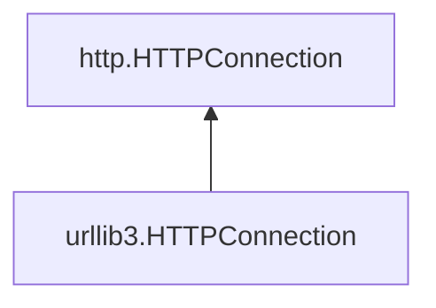

### 출처
* [urlib3.Response](https://urllib3.readthedocs.io/en/stable/reference/urllib3.response.html#urllib3.response.BaseHTTPResponse)
* [http.client](https://docs.python.org/ko/3/library/http.client.html#httpconnection-objects)
___
### 개요
* [[#HTTP Response 받는 법]]
* [[#urllib3.getresponse()]]
* [[#http.getresponse()]]
* [[#http.HTTPResponse]]
* [[#urllib3.HTTPResponse]]
___
### HTTP Response 받는 법

우리는 이전까지  urllib3에서 어떻게 요청을 전송 하는지를 확인했다. 이하에서는 어떻게 응답을 수신하고 처리 하는지를 확인한다. 응답에 대한 작업이 처음 모습을 드러내는 곳은 커넥션 풀의 `make_request` 메서드이다. 아래 코드를 보자.

```python title:connectionpool.py
class HTTPConnectionPool:
	...
	#send request and do something..
	...
	
	try:
        response = conn.getresponse()
    except (BaseSSLError, OSError) as e:
        self._raise_timeout(err=e, url=url, timeout_value=read_timeout)
            raise

	# Set properties that are used by the pooling layer.
	response.retries = retries
	response._connection = response_conn  # type: ignore[attr-defined]
	response._pool = self  # type: ignore[attr-defined]

	
```

해당 코드는 `make_request` 메서드 내부로 이 메서드는 커넥션 풀에서 특정 커넥션을 추출해 요청을 전송하고 이에 대한 응답을 처리하는 작업을 수행한다. 이는 일전의 [[HTTPConnection 부터 send까지 (1)#HTTPConnectionPool.urlopen|urlopen]] 에서 설명한 메서드로 실질적인 요청의 전송 및 응답을 처리하는 작업을 진행한다.

응답을 얻어오는 부부만 확인해보면, `getresponse` 객체를 활용해 응답을 확보하는 것을 확인할 수 있다. 이제 `getresponse`로 이동해보자.
___
### urllib3.getresponse()

응답을 획득하는 함수는 아래와 같이 동작한다.

```python title:connection.py
def getresponse(  # type: ignore[override]
        self,
    ) -> HTTPResponse:
        """
        Get the response from the server.

        If the HTTPConnection is in the correct state, returns an instance of HTTPResponse or of whatever object is returned by the response_class variable.

        If a request has not been sent or if a previous response has not be handled, ResponseNotReady is raised. If the HTTP response indicates that the connection should be closed, then it will be closed before the response is returned. When the connection is closed, the underlying socket is closed.
        """
        # Raise the same error as http.client.HTTPConnection
        if self._response_options is None:
            raise ResponseNotReady()

        # Reset this attribute for being used again.
        resp_options = self._response_options
        self._response_options = None

        # Since the connection's timeout value may have been updated
        # we need to set the timeout on the socket.
        self.sock.settimeout(self.timeout)

        # This is needed here to avoid circular import errors
        from .response import HTTPResponse

        # Get the response from http.client.HTTPConnection
        httplib_response = super().getresponse()

        try:
            assert_header_parsing(httplib_response.msg)
        except (HeaderParsingError, TypeError) as hpe:
            log.warning(
                "Failed to parse headers (url=%s): %s",
                _url_from_connection(self, resp_options.request_url),
                hpe,
                exc_info=True,
            )

        headers = HTTPHeaderDict(httplib_response.msg.items())

        response = HTTPResponse(
            body=httplib_response,
            headers=headers,
            status=httplib_response.status,
            version=httplib_response.version,
            reason=httplib_response.reason,
            preload_content=resp_options.preload_content,
            decode_content=resp_options.decode_content,
            original_response=httplib_response,
            enforce_content_length=resp_options.enforce_content_length,
            request_method=resp_options.request_method,
            request_url=resp_options.request_url,
        )
        return response
```

코드는 길지만 요약하면 결국 `super.getresponse()` 에서 실질적인 응답을 가져오고 이를 통해 얻은 응답 객체를 urrllib3 자체 `HTTPResponse` 객체로 변환하는 작업을 수행한다. 해당 메서드는  `HTTPConnection` 내부에 존재하고 이의 부모 클래스는 파이썬 내장 라이브러리인 `http` 의 `HTTPConnection`이므로 응답 처리는 파이썬의 기본 내장 함수를 활용해 처리하고 있다 할 수 있다.
다이어그램으로 표현하면 아래와 같다.



이제 진짜 응답을 처리하는 `http.getresponse`를 확인해보자.
___
### http.getresponse()

실제 응답을 처리하는 코드는 아래와 같다.

```python title:client.py
def getresponse(self):
	"""Get the response from the server.

	If the HTTPConnection is in the correct state, returns an
	instance of HTTPResponse or of whatever object is returned by
	the response_class variable.

	If a request has not been sent or if a previous response has
	not be handled, ResponseNotReady is raised.  If the HTTP
	response indicates that the connection should be closed, then
	it will be closed before the response is returned.  When the
	connection is closed, the underlying socket is closed.
	"""

	# if a prior response has been completed, then forget about it.
	if self.__response and self.__response.isclosed():
		self.__response = None

	# if a prior response exists, then it must be completed (otherwise, we
	# cannot read this response's header to determine the connection-close
	# behavior)
	#
	# note: if a prior response existed, but was connection-close, then the
	# socket and response were made independent of this HTTPConnection
	# object since a new request requires that we open a whole new
	# connection
	#
	# this means the prior response had one of two states:
	#   1) will_close: this connection was reset and the prior socket and
	#                  response operate independently
	#   2) persistent: the response was retained and we await its
	#                  isclosed() status to become true.
	#
	if self.__state != _CS_REQ_SENT or self.__response:
		raise ResponseNotReady(self.__state)

	if self.debuglevel > 0:
		response = self.response_class(self.sock, self.debuglevel,
									   method=self._method)
	else:
		response = self.response_class(self.sock, method=self._method)

	try:
		try:
			response.begin()
		except ConnectionError:
			self.close()
			raise
		assert response.will_close != _UNKNOWN
		self.__state = _CS_IDLE

		if response.will_close:
			# this effectively passes the connection to the response
			self.close()
		else:
			# remember this, so we can tell when it is complete
			self.__response = response

		return response
	except:
		response.close()
		raise
```

`response_class` 를 활용해 응답 객체를 생성하고 해당 객체 내부의 `begin` 메서드를 실행한 후 이 객체를 반환하는 방식으로 동작한다. 응답 객체를 생성하는 `response_class` 메서드 내부를 들여다보자.

놀랍게도 `response_class`는 메서드가 아니라 클래스이다. HTTPConenction 내부에서 `response_class = HTTPResponse` 으로 정의하고 있기 때문에 우리가 생성하는 응답 객체는 HTTPResponse가 된다.

그러면 이제 HTTPResponse 객체를 살펴보자. 여기에 모든 내용이 전부 정리돼 있을 것이다.
___
### http.HTTPResponse

우선적으로 위에서도 사용한 메서드인 `begin` 부터 확인해보자. 이 메서드는 **본격적인 응답 읽기 작업을 수행하기에 앞서 응답의 헤더와 상태코드 청킹 여부 컨텐츠 길이 등을 파악하는 작업을 수행한다.** 응답의 본문은 방치하고 본문을 읽기 위해 필요한 헤더 정보들을 우선적으로 추출하는 메서드라 생각하면 쉽다.

```python title:client.py
def begin(self):
	if self.headers is not None:
		# we've already started reading the response
		return

	# read until we get a non-100 response
	while True:
		version, status, reason = self._read_status()
		if status != CONTINUE:
			break
		# skip the header from the 100 response
		skipped_headers = _read_headers(self.fp)
		if self.debuglevel > 0:
			print("headers:", skipped_headers)
		del skipped_headers

	self.code = self.status = status
	self.reason = reason.strip()
	if version in ("HTTP/1.0", "HTTP/0.9"):
		# Some servers might still return "0.9", treat it as 1.0 anyway
		self.version = 10
	elif version.startswith("HTTP/1."):
		self.version = 11   # use HTTP/1.1 code for HTTP/1.x where x>=1
	else:
		raise UnknownProtocol(version)

	self.headers = self.msg = parse_headers(self.fp)

	if self.debuglevel > 0:
		for hdr, val in self.headers.items():
			print("header:", hdr + ":", val)

	# are we using the chunked-style of transfer encoding?
	tr_enc = self.headers.get("transfer-encoding")
	if tr_enc and tr_enc.lower() == "chunked":
		self.chunked = True
		self.chunk_left = None
	else:
		self.chunked = False

	# will the connection close at the end of the response?
	self.will_close = self._check_close()

	# do we have a Content-Length?
	# NOTE: RFC 2616, S4.4, #3 says we ignore this if tr_enc is "chunked"
	self.length = None
	length = self.headers.get("content-length")
	if length and not self.chunked:
		try:
			self.length = int(length)
		except ValueError:
			self.length = None
		else:
			if self.length < 0:  # ignore nonsensical negative lengths
				self.length = None
	else:
		self.length = None

	# does the body have a fixed length? (of zero)
	if (status == NO_CONTENT or status == NOT_MODIFIED or
		100 <= status < 200 or      # 1xx codes
		self._method == "HEAD"):
		self.length = 0

	# if the connection remains open, and we aren't using chunked, and
	# a content-length was not provided, then assume that the connection
	# WILL close.
	if (not self.will_close and
		not self.chunked and
		self.length is None):
		self.will_close = True
```

따라서 begin만 진행한다고 해서 응답 데이터를 읽을 수 있는 것이 아니다. 별도의 read 작업을 수행해줘야 실질적인 응답 데이터를 읽는 것이 가능하다.

이제 다시 돌아가보자. 우리는 아래의 순서를 통해 들어왔다.

 ```mermaid
 flowchart TD
 ConnectionPool.urlopen -->
 ConnectionPool.make_request --> HTTPConnection.getresponse --> super.HTTPConnection.getresponse
```


`super.HTTPConnection.getresponse`는 begin 메서드를 실행한 response를 반환하기 때문에 실질적인 메시지에는 헤더가 존재하지 않고 헤더의 데이터들은 인스턴스의 속성으로 관리되는 상태가 된다. 따라서 커넥션 풀에서 urllib3 자체의 HTTPResponse 객체로 포팅하는 과정을 보면 인스턴스의 속성을 각각 넣어주는 것을 확인할 수 있다.

```python title:connectionpool.py
	response = HTTPResponse(
		body=httplib_response,
		headers=headers,
		status=httplib_response.status,
		version=httplib_response.version,
		reason=httplib_response.reason,
		preload_content=resp_options.preload_content,
		decode_content=resp_options.decode_content,
		original_response=httplib_response,
		enforce_content_length=resp_options.enforce_content_length,
		request_method=resp_options.request_method,
		request_url=resp_options.request_url,
	)
```

이제 실제 응답 데이터를 어떻게 읽고 관리 하는지를 확인해보자. 
___
### urllib3.HTTPResponse


`urlopen`을 수행하고 나면 그 결과로 `begin` 메서드가 실행된 `http.HTTPResponse`를 포팅한 `urlli3b.HTTPResponse`가 반환된다는 것까지 확인했다. 그렇다면 우리가 실질적으로 `urlopen`을 수행하고 난뒤 전달된 결과 값을 어떻게 읽고 조작하는 것일까?

`urlli3b.HTTPResponse`에 대한 공식 문서의 설명은 다음과 같다. 요약하면 **http 모듈의 응답 객체와 비슷하지만, data라는 속성을 통해 미리 가공돼 있는 본문 데이터에 곧장 접근할 수 있다는 차이점이 존재한다.** 또한 io객체를 상속 받아 readble하다는 특징을 갖는다.

> Backwards-compatible with [`http.client.HTTPResponse`](https://docs.python.org/3/library/http.client.html#http.client.HTTPResponse "(in Python v3.12)") but the **response `body` is loaded and decoded on-demand when the `data` property is accessed.** This class is also compatible with the Python standard library’s [`io`](https://docs.python.org/3/library/io.html#module-io "(in Python v3.12)") module, and can hence be treated as a readable object in the context of that framework. Extra parameters for behaviour not present in [`http.client.HTTPResponse`](https://docs.python.org/3/library/http.client.html#http.client.HTTPResponse "(in Python v3.12)"):

이제 코드를 한번 살펴보자. 아래는 간단한 urllib3 사용 예제이다. 확인해보면 data 속성에 접근하는 것 만으로 본문 데이터를 확인하는 것을 볼 수 있다. 어떻게 가능할까?

```python hl:6
import urllib3

resp = urllib3.request("GET", "https://httpbin.org/robots.txt")
resp.status
>> 200
resp.data
>> b"User-agent: *\nDisallow: /deny\n"
```

```python title:response.py
class HTTPResponse(BaseHTTPResponse):
	...
	...
	@property
	 def data(self) -> bytes:
        # For backwards-compat with earlier urllib3 0.4 and earlier.
        if self._body:
            return self._body  # type: ignore[return-value]

        if self._fp:
            return self.read(cache_content=True)

        return None  # type: ignore[return-value]

```

우리가 `data` 속성을 입력했을 때 `@property`에 의해 위의 메서드가 실행되고 이에 따라 `_body`혹은 `read` 메서드의 결과가 반환된다. `_body` 가 어떻게 처리 되는지 부터 확인해보자.

```python title:"response.py" hl:5,24
class HTTPResponse(BaseHTTPResponse):
	...
	...
        if body and isinstance(body, (str, bytes)):
            self._body = body

        self._pool = pool
        self._connection = connection

        if hasattr(body, "read"):
            self._fp = body  # type: ignore[assignment]

        # Are we using the chunked-style of transfer encoding?
        self.chunk_left: int | None = None

        # Determine length of response
        self.length_remaining = self._init_length(request_method)

        # Used to return the correct amount of bytes for partial read()s
        self._decoded_buffer = BytesQueueBuffer()

        # If requested, preload the body.
        if preload_content and not self._body:
            self._body = self.read(decode_content=decode_content)
```

HTTPRespnse에 전달되는 body는 높은 확률로 `http.HTTPResponse` 타입이므로 24번째 줄에서 `body`를 읽는 작업을 수행한다. 여기서 확인해볼 부분은 preload_content 파라미터이다. 
preload_content 파라미터는 응답을 소켓 버퍼로부터 한번에 읽을 지를 결정한다. 이는 `urlopen` 부터 전달되는 파라미터로 기본적으로 참으로 설정돼 있다. 따라서 위의 기본적인 urllib3 활용하기 예시를 실행하면 24번 줄의 실행 결과가 반환된다.

이제 거의 다왔다 마지막으로 read 하는 부분만 살펴보자. read는 다음과 같이 처리된다.

```python title:response.py hl:14,22
self._init_decoder()
if decode_content is None:
	decode_content = self.decode_content

if amt and amt < 0:
	# Negative numbers and `None` should be treated the same.
	amt = None
elif amt is not None:
	cache_content = False

	if len(self._decoded_buffer) >= amt:
		return self._decoded_buffer.get(amt)

data = self._raw_read(amt)

flush_decoder = amt is None or (amt != 0 and not data)

if not data and len(self._decoded_buffer) == 0:
	return data

if amt is None:
	data = self._decode(data, decode_content, flush_decoder)
	if cache_content:
		self._body = data
```

확인해보면 실질적인 데이터를 읽는 작업은 `raw_read`에서 이를 디코딩하는 작업은 `decode`에서 진행됨을 확인할 수 있다. `raw_read`는 다음과 같은 작업을 수행한다.

```python title:response.py hl:15
buffer = io.BytesIO()
# Besides `max_chunk_amt` being a maximum chunk size, it
# affects memory overhead of reading a response by this
# method in CPython.
# `c_int_max` equal to 2 GiB - 1 byte is the actual maximum
# chunk size that does not lead to an overflow error, but
# 256 MiB is a compromise.
max_chunk_amt = 2**28
while amt is None or amt != 0:
	if amt is not None:
		chunk_amt = min(amt, max_chunk_amt)
		amt -= chunk_amt
	else:
		chunk_amt = max_chunk_amt
	data = self._fp.read(chunk_amt)
	if not data:
		break
	buffer.write(data)
	del data  # to reduce peak memory usage by `max_chunk_amt`.
return buffer.getvalue()
```

`raw_read`는 주어진 `amt` 바이트 수만큼 소켓에서 데이터를 읽고 이를 버퍼로 옮기는 작업을 수행한다. 이후 버퍼에서 해당 값을 한번에 추출해 반환한다. 이 데이터가 data로 반환되고 이후 디코딩 처리돼 문자열의 형태로 우리에게 전달된다.
